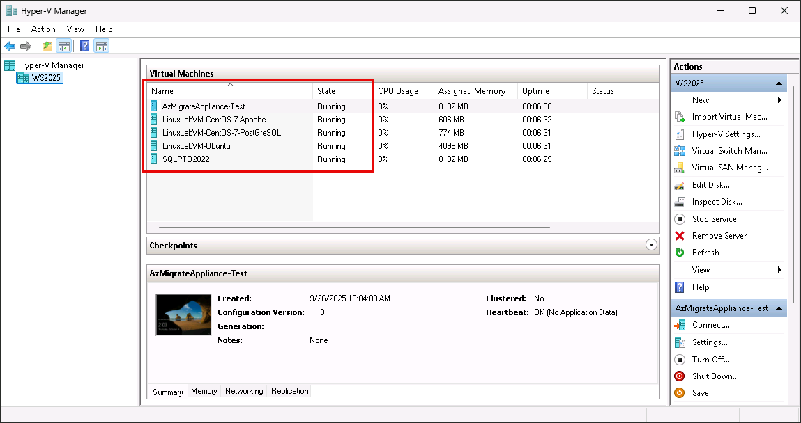
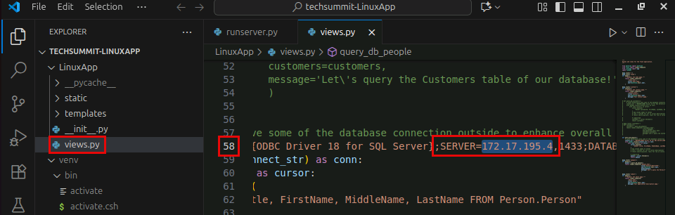

# Exercise 1: Migrate a Linux VM to an Azure VM

Contoso Inc. is in the early stages of its infrastructure modernization journey, aiming to reduce datacenter overhead and improve operational agility by migrating key workloads to Azure. Among its legacy systems is a Linux-based personnel management application running on a Hyper-V virtual machine. While the application remains critical to daily operations, its underlying infrastructure is aging and difficult to scale. To preserve compatibility while gaining cloud-based resilience and manageability, Contoso has chosen a lift-and-shift migration strategy for this workload.

In this exercise, you will use the [Azure Migrate Service](https://learn.microsoft.com/en-us/azure/migrate/prepare-for-migration?view=migrate-classic) to assess, replicate, and migrate a Hyper-V–based Ubuntu VM to Azure. This process simulates the real-world steps Contoso’s IT team would follow to transition legacy infrastructure into a cloud-first model.

## Objectives

After completing this exercise, you will be able to:

- Assess the readiness of a Linux VM for migration to Azure
- Configure replication of the VM using Azure Migrate
- Perform a lift-and-shift migration of the VM to Azure

## Duration

**Estimated time**: 1 Hour and 15 minutes

===

# Task 1: Test the application before migration

## Introduction

Before initiating a migration, it is critical to confirm that the source Linux VM is functioning properly in the Hyper-V environment. This includes verifying that the personnel management application is running and successfully connecting to the SQL Server database.

## Description

In this task, you will log in to the `LinuxLabVM-Ubuntu` virtual machine and test the personnel management application to ensure it is operational prior to migration.

## Success criteria

- You can connect to the Linux VM in Hyper-V Manager.
- You can run the server application from Visual Studio Code.
- You can confirm that data is returned successfully in the web app accessing the SQL database.

## Learning resources

- [Preparing for migrating Linux Virtual Machine to Azure](https://learn.microsoft.com/en-us/azure/migrate/prepare-for-migration?view=migrate-classic)

## Key tasks

1. [ ] Launch **Hyper-V Manager** from the desktop of your Lab VM.

    

2. [ ] Confirm that all five virtual machines are listed and show a status of **Running** in the **Virtual Machines** panel of Hyper-V Manager.

    

    > For this exercise, you will use the `LinuxLabVM-Ubuntu` and `AzMigrateAppliance-Test` virtual machines.

3. [ ] Select the `LinuxLabVM-Ubuntu` in the list and choose **Connect** in the right-hand menu.

    

4. [ ] At the Ubuntu login screen:

   - Select the `administrator` account  
   - Enter the password provided on the **Resource** tab of the lab instructions  
   - Press **Enter** to log in to the Ubuntu machine  

    > Passwords are provided in the **lab instructions** tab. You can enter it manually, or select the **[T]** icon in the instructions to auto-type the password.

5. [ ] Click the **Show Applications** button at the top left of the Ubuntu VM window, enter `"visual studio"` into the search box, and select **Visual Studio Code** from the search results.

    

    > Visual Studio Code will open to the `techsummit-LinuxApp` workspace.

6. [ ] From the **Explorer** in VS Code, open the `views.py` file. In this file, you need to update the IP address in the `connect_str` variable on line 58 to point to the `SQLPTO2022` VM in your environment.

7. [ ] Locate the IP address of the `SQLPTO2022` VM by opening the `VM_IPs.txt` file on the Lab VM's desktop.

    

8. [ ] In the `VM_IPs.txt` file, copy the **private IP** address of the `SQLPTO2022` VM.

    

9. [ ] In the `views.py` file, go to **line 58** and replace the existing IP address in the `SERVER` field of the `connect_str` variable with the private IP of the `SQLPTO2022` VM.

    

10. [ ] Save the `views.py` file.

11. [ ] Open `runserver.py` from the VS Code Explorer and run it by clicking the **Run Python File** button in the top right corner of the file tab.

    

12. [ ] In the **Terminal** panel of VS Code, click the **Running on** link (`http://localhost:5555`) to launch the application in your default browser.

    

13. [ ] In the web app, select the **People** tab and verify that a list of people from the `Person.Person` table is displayed.

    

    > If no data appears, double-check the IP address in `views.py` and ensure the `SQLPTO2022` VM is running and accessible.

14. [ ] Close the personnel management web app browser.

15. [ ] Close the `LinuxLabVM-Ubuntu` VM window.

===

# Task 2: Prepare the Hyper-V Host

## Introduction

Azure Migrate requires some preparation of the Hyper-V host before beginning a migration. For this lab, those preparation steps have been consolidated into a PowerShell script that enables required services and sets permissions. Running this script ensures the host is ready to support VM replication and migration.

## Description

In this task, you will run the Azure Migrate preparation script using PowerShell on the Hyper-V host (your Lab VM).

## Success Criteria

- You have downloaded the Azure Migrate Hyper-V preparation script  
- You have executed the `MicrosoftAzureMigrate-Hyper-V.ps1` script on the Hyper-V host without errors  
- You have reset the network connectivity category to **Public**

## Learning Resources

- [Preparing for migrating Linux Virtual Machine to Azure](https://learn.microsoft.com/en-us/azure/migrate/prepare-for-migration?view=migrate-classic)

## Key Tasks

1. [ ] On the Lab VM, open the **Search Bar** and enter `"powershell"`.

    

2. [ ] In the search results, select **Windows PowerShell** under **Apps** and select **Run as administrator**.

    > **Important**: Do not select **Windows PowerShell ISE**.

    

3. [ ] In the PowerShell terminal, set the network category to **Private** by running:

    ```powershell
    Set-NetConnectionProfile -NetworkCategory Private
    ```

4. [ ] Verify the change by running:

    ```powershell
    Get-NetConnectionProfile
    ```

    

5. [ ] Open a browser on the Lab VM and navigate to `https://aka.ms/migrate/hyperv/script` to download the `MicrosoftAzureMigrate-Hyper-V.ps1` script.

    

    > **Note**: Your Lab VM also serves as the Hyper-V host for this workshop.

6. [ ] Return to PowerShell and change to the **Downloads** directory:

    ```powershell
    cd Downloads
    ```

7. [ ] Execute the downloaded script:

    ```powershell
    .\MicrosoftAzureMigrate-Hyper-V.ps1
    ```

8. [ ] Respond to the script prompts as follows:

    - **Do you want to run software from this untrusted publisher?** → `[A] Always run`  
    - **Enable Remote Management (WinRM)?** → `Y`  
    - **Make these changes?** → `y`  
    - **Enable PowerShell Remoting?** → `Y`  
    - **Configure firewall to open required ports?** → `Y`  
    - **Use SMB share(s) to store VHDs?** → `Y`  
    - **Create non-administrator local user for Azure Migrate?** → `Y`  
    - When prompted for credentials:
      - **Username**: `MigrateLocal`  
      - **Password**: `Pa$$w0rd`

9. [ ] After the script completes, reset the network category to **Public**:

    ```powershell
    Set-NetConnectionProfile -NetworkCategory Public
    ```

10. [ ] Confirm the reset by running:

    ```powershell
    Get-NetConnectionProfile
    ```

    

===

# Task 3: Provision Azure Migrate and create a new project

## Introduction

In this task, you will run a PowerShell script in the Azure Cloud Shell to provision a new instance of Azure Migration and create a new Azure Migrate Project in the Azure Portal.

## Description

In this task, you will execute a script a Cloud Shell session in the Azure Portal to generate all the needed resources, then create a new Azure Migrate Project.

## Success criteria

- You have executed the script in Azure Cloud shell and provisioned an Azure Migrate service.
- You have created a new Azure Migrate Project in the Azure Portal.

## Learning resources

- [Preparing for migrating Linux Virtual Machine to Azure](https://learn.microsoft.com/en-us/azure/migrate/prepare-for-migration?view=migrate-classic)

## Key tasks

1. [ ] Open a web browser on the Lab VM and navigate to the [Azure portal](https://portal.azure.com/).

2. [ ] Sign in using your lab credentials from the **Resources** tab in the instructions panel.

    

    > **IMPORTANT**: You may be prompted to use a Temporary Access Pass (TAP) for login. This value is listed on the **Resources** tab.
    >
    > 
    >
    > If using the Temporary Access Pass does not work, choose the option to **Use your password instead** and login using the password provided.
    >
    > 

3. [ ] Click **Yes** if prompted to stay signed in.

4. [ ] In the Azure portal, start a Cloud Shell by selecting the Cloud Shell icon in the top bar.

    

5. [ ] The Azure Cloud shell will ask whether you want to start a `Bash` or `Powershell` session, choose `Powershell`

6. [ ] In the Cloud Shell getting started dialog, select `No storage account required` and choose the only subscription available in the Subscription dropdown, then select `Apply`.

    

7. [ ] At the Cloud Shell prompt, run the following create the resources needed in Azure.

    > [!TIP]
    > You may need to press the `ENTER` key during the `New-AzVirtualNetwork` command to complete running the script.

    ```powershell
    # Login to Azure
    # Write-Host "Logging in to Azure..."
    # Connect-AzAccount
    
    $location = "centralus"
    $resourceGroupName = "rg-AzMigrateLab"
    $storagePrefix = "storazmig"
    $vnetName = "vnet-AzMigrateLab"
    
    # Create Resource Group
    Write-Host "Creating resource group '$resourceGroupName' in location '$location'..."
    New-AzResourceGroup -Name $resourceGroupName -Location $location
    
    # Generate unique storage account name
    $randomSuffix = -join ((48..57) + (97..122) | Get-Random -Count 8 | % {[char]$_})
    $storageAccountName = "$storagePrefix$randomSuffix"
    
    Write-Host "Creating storage account '$storageAccountName'..."
    New-AzStorageAccount -ResourceGroupName $resourceGroupName `
       -Name $storageAccountName `
       -Location $location `
       -SkuName Standard_GRS `
       -Kind StorageV2
    
    # Create Virtual Network and Subnet
    Write-Host "Creating virtual network '$vnetName' with subnet 'default'..."
    $subnetConfig = New-AzVirtualNetworkSubnetConfig -Name "default" -AddressPrefix "198.168.4.0/26"
    New-AzVirtualNetwork -Name $vnetName `
        -ResourceGroupName $resourceGroupName `
        -Location $location `
        -AddressPrefix "198.168.4.0/24" `
        -Subnet $subnetConfig
    ```

8. [ ] When the script finishes running, you should see output like the following:

    ```powershell
    ResourceGroupName Name              Location  ProvisioningState EnableDdosProtection DefaultPublicNatGateway
    ----------------- ----              --------  ----------------- -------------------- -----------------------
    rg-AzMigrateLab   vnet-AzMigrateLab centralus Succeeded         False
    ```

9. [ ] Close the Cloud Shell pane in the Azure portal.

10. [ ] In the Azure portal, search for "Azure Migrate" in the search bar and select **Azure Migrate** under **Services** in the search results.

    

11. [ ] On the **Azure Migrate** blade, select **All projects** in the left menu and then select **Create Project** in the toolbar.

    

12. [ ] On the Azure Migrate **Create Project** blade, enter the following:

    - **Subscription**: Accept the default value.
    - **Resource group**: Choose `rg-AzMigrateLab`
    - **Project**: Enter `Linux-VM-Migration`
    - **Geograpgy**: Choose `United states`.
    - Expand **Advanced** and verify the Connectivity method is set to `Public Endpoint`.
    - Select **Create**.

    

13. [ ] When project creation has finished, select **Refresh** on the **All project** blade to see your new project in the list. Keep this blade open for the next task.

===

# Task 4: Configuring the Appliance and discover the Virtual Machine

## Introduction

In this task, you will configure the Appliance and Discover the Virtual Machine

## Description

In this task, you will access the Azure Migrate Project you created and generate a project key to allow you to set up an Appliance to get ready for replication and migration of your Linux VM.

## Success criteria

- You can start the discovery in the Azure Migrate Project and generate a project Key.
- You can connect to the Azure Migrate VM already running in the Hyper-V Manager for the lab
- Verify the Azure Migrate Project Key Successfully
- Verify the authentication against the Appliance and confirm successful registration 
- Verify successful management of credentials and discovery sources

## Learning resources

- [Preparing for migrating Linux Virtual Machine to Azure](https://learn.microsoft.com/en-us/azure/migrate/prepare-for-migration?view=migrate-classic)

## Key tasks

1. [ ] In the Azure portal, make sure you are in the `Azure Migrate` blade and you can see your project that you just created


2. [ ] Select the project that you created earlier

3. [ ] Click on the `Start Discovery` button at the bottom of the overview page choosing `Using Appliance` for `Azure`


4. [ ] In the discovery blade, choose `Yes, with Hyper-V` for the server virtualized option, then give your appliance a name, for example `LabAppliance` and ckicl on `Generate Key`. 


> [!IMPORTANT]
> Do NOT download the VHD

5. [ ] After a minute or so, you should see your Project key, where you should download and place on the desktop of your HyperV host machine in a file called `project_key`


6. [ ] Back in your Hyper-V Manager, we will now connect to a different VM. Connect to the `AzMigrateAppliance-Test` Virtual Machine


7. [ ] Login to the VM using the credentials in the lab on the right sidebar

8. [ ] On the desktop, find the icon for `Azure Migrate Appliance Configuration Manager` and launch it


9. [ ] Paste the Project Key we saved on the desktop of the Hyper-V machine earlier, in the `Verification of Azure Migrate project Key` section and click on `Verify`


10. [ ] The verification should be successfull within seconds.

11. [ ] After the verification, click on the `Login` button below it in the section `Azure user login and appliance registration status`


12. [ ] A window will pop up with a device code, copy the code to the clipboard and login


13. [ ] Enter the code in the next window and then enter your credentials for Azure from the `Resources` tab in the lab again. This time use the `TAP` not the password to login.

14. [ ] You will see that you are logged in but you might get a `MYSQL` error, you can ignore it.


15. [ ] Continue with section 2 `Manage credentials and discovery sources` and click on `Add credentials`


16. [ ] In the Add credentials popup, create a `Friendly name` to your liking and enter the username and password we created earlier. Username: `MigrateLocal` and whatever password your chose at the time. Click save.


17. [ ] Now we move to step 2 for `Provide Hyper-V host/cluster details` and click on `Add discovery source`


18. [ ] For this step, you will need to run command line on the Hyper-V Host machine and execute `ipconfig` to grab the IP address of the machine. Then come back to the Add discovery source popup and choose `Add single item`


19. [ ] Type in the IP Address / FQDN you received from you `ipconfig` execution on the Hyper-V Host machine and then choose the `Map credentials` you created earlier from the dropdown.


20. [ ] You will probably receive an error for the validation step and that is due to missing IAM access control privileges between the resources of storage and the vaults


21. [ ] Head back to the Azure portal and open the blade for the storage account associated with your Resource Group that was created for you

22. [ ] In the `Access Control (IAM) blade` of the storage account, Add the following role assignments:

    - `Storage Blob Data Contibutor`, job function role should be assigned access to `Data replication vault Managed Identity` 
    - `Contributor`, priviledged administrator role should be assigned access to `Data replication vault Managed Identity` 


23. [ ] Back on the Application Manager, run the `re-validate` again and this time it should succeed.


24. [ ] In step 3 in the Configuration manager toggle off the `Guest discovery is enabled by default`

25. [ ] Click on `Start Discovery` button. This is step can take up to 15 minutes.

26. [ ] Confirm the discovery of the Virtual Machine in the Azure Portal by expanding `Explore Inventory`, `All Inventory`, you should see your new VM listed.


# Task 5: Assess, replicate and migrate Linux Ubuntu VM

## Introduction

In this task, you will assess, replicate and migrate your Linux VM to Azure.

## Description

In this task, you will create the assessment of the Linux VM server in the Azure Migrate Project, download the necessary software on the Hyper-V machine to establish the replication provider with a registration key, start the replication process and finally migrate the Linux VM to zure.

## Success criteria

- You can create the assessment successfully in the Azure Portal.
- You can download the AzureSiteRecoveryProvider application and the registration key.
- You can successfully start the replication process.
- You can successfully start the migration process.

## Learning resources

- [Preparing for migrating Linux Virtual Machine to Azure](https://learn.microsoft.com/en-us/azure/migrate/prepare-for-migration?view=migrate-classic)

## Key tasks

1. [ ] From the Azure portal, on the Azure Migrate Project blade, open the `Decide and Plan` section and click on `Assessments` and create a new assessment by clicking on `Create assessment`


2. [ ] Give the assessment a name and create a `Workload`

3. [ ] Choose the `LinuxLabVM-Ubuntu` and click `Add`


4. [ ] Click on Next and ensure the Default target location is `Central US` and that the Sizing criteria is `Performance-based`

5. [ ] Click on `Review + Create assessment` then `Create`


6. [ ] Back in the blade, expand the `Execute` section and click on Migrations, then click on `Discover more`


7. [ ] For the `Where to you want to migrate to?` choose `Azure VM`, for the `Are your machines virtualized?` choose `Yes, with Hyper-V` anf the `Target region` choose `Central US`


8. [ ] Download the Hyper-V replication provider software using the hyperlink in step 1 in the screenshot below, then download the registration key in step 2 in the screenshot.


> [!IMPORTANT]
> Remember you need to be on the Hyper-V host machine when you download the software and the key above.

9. [ ] Run the `AzureSiteRecoveryProvider.exe` that you just downloaded

10. [ ] Select `On (recommended)` and click `Next`. Install at default location and click `Install`. Do NOT click `Finish`

11. [ ] After the installation is complete, click on `Register`

12. [ ] Browse to the registration key file you downloaded and click Next


13. [ ] Select `Connect directly to Azure Site Recovery without a proxy server` and click Next

14. [ ] After about 60 seconds the configuration will complete and then you can click `Finish`

15. [ ] Close the blade and revisit the `Dicover more` page on the migrations blade, you should see that you have ONE connected registration


16. [ ] Click on `Finalize registration`. This step takes around 3 minutes.

17. [ ] Now it is time to start the replication, head back to the Migration Project blade and expend `Execute`, `Migrations` and this time click the `Replicate` button


18. [ ] In the `Specify Intent` page, Choose `server or virtual machines (vm)` on what to migrate. `Azure VM` to where to migrate, and `Yes, with Hyper-V` for whether your machines are virtualized, then click continue.


19. [ ] Choose `Standard or trusted launch Virtual Machine` for the security type, `Yes, apply migration settings from an Azure Migrate assessment` for rthe import settings dropdown, pick your assessment you created earlier in the `Select Assessment` dropdown and finally check the box next to your `LinuxLabVM-Ubuntu` and click next.


20. [ ] In the replicate blade, pick your resourcegroup from the dropdown, for the cache storage account pick the storage account in the dropdown that was created for you, pick the Virtual network and click next.


21. [ ] That error is because the storage account does not have the proper access priviledge to the Recovery Service vault. To fix this issue, first open the Recovery Service Vault resouce in another browers page and under `Settings | Identity` turn ON the status on the `System assigned` and save.


22. [ ] Then we need to assign the `Contributor` and `Storage Blob Data Contributor` to the the storage account, like we did before, but this time to the managed identity of the `Recovery Services Vault`

23. [ ] Now, no errors show show up in the `Replicate` blade and you should move to the next step. (You will need to redo the replicate steps after the IAM has been fixed).

24. [ ] In the compute blade, chnge the `OS Type` dropdown to `Linux`. Pick any availability, no other value should be changed. Click Next.


25. [ ] For Disks blade and the others just click Next till the end to start the replication.

26. [ ] This step will take some time, around 25 muinutes. You can check on the progress by opening the `Replication Summary` and clicking on `Jobs` to monitor the completion. 


27. [ ] The replication is complete when you see the replication status for the LinuxLabVM-Ubuntu set to `Protected`. Now you can start the migrations from the ellipsis button on the right of the screen.


28. [ ] Choose `Yes` to shutting down the VM and performing a planned migration with no data loss.

29. [ ] Click on `Migrate`. This will take another 2+ hours to complete. You can monitor the progress by opening the `Jobs` section on the Migration blade and click on `Planned failover`


