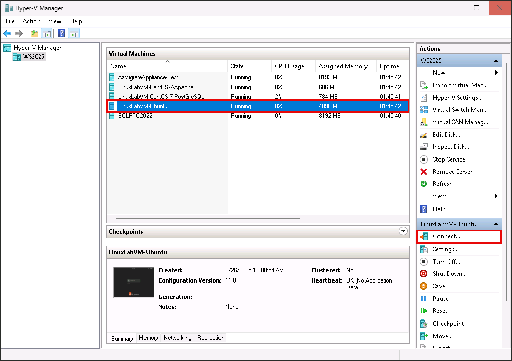
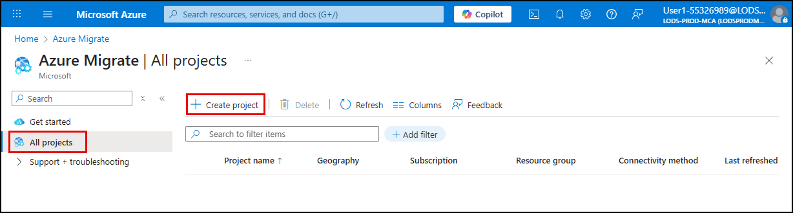
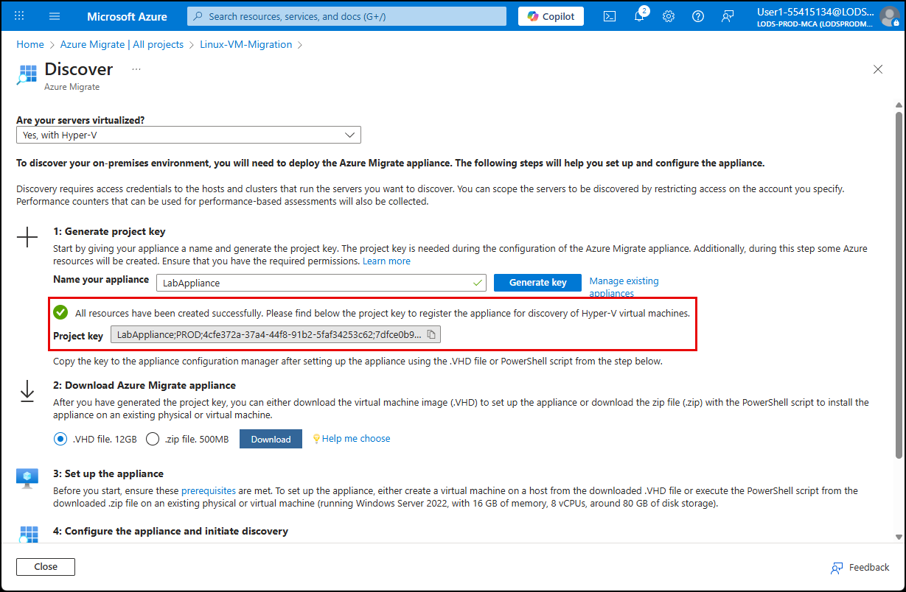
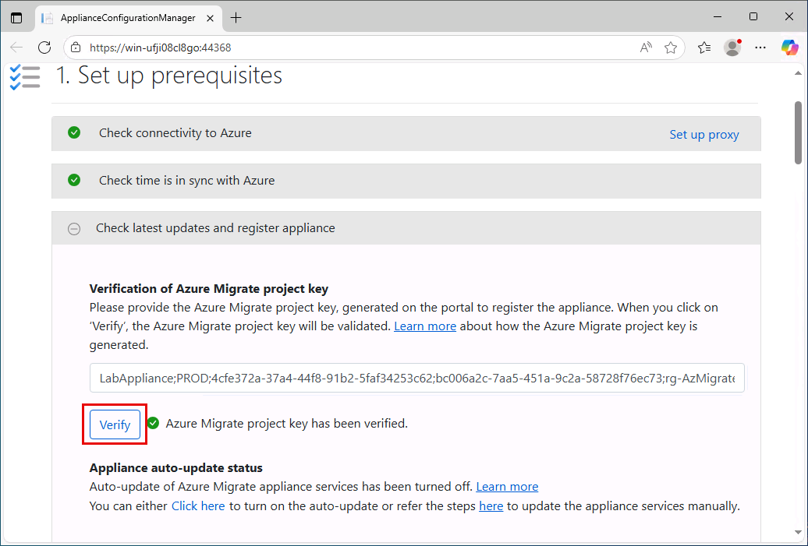
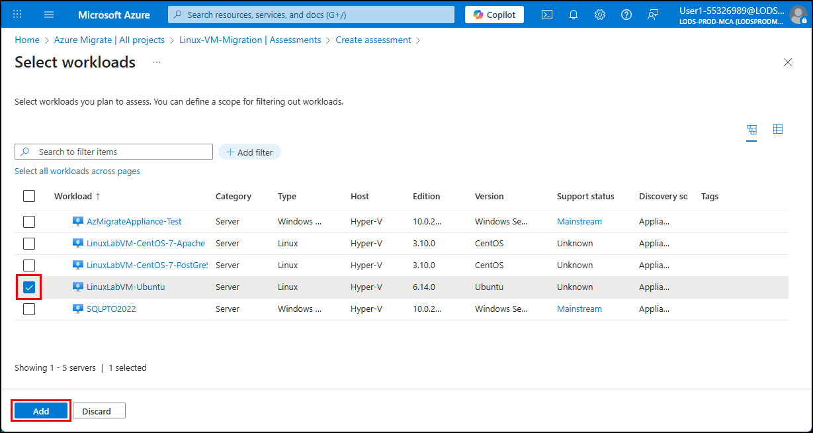

# Exercise 1: Migrate a Linux VM to an Azure VM

Contoso Inc. is modernizing its infrastructure to improve scalability, security, and operational efficiency. As part of this initiative, the company plans to migrate its legacy Linux Virtual Machines to Azure. To ensure a smooth transition, Contoso will use the built-in Azure Migration service to assess, replicate and migrate the Virtual Machines.

In this exercise, you will use the [Azure Migrate Service](https://learn.microsoft.com/en-us/azure/migrate/prepare-for-migration?view=migrate-classic) to assess, replicate and migrate a Hyper-V based Linux Virtual Machine to Azure VM.

## Objectives

After completing this exercise, you will be able to:

- Assess the migration of your Linux VM to Azure
- Replicate the Appliances of the Linux VM to get it ready for migration to Azure 
- Migrate the Linux VM to Azure

## Duration

**Estimated time**: 1 Hour and 15 minutes

===

# Task 1: Test the Application before the migration

## Introduction

Before initiating a migration, it is critical to confirm that the source LinuxVM is working in the Hyper-V environment by connecting to it and making sure the application running on the VM is connecting and working correctly to the SQL database.

## Description

In this task, you will verify that each of these crtical steps have been met before proceeding with the migration.

## Success criteria

- You can connect to the Linux VM in the Hyper-V manager
- You can run the server application from Visual Studio Code
- You can confirm that data is returned successfully in the web app accessing the SQL database.

## Learning resources

- [Preparing for migrating Linux Virtual Machine to Azure](https://learn.microsoft.com/en-us/azure/migrate/prepare-for-migration?view=migrate-classic)

## Key tasks

> [!IMPORTANT]
> After launching the lab, ensure the the `LinuxVM-Ubuntu` is running in your Hyper-V

1- [] Login to the Hyper-V machine as the first step of this exercise.  The lab will provide the password in the intructions tab on the right, you can enter it manually or just click on the [T] in the instructions and the password will be typed in for you automatically to login.
2- [] Once logged in, double click the desktop icon of `Hyper-V Manager` to start the application


3- [] Ensure that Five virtual machines are available and running as you can see in screenshot below.  In this first Exercise, we will only use the `LinuxLabVM-Ubuntu` and the `AzMigrateAppliance-Test` Virtual machines.


4- [] Click to highlight the `LinuxLabVM-Ubuntu` in the list and click on  `Connect` on the right sidebar



5- [] As the `Administrator` enter the password provided to you on the `Resources` tab on the right of the lab and press the enter key to login to the Ubuntu machine.

6- [] Click on Use bar icon in top left in the Ubuntu VM, then search for `Visual Studio Code` and finally click on the Visual Studio Code icon to launch it.


7- [] The Visual Studio Code IDE will open and you should have the `LinuxApp` already open.  Click on the `views.py` file in the explorer.

8- [] On the desktop of the Hyper-V machine you will find a text file called `VM_IPs` open the file and copy the IP value of the `SQLPTO2022`.  Paste that IP address in the `views.py` file in the connection string line as show in the screenshot below.


9- [] Open the file `runserver.py` in the explorer of Visual Studio code and run it by clicking on the play button in the top right of the editor, then `CTRL-Click` the `http://localhost:xxxx` link in the terminal to launch the LinuxApp in the default browser


10- [] The application will start in the browser. Navigate to the `People` tab


11- [] Ensure data is populated on the people's page.  It should look like the screenshot below


# Task 2: Preparing the Hyper-V Host

## Introduction

Before initiating a migration, it is critical to download the scripts needed for the Hyper-V Host machine to execute in order to create the necessary resources in Azure and set the Network connectivity category profile.

## Description

In this task, you will download a script on the Hyper-V Host machine and run it from a Powershell session while setting the profile for the Network Connectivity Category.

## Success criteria

- You can download the Hyper-V migrate script 
- You can set the Network Connectivity Category successfully
- You can Execute the script on the Hyper-V Host machine successfully in Powershell.

## Learning resources

- [Preparing for migrating Linux Virtual Machine to Azure](https://learn.microsoft.com/en-us/azure/migrate/prepare-for-migration?view=migrate-classic)

## Key tasks

1- [] Back in your Hyper-V host machine, open a browser window and navigate to `https://aka.ms/migrate/hyperv/script` to download the script needed to prepare the HyperV


2- [] From the search bar at the bottom of the HyperV machine type `Powershell`.  A window will pop with multiple options, make sure to choose the Windows PowerShell app NOT  the ISE one and start it by running as Administrator.


3- [] In the terminal, run:
```powershell
Set-NetConnectionProfile -NetworkCategory Private
```
Then run the following to ensure that the NetworkCategory is set to `Private`

```powershell
Get-NetConnectionProfile
```


4- [] Now head over to where you downloaded the script in step 1 and execute the script in the terminal, accepting ALL the prompts that will show up. There should be 7 prompts where you should agree to all.  At the last step you will be asked to choose a username and password for credentials/ Enter `MigrateLocal` as the username and `Pa$$w0rd` as the password.


5- [] Now you can reset the Network Connection to public by running the following command in the terminal

```powershell
Set-NetConnectionProfile -NetworkCategory Public
```
Then run the following to ensure that the NetworkCategory is set to `Public`

```powershell
Get-NetConnectionProfile
```


# Task 3: Azure Migrate Project creation

1- [] On the Hyper V Host Machine, open a browser window and navigate to `https://portal.azure.com`
 
2- [] Login using the credentials in the lab available on the `Resources` tab on the right of the lab screen.  There you will find the username and password you should use and also a TAP (Temporary Access Password) that we will use later.

> [!IMPORTANT]
> If prompted for Temporary Access Pass, Select use your password instead.


3- [] Another Credential screen will show up, this time enter the TAP password you see in the `Resources` Tab

4- [] The Azure portal will load, start a cloud shell by click on the cloudshell icon in the top bar like in the screenshot below


5- [] The Azure Cloud shell will ask whether you want to start a `Bash` or `Powershell` session, choose `Powershell`

6- [] The next screen will ask about storage, choose `No storage account required`

7- [] Select the only subscription you see in the dropdown and click `Apply`

8- [] You should see a cloudshell similar to the one in the screenshot below


9- [] Run the following in the CloudShell to create the resources needed in Azure.

```powershell
# Login to Azure
# Write-Host "Logging in to Azure..."
# Connect-AzAccount

$location = "centralus"
$resourceGroupName = "rg-AzMigrateLab"
$storagePrefix = "storazmig"
$vnetName = "vnet-AzMigrateLab"

# Create Resource Group
Write-Host "Creating resource group '$resourceGroupName' in location '$location'..."
New-AzResourceGroup -Name $resourceGroupName -Location $location

# Generate unique storage account name
$randomSuffix = -join ((48..57) + (97..122) | Get-Random -Count 8 | % {[char]$_})
$storageAccountName = "$storagePrefix$randomSuffix"

Write-Host "Creating storage account '$storageAccountName'..."
New-AzStorageAccount -ResourceGroupName $resourceGroupName `
   -Name $storageAccountName `
   -Location $location `
   -SkuName Standard_GRS `
   -Kind StorageV2

# Create Virtual Network and Subnet
Write-Host "Creating virtual network '$vnetName' with subnet 'default'..."
$subnetConfig = New-AzVirtualNetworkSubnetConfig -Name "default" -AddressPrefix "198.168.4.0/26"
New-AzVirtualNetwork -Name $vnetName `
    -ResourceGroupName $resourceGroupName `
    -Location $location `
    -AddressPrefix "198.168.4.0/24" `
    -Subnet $subnetConfig
```

> [!TIP]
> You might need to press the ENTER key once during the `New-AzVirtualNetwork` command while running the script.

10- [] Back in your Azure Portal, search for `Azure Migrate` in the upper search bar and start `Azure Migrate`


11- [] In the `Azure Migrate` blade, click on `All projects` and `Create Project`



12- [] In the `Create Project` blade, fill in the resource group, it should be `rg-AzMigrateLab`, Give it a name for the project, make sure the Geograpgy is `United states` and finally in the Advanced section maker sure the connectivity method is `Public Endpoint`

13- [] Click on `Create` to start the create of the Azure Migrate Project.


# Task 4: Configuring the Appliance and discover the Virtual Machine

1- [] In the Azure portal, make sure you are in the `Azure Migrate` blade and you can see your project that you just created


2- [] Select the project that you created earlier

3- [] Click on the `Start Discovery` button at the bottom of the overview page choosing `Using Appliance` for `Azure`


4- [] In the discovery blade, choose `Yes, with Hyper-V` for the server virtualized option, then give your appliance a name, for example `LabAppliance` and ckicl on `Generate Key`.  


> [!IMPORTANT]
> Do NOT download the VHD

5- [] After a minute or so, you should see your Project key, where you should download and place on the desktop of your HyperV host machine in a file called `project_key`



6- [] Back in your Hyper-V Manager, we will now connect to a different VM.  Connect to the `AzMigrateAppliance-Test` Virtual Machine


7- [] Login to the VM using the credentials in the lab on the right sidebar

8- [] On the desktop, find the icon for `Azure Migrate Appliance Configuration Manager` and launch it


9- [] Paste the Project Key we saved on the desktop of the Hyper-V machine earlier, in the `Verification of Azure Migrate project Key` section and click on `Verify`



10- [] The verification should be successfull within seconds.

11- [] After the verification, click on the `Login` button below it in the section `Azure user login and appliance registration status`


12- [] A window will pop up with a device code, copy the code to the clipboard and login


13- [] Enter the code in the next window and then enter your credentials for Azure from the `Resources` tab in the lab again.  This time use the `TAP` not the password to login.

14- [] You will see that you are logged in but you might get a `MYSQL` error, you can ignore it.


15- [] Continue with section 2 `Manage credentials and discovery sources` and click on `Add credentials`


16- [] In the Add credentials popup, create a `Friendly name` to your liking and enter the username and password we created earlier. Username: `MigrateLocal` and whatever password your chose at the time.  Click save.


17- [] Now we move to step 2 for `Provide Hyper-V host/cluster details` and click on `Add discovery source`


18- [] For this step, you will need to run command line on the Hyper-V Host machine and execute `ipconfig` to grab the IP address of the machine.  Then come back to the Add discovery source popup and choose `Add single item`


19- [] Type in the IP Address / FQDN you received from you `ipconfig` execution on the Hyper-V Host machine and then choose the `Map credentials` you created earlier from the dropdown.


20- [] You will probably receive an error for the validation step and that is due to missing IAM access control privileges between the resources of storage and the vaults


21- [] Head back to the Azure portal and open the blade for the storage account associated with your Resource Group that was created for you

22- [] In the `Access Control (IAM) blade` of the storage account, Add the following role assignments:

    - `Storage Blob Data Contibutor`, job function role should be assigned access to `Data replication vault Managed Identity` 
    - `Contributor`, priviledged administrator role should be assigned access to `Data replication vault Managed Identity` 


23- [] Back on the Application Manager, run the `re-validate` again and this time it should succeed.


24- [] In step 3 in the Configuration manager toggle off the `Guest discovery is enabled by default`

25- [] Click on `Start Discovery` button.  This is step can take up to 15 minutes.

26- [] Confirm the discovery of the Virtual Machine in the Azure Portal by expanding `Explore Inventory`, `All Inventory`, you should see your new VM listed.


# Task 5: Assess, replicate and migrate Linux Ubuntu VM

1- [] From the Azure portal, on the Azure Migrate Project blade, open the `Decide and Plan` section and click on `Assessments` and create a new assessment by clicking on `Create assessment`


2- [] Give the assessment a name and create a `Workload`

3- [] Choose the `LinuxLabVM-Ubuntu` and click `Add`



4- [] Click on Next and ensure the Default target location is `Central US` and that the Sizing criteria is `Performance-based`

5- [] Click on `Review + Create assessment` then `Create`


6- [] Back in the blade, expand the `Execute` section and click on Migrations, then click on `Discover more`


7- [] For the `Where to you want to migrate to?` choose `Azure VM`, for the `Are your machines virtualized?` choose `Yes, with Hyper-V` anf the `Target region` choose `Central US`


8- [] Download the Hyper-V replication provider software using the hyperlink in step 1 in the screenshot below, then download the registration key in step 2 in the screenshot.


> [!IMPORTANT]
> Remember you need to be on the Hyper-V host machine when you download the software and the key above.

9- [] Run the `AzureSiteRecoveryProvider.exe` that you just downloaded

10- [] Select `On (recommended)` and click `Next`. Install at default location and click `Install`. Do NOT click `Finish`

11- [] After the installation is complete, click on `Register`

12- [] Browse to the registration key file you downloaded and click Next


13- [] Select `Connect directly to Azure Site Recovery without a proxy server` and click Next

14- [] After about 60 seconds the configuration will complete and then you can click `Finish`

15- [] Close the blade and revisit the `Dicover more` page on the migrations blade, you should see that you have ONE connected registration


16- [] Click on `Finalize registration`.  This step takes around 3 minutes.

17- [] Now it is time to start the replication, head back to the Migration Project blade and expend `Execute`, `Migrations` and this time click the `Replicate` button


18- [] In the `Specify Intent` page, Choose `server or virtual machines (vm)` on what to migrate.  `Azure VM` to where to migrate, and `Yes, with Hyper-V` for whether your machines are virtualized, then click continue.


19- [] Choose `Standard or trusted launch Virtual Machine` for the security type, `Yes, apply migration settings from an Azure Migrate assessment` for rthe import settings dropdown, pick your assessment you created earlier in the `Select Assessment` dropdown and finally check the box next to your `LinuxLabVM-Ubuntu` and click next.


20- [] In the replicate blade, pick your resourcegroup from the dropdown, for the cache storage account pick the storage account in the dropdown that was created for you, pick the Virtual network and click next.


21- [] That error is because the storage account does not have the proper access priviledge to the Recovery Service vault.  To fix this issue, first open the Recovery Service Vault resouce in another browers page and under `Settings | Identity` turn ON the status on the `System assigned` and save.


22- [] Then we need to assign the `Contributor` and `Storage Blob Data Contributor` to the the storage account, like we did before, but this time to the managed identity of the `Recovery Services Vault`

23- [] Now, no errors show show up in the `Replicate` blade and you should move to the next step.  (You will need to redo the replicate steps after the IAM has been fixed).

24- [] In the compute blade, chnge the `OS Type` dropdown to `Linux`. Pick any availability, no other value should be changed. Click Next.


25- [] For Disks blade and the others just click Next till the end to start the replication.

26- [] This step will take some time, around 25 muinutes.  You can check on the progress by opening the `Replication Summary` and clicking on `Jobs` to monitor the completion. 


27- [] The replication is complete when you see the replication status for the LinuxLabVM-Ubuntu set to `Protected`.  Now you can start the migrations from the ellipsis button on the right of the screen.


28- [] Choose `Yes` to shutting down the VM and performing a planned migration with no data loss.

29- [] Click on `Migrate`.  This will take another 2+ hours to complete.  You can monitor the progress by opening the `Jobs` section on the Migration blade and click on `Planned failover`


