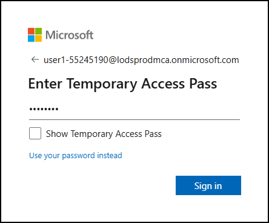
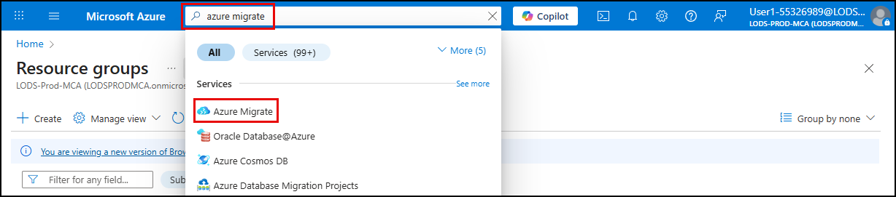
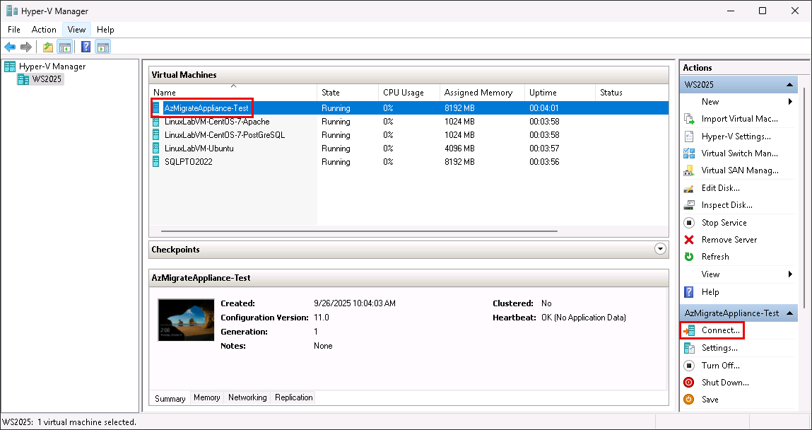
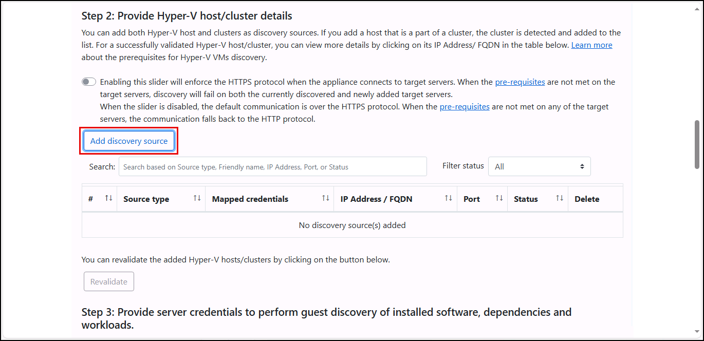
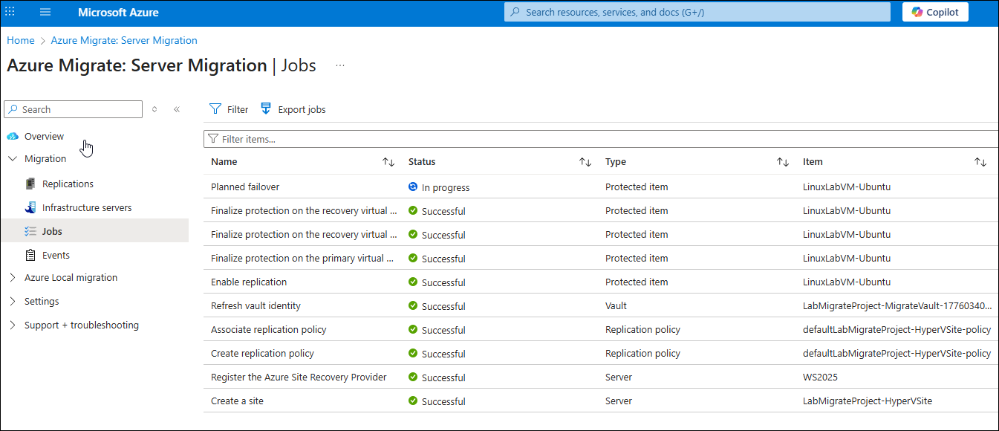

# Exercise 1: Migrate a Linux VM to an Azure VM

Contoso Inc. is in the early stages of its infrastructure modernization journey, aiming to reduce datacenter overhead and improve operational agility by migrating key workloads to Azure. Among its legacy systems is a Linux-based personnel management application running on a Hyper-V virtual machine. While the application remains critical to daily operations, its underlying infrastructure is aging and difficult to scale. To preserve compatibility while gaining cloud-based resilience and manageability, Contoso has chosen a lift-and-shift migration strategy for this workload.

In this exercise, you will use the [Azure Migrate Service](https://learn.microsoft.com/azure/migrate/prepare-for-migration?view=migrate-classic) to assess, replicate, and migrate a Hyper-V–based Ubuntu VM to Azure. This process simulates the real-world steps Contoso’s IT team would follow to transition legacy infrastructure into a cloud-first model.

## Objectives

After completing this exercise, you will be able to:

- Assess the readiness of a Linux VM for migration to Azure
- Configure replication of the VM using Azure Migrate
- Perform a lift-and-shift migration of the VM to Azure

## Duration

**Estimated time**: 1 Hour and 15 minutes

===

# Task 1: Test the application before migration

## Introduction

Before initiating a migration, it is critical to confirm that the source Linux VM is functioning properly in the Hyper-V environment. This includes verifying that the personnel management application is running and successfully connecting to the SQL Server database.

## Description

In this task, you will log in to the `LinuxLabVM-Ubuntu` virtual machine and test the personnel management application to ensure it is operational prior to migration.

## Success criteria

- You can connect to the Linux VM in Hyper-V Manager.
- You can run the server application from Visual Studio Code.
- You can confirm that data is returned successfully in the web app accessing the SQL database.

## Learning resources

- [Preparing for migrating Linux Virtual Machine to Azure](https://learn.microsoft.com/azure/migrate/prepare-for-migration?view=migrate-classic)

## Key tasks

1. [ ] Launch **Hyper-V Manager** from the desktop of your Lab VM.

    

2. [ ] Confirm that all five virtual machines are listed and show a status of **Running** in the **Virtual Machines** panel of Hyper-V Manager.

    

    > For this exercise, you will use the `LinuxLabVM-Ubuntu` and `AzMigrateAppliance-Test` virtual machines.

3. [ ] Select the `LinuxLabVM-Ubuntu` in the list and choose **Connect** in the right-hand menu.

    

4. [ ] At the Ubuntu login screen:

   - Select the `administrator` account  
   - Enter the password provided on the **Resource** tab of the lab instructions  
   - Press **Enter** to log in to the Ubuntu machine  

    > Passwords are provided in the **lab instructions** tab. You can enter it manually, or select the **[T]** icon in the instructions to auto-type the password.

5. [ ] Select the **Show Applications** button at the top left of the Ubuntu VM window, enter `"visual studio"` into the search box, and select **Visual Studio Code** from the search results.

    

    > Visual Studio Code will open to the `techsummit-LinuxApp` workspace.

6. [ ] From the **Explorer** in VS Code, open the `views.py` file. In this file, you need to update the IP address in the `connect_str` variable on line 58 to point to the `SQLPTO2022` VM in your environment.

7. [ ] Locate the IP address of the `SQLPTO2022` VM by opening the `VM_IPs.txt` file on the Lab VM's desktop.

    

8. [ ] In the `VM_IPs.txt` file, copy the **private IP** address of the `SQLPTO2022` VM.

    

9. [ ] In the `views.py` file, go to **line 58** and replace the existing IP address in the `SERVER` field of the `connect_str` variable with the private IP of the `SQLPTO2022` VM.

    

10. [ ] Save the `views.py` file.

11. [ ] Open `runserver.py` from the VS Code Explorer and run it by selecting the **Run Python File** button in the top right corner of the file tab.

    

12. [ ] In the **Terminal** panel of VS Code, select the **Running on** link (`http://localhost:5555`) to launch the application in your default browser.

    

13. [ ] In the web app, select the **People** tab and verify that a list of people from the `Person.Person` table is displayed.

    

    > If no data appears, double-check the IP address in `views.py` and ensure the `SQLPTO2022` VM is running and accessible.

14. [ ] Close the personnel management web app browser.

15. [ ] Close the `LinuxLabVM-Ubuntu` VM window.

===

# Task 2: Prepare the Hyper-V Host

## Introduction

Azure Migrate requires some preparation of the Hyper-V host before beginning a migration. For this lab, those preparation steps have been consolidated into a PowerShell script that enables required services and sets permissions. Running this script ensures the host is ready to support VM replication and migration.

## Description

In this task, you will run the Azure Migrate preparation script using PowerShell on the Hyper-V host (your Lab VM).

## Success Criteria

- You have downloaded the Azure Migrate Hyper-V preparation script  
- You have executed the `MicrosoftAzureMigrate-Hyper-V.ps1` script on the Hyper-V host without errors  
- You have reset the network connectivity category to **Public**

## Learning Resources

- [Preparing for migrating Linux Virtual Machine to Azure](https://learn.microsoft.com/azure/migrate/prepare-for-migration?view=migrate-classic)

## Key Tasks

1. [ ] On the Lab VM, open the **Search Bar** and enter `"powershell"`.

    

2. [ ] In the search results, select **Windows PowerShell** under **Apps** and select **Run as administrator**.

    > **Important**: Do not select **Windows PowerShell ISE**.

    

3. [ ] In the PowerShell terminal, set the network category to **Private** by running:

    ```powershell
    Set-NetConnectionProfile -NetworkCategory Private
    ```

4. [ ] Verify the change by running:

    ```powershell
    Get-NetConnectionProfile
    ```

    

5. [ ] Open a browser on the Lab VM and navigate to `https://aka.ms/migrate/hyperv/script` to download the `MicrosoftAzureMigrate-Hyper-V.ps1` script.

    

    > **Note**: Your Lab VM also serves as the Hyper-V host for this workshop.

6. [ ] Return to PowerShell and change to the **Downloads** directory:

    ```powershell
    cd Downloads
    ```

7. [ ] Execute the downloaded script:

    ```powershell
    .\MicrosoftAzureMigrate-Hyper-V.ps1
    ```

8. [ ] Respond to the script prompts as follows:

    - **Do you want to run software from this untrusted publisher?** → `[A] Always run`  
    - **Enable Remote Management (WinRM)?** → `Y`  
    - **Make these changes?** → `y`  
    - **Enable PowerShell Remoting?** → `Y`  
    - **Configure firewall to open required ports?** → `Y`  
    - **Use SMB share(s) to store VHDs?** → `Y`  
    - **Create non-administrator local user for Azure Migrate?** → `Y`  
    - When prompted for credentials:
      - **Username**: `MigrateLocal`  
      - **Password**: `Pa$$w0rd`

9. [ ] After the script completes, reset the network category to **Public**:

    ```powershell
    Set-NetConnectionProfile -NetworkCategory Public
    ```

10. [ ] Confirm the reset by running:

    ```powershell
    Get-NetConnectionProfile
    ```

    

===

# Task 3: Provision Azure Migrate and create a new project

## Introduction

Azure Migrate requires a supporting set of Azure resources before migration can begin. You will execute a PowerShell script in Azure Cloud Shell to provision the necessary infrastructure for Azure Migrate. After the script completes, you will create a new Azure Migrate project to begin the migration process.

## Description

In this task, you will use Azure Cloud Shell to run a PowerShell script that provisions a resource group, storage account, and virtual network. You will then create a new Azure Migrate project in the Azure portal.

## Success criteria

- You have executed the script in Azure Cloud Shell and provisioned the required Azure resources  
- You have created a new Azure Migrate project in the Azure portal  

## Learning resources

- [Preparing for migrating Linux Virtual Machine to Azure](https://learn.microsoft.com/azure/migrate/prepare-for-migration?view=migrate-classic)

## Key tasks

1. [ ] Open a web browser on the Lab VM and navigate to the [Azure portal](https://portal.azure.com/).

2. [ ] Sign in using your lab credentials from the **Resources** tab in the instructions panel.

    

    > **IMPORTANT**: You may be prompted to use a Temporary Access Pass (TAP) for login. This value is listed on the **Resources** tab.
    >
    > 
    >
    > If TAP does not work, choose **Use your password instead** and log in using the provided password.
    >
    > 

3. [ ] Select **Yes** if prompted to stay signed in.

4. [ ] In the Azure portal, start a Cloud Shell session by selecting the Cloud Shell icon in the top bar.

    

5. [ ] When prompted, choose `PowerShell` as your shell type.

6. [ ] In the Cloud Shell setup dialog:

    - Select `No storage account required`
    - Choose the available subscription from the dropdown
    - Select **Apply**

    

7. [ ] At the Cloud Shell prompt, run the following script to create the required resources:

    > **TIP**:
    > You may need to press `ENTER` during the `New-AzVirtualNetwork` command to complete execution.

    ```powershell
    $location = "centralus"
    $resourceGroupName = "rg-AzMigrateLab"
    $storagePrefix = "storazmig"
    $vnetName = "vnet-AzMigrateLab"

    # Create Resource Group
    Write-Host "Creating resource group '$resourceGroupName' in location '$location'..."
    New-AzResourceGroup -Name $resourceGroupName -Location $location

    # Generate unique storage account name
    $randomSuffix = -join ((48..57) + (97..122) | Get-Random -Count 8 | % {[char]$_})
    $storageAccountName = "$storagePrefix$randomSuffix"

    Write-Host "Creating storage account '$storageAccountName'..."
    New-AzStorageAccount -ResourceGroupName $resourceGroupName `
       -Name $storageAccountName `
       -Location $location `
       -SkuName Standard_GRS `
       -Kind StorageV2

    # Create Virtual Network and Subnet
    Write-Host "Creating virtual network '$vnetName' with subnet 'default'..."
    $subnetConfig = New-AzVirtualNetworkSubnetConfig -Name "default" -AddressPrefix "198.168.4.0/26"
    New-AzVirtualNetwork -Name $vnetName `
        -ResourceGroupName $resourceGroupName `
        -Location $location `
        -AddressPrefix "198.168.4.0/24" `
        -Subnet $subnetConfig
    ```

8. [ ] When the script finishes, verify output similar to:

    ```powershell
    ResourceGroupName Name              Location  ProvisioningState EnableDdosProtection DefaultPublicNatGateway
    ----------------- ----              --------  ----------------- -------------------- -----------------------
    rg-AzMigrateLab   vnet-AzMigrateLab centralus Succeeded         False
    ```

9. [ ] Close the Cloud Shell pane.

10. [ ] In the Azure portal, search for "Azure Migrate" in the search bar and select **Azure Migrate** under **Services**.

    

11. [ ] On the **Azure Migrate** blade:

    - Select **All projects** in the left menu  
    - Select **Create Project** in the toolbar

    

12. [ ] On the **Create Project** blade, enter the following:

    - **Subscription**: Accept the default  
    - **Resource group**: Select `rg-AzMigrateLab`  
    - **Project name**: `Linux-VM-Migration`  
    - **Geography**: `United States`  
    - Expand **Advanced** and verify **Connectivity method** is set to `Public Endpoint`  
    - Select **Create**

    

13. [ ] After project creation completes, select **Refresh** on the **All projects** blade to view your new project.

    > Keep this blade open for the next task.

===

# Task 4: Register an Azure Migrate appliance

## Introduction

To begin discovery and assessment of on-premises virtual machines, Azure Migrate requires an appliance to be registered and connected to your Azure Migrate project. The appliance collects metadata about your Hyper-V environment and securely transmits it to Azure for analysis. You will use the Azure Migrate Appliance Configuration Manager to register your appliance with the Azure Migrate project created earlier. This step enables discovery of virtual machines hosted on your Hyper-V environment.

## Description

In this task, you will register the pre-provisioned Azure Migrate appliance using the Appliance Configuration Manager.

## Success criteria

- Your Azure Migrate project key has been verified  
- You have successfully logged in with your lab user credentials  
- Your appliance has been successfully registered  

## Learning resources

- [Azure Migrate appliance](https://learn.microsoft.com/azure/migrate/migrate-appliance?view=migrate-classic)  
- [Appliance requirements](https://learn.microsoft.com/azure/migrate/migrate-appliance?view=migrate-classic)  
- [Preparing for migrating Linux Virtual Machine to Azure](https://learn.microsoft.com/azure/migrate/prepare-for-migration?view=migrate-classic)

## Key tasks

1. [ ] Return to the Azure Migrate **All projects** blade in the Azure portal and select the **Linux-VM-Migration** project.

    

2. [ ] On the **Overview** page, select **Start Discovery**, then choose `Using Appliance` → `For Azure`.

    

3. [ ] On the **Discovery** blade:
    - **Are your servers virtualized?** → `Yes, with Hyper-V`  
    - **Name your appliance** → `LabAppliance`  
    - Select **Generate Key**

    

    > **IMPORTANT**: Do not download the Azure Migrate appliance VHD or ZIP file.

4. [ ] After a minute or two, a **Project key** field will appear on the Discover screen.

    

5. [ ] Copy the project key, then open the `project_key.txt` file on the desktop of the Lab VM and paste the key into the file.

6. [ ] Save the updated `project_key.txt` file.

7. [ ] On the Lab VM, open **Hyper-V Manager** and connect to the `AzMigrateAppliance-Test` VM.

    

8. [ ] Log in to the VM using the credentials provided in the lab instructions.

9. [ ] On the `AzMigrateAppliance-Test` VM desktop, open the **Azure Migrate Appliance Configuration Manager**.

    

10. [ ] Under **Verification of Azure Migrate project key**, paste the key from `project_key.txt`, select **Verify**, and confirm the message:  
    > **Azure Migrate project key has been verified**

    

11. [ ] Scroll to the **Azure user login and appliance registration status** section and select **Login**.

    

12. [ ] In the pop-up window, select **Copy code & Login**.

    

13. [ ] Enter the code in the next window and sign in using the Azure credentials from the **Resources** tab in the lab instructions.

14. [ ] Close the sign-in window and return to the **Appliance Configuration Manager** browser tab.

    > **Note**: It may take up to 10 minutes for the appliance registration to complete.  
    > You may see an error about Azure artifacts for MySQL discovery not being deployed. This can be safely ignored.
    >
    > 

===

# Task 5: Discover virtual machines on the Hyper-V Host

## Introduction

Once the Azure Migrate appliance has been registered, it can begin discovering virtual machines hosted on your Hyper-V environment. This discovery process collects metadata about VM configurations, operating systems, and resource usage, which helps Contoso’s IT team assess readiness and plan migration strategies.

## Description

In this task, you will configure discovery credentials and sources, then initiate the discovery process. You will use the Azure Migrate Appliance Configuration Manager to provide credentials and host details for your Hyper-V environment. Once configured, the appliance will begin discovering virtual machines and report results to your Azure Migrate project.

## Success criteria

- You have started a discovery in the Azure Migrate project  
- You have reviewed the discovery results in the Azure portal  

## Learning resources

- [Discover servers running on Hyper-V with Azure Migrate: Discovery and assessment](https://learn.microsoft.com/azure/migrate/tutorial-discover-hyper-v?view=migrate-classic)

## Key tasks

1. [ ] Return to the **Appliance Configuration Manager** on the `AzMigrateAppliance-Test` VM and continue with Section 2: **Manage credentials and discovery sources**. Select **Add credentials** under **Step 1: Provide Hyper-V host credentials for discovery of Hyper-V VMs**.

    

2. [ ] In the **Add credentials** popup, enter the following:

    - **Friendly name**: `Lab Credentials`  
    - **Username**: `MigrateLocal`  
    - **Password**: `Pa$$w0rd`  
    - Select **Save**

    

3. [ ] Under **Step 2: Provide Hyper-V host/cluster details**, select **Add discovery source**.

    

4. [ ] In the **Add discovery source** dialog, select **Add single item**.

    

5. [ ] To complete the form, you’ll need the IP address of your Lab VM (which acts as the Hyper-V host). On the Lab VM, open **Command Prompt** (`cmd.exe`) and run:

    ```bash
    ipconfig
    ```

6. [ ] Copy the `IPv4 Address` from the output.

7. [ ] Return to the **Appliance Configuration Manager** and complete the **Add discovery source** form:

    - **Discovery source**: Leave `Hyper-V Host/Cluster` selected  
    - **IP Address/FQDN**: Paste the IP address of your Lab VM  
    - **Map credentials**: Select `Lab Credentials`  
    - Select **Save**

    

8. [ ] After validation completes, toggle off **Guest discovery is enabled by default** under **Step 3: Provide server credentials to perform guest discovery of installed software, dependencies, and workloads**.

9. [ ] Scroll down and select the **Start Discovery** button.

    > **Note**: This step can take up to 15 minutes to complete.

10. [ ] When discovery finishes, return to the Azure portal. Expand **Explore Inventory** → **All Inventory** and confirm that your VM appears in the list.

    

===

# Task 6: Assess and Replicate the Linux Ubuntu VM

## Introduction

With discovery complete, Contoso’s migration team is ready to assess, replicate, and migrate its Linux-based personnel system to Azure. This task simulates the final stages of a lift-and-shift migration using Azure Migrate. You’ll begin by creating an assessment to validate sizing and compatibility, and then configure replication using the Azure Site Recovery provider.

## Description

In this task, you create an assessment for the Linux VM in your Azure Migrate project and configure replication using the Azure Site Recovery provider and registration key.

## Success Criteria

- You created the assessment successfully in the Azure portal  
- You downloaded the Azure Site Recovery provider and registration key  
- You completed the replication process successfully  

## Learning resources

- [Preparing for migrating Linux Virtual Machine to Azure](https://learn.microsoft.com/azure/migrate/prepare-for-migration?view=migrate-classic)

## Key tasks

1. [ ] On the Azure Migrate Project blade in the Azure portal, expand the **Decide and Plan** section in the left menu, select **Assessments**, and create a new assessment by selecting **Create assessment**.

    

2. [ ] Give the assessment a name, such as `LabAssessment`, and select **Add workloads**.

    

3. [ ] On the **Select workloads** page, check the box next to the `LinuxLabVM-Ubuntu` VM and select **Add**.

    

4. [ ] Select **Next** and verify that **Sizing criteria** is set to `Performance-based`.

5. [ ] Select **Review + Create assessment**, then select **Create** on the review tab.

6. [ ] On the **Assessments** blade, select **Refresh** after recieving the notification that the assessment was created.

    

7. [ ] Expand **Execute** in the left menu, select **Migrations**, and on the Migration blade, select **Discover more**.

    

8. [ ] On the **Discover** blade:

   - **Where to you want to migrate to?**: Choose `Azure VM`
   - **Are your machines virtualized?**: Choose `Yes, with Hyper-V`
   - **Target region**: Accept the default value already selected
   - Check the box for **Confirm that the target region for migration is "[YOUR_SELECTED_REGION]"
   - Select **Create resources**

    

9. [ ] When the deployment completes, under **1. Prepare Hyper-V host servers**:

   1. Select the **Download** link to download the Hyper-V replication provider software installer.
   2. Select the **Download** button to download the registration key in step 2 in the screenshot.

    

    > **IMPORTANT**: You must be on the Lab VM when you download the software and the key above so that your Hyper-V host is configured correctly.

10. [ ] Run the `AzureSiteRecoveryProvider.exe` that you just downloaded.

11. [ ] Select **On (recommended)** and **Next**.

12. [ ] Install into the default location and select **Install**.

    > **IMPORTANT**: Do NOT click **Finish** yet.

13. [ ] After the installation is complete, select **Register**.

14. [ ] Browse to the registration key file you downloaded and select **Next**.

    

15. [ ] Select **Connect directly to Azure Site Recovery without a proxy server** and select **Next**.

16. [ ] After about 60 seconds the configuration will complete.

17. [ ] Select **Finish**.

18. [ ] Close the blade and return to the **Dicover more** page on the Migrations blade.

    > You should see that you have one connected registration.

    

19. [ ] Select **Finalize registration**.

    > This step may take up to 3 minutes.

20. [ ] Return to the Migration Project blade, expand **Execute** in the left menu, select **Migrations**, and select the **Replicate** button.

    

21. [ ] On the **Specify intent** page:

    - **What do you want to migration?**: Choose `Servers or virtual machines (VM)`
    - **Where do you want to migrate to?**: Select `Azure VM`
    - **Are your machines virtualized?**: Select `Yes, with Hyper-V`
    - Select **Continue**

    

22. [ ] On the **Replicate** Virtual machines tab:

    - **Target VM security type**: Choose `Standard or Trusted Launch Virtual machines`
    - **Import migration settings from an assessment**: Select `Yes, apply migration settings from an Azure Migrate assessment`
    - **Select assessment**: Select the `LabAssessment` you created earlier
    - Check the box next to `LinuxLabVM-Ubuntu`
    - Select **Next**

    

23. [ ] On the **Target settings** tab:

    - **Resource group**: Select rg-AzMigrateLab`
    - **Replication storage account**: Select the storage account that was created for you
    - **Virtual network**: Choose `vnet-AzMigrateLab`
    - Select **Next**

    

    > **NOTE**: You may see an error that the Azure Migrate service cannot access the replication storage account. This error is because the storage account does not have the proper access priviledge to the Recovery Service vault. To resove this issue, first open the Recovery Service Vault resouce in another browser page and under `Settings | Identity` turn ON the status on the `System assigned` and select **Save**.
    >
    > 
    >
    > Next, you need to assign the `Contributor` and `Storage Blob Data Contributor` RBAC roles to the the `Recovery Services Vault` identity on the the storage account.
    >
    > The above steps should remove the error on the `Replicate` blade's Target settings tab and enable you to move to the next step. (You will need to redo the replicate steps after the IAM has been fixed).

24. [ ] On the **Compute** tab:

    - Select `Linux` in the **OS Type** drop down.
    - Select any availability
    - Accept the default values for all other values
    - Select **Next**

    

25. [ ] Accept the default values on the remaining tabs, then select **Start** on the**Review + start replication** tab.

    > **NOTE**: The replication step can take 25 muinutes or more. You can monitor the progress by opening the **Replications Summary** and selecting **Jobs** in the left menu under **Migration**.
    >
    > 

===

# Task 7: Migrate the Linux Ubuntu VM

## Introduction

With the Linux Ubuntu VM replicated, you are ready to migrate the Linux-based personnel system to Azure. This task simulates the final stages of a lift-and-shift migration using Azure Migrate. You will perform a planned migration to Azure Virtual Machines.

## Description

In this task, you perform a planned migration of the Linux VM to Azure.

## Success Criteria

- You initiated the migration process successfully

## Learning resources

- [Preparing for migrating Linux Virtual Machine to Azure](https://learn.microsoft.com/azure/migrate/prepare-for-migration?view=migrate-classic)

## Key tasks

1. [ ] The replication is complete when you see the replication status for the `LinuxLabVM-Ubuntu` set to **Protected**.

2. [ ] Start the migration by selecting the ellipsis to the right of the `LinuxLabVM-Ubuntu` item and then selecting **Migrate** from the context menu.

    

3. [ ] Select **Yes** to shutting down the VM and performing a planned migration with no data loss.

4. [ ] Select **Migrate**.

    > **IMPORTANT**: The migration can take over two hours to complete. You can monitor the progress by opening the **Jobs** section on the Migration blade and selecting **Planned failover**.

    

    
