# Exercise 2: SQL Server migration to Azure SQL Database

Contoso Inc. is continuing its infrastructure modernization journey by migrating legacy workloads to Azure in order to improve scalability, security, and operational efficiency. As part of this initiative, the company plans to move its on-premises SQL Server databases to Azure SQL Database to take advantage of the fully managed platform that offers built-in high availability, automated updates, and elastic scalability.

In this exercise, you will migrate an on-premises, VM-hosted SQL Server database to Azure SQL Database using the [Azure Database Migration Service](https://learn.microsoft.com/azure/dms/dms-overview). This process includes validating the source environment, configuring and running the migration project, verifying that the target database reflects the expected schema and data, and protecting the target database from threats and vulnerabilities.

## Objectives

After completing this exercise, you will be able to:

- Assess the compatibility of an on-premises SQL Server database for migration to Azure SQL Database.
- Configure and execute a migration using Azure Database Migration Service.
- Verify the integrity of the migrated schema and data in Azure SQL Database.

## Duration

**Estimated time**: 45 minutes

===

# Task 1: Review Azure Migrate SQL Server assessment

## Introduction

Before migrating a SQL Server database to Azure SQL Database, it is important to assess the source environment to identify any potential compatibility issues, performance considerations, and remediation steps. Azure Migrate provides a comprehensive assessment tool that can analyze your on-premises SQL Server instances and generate a detailed report.

## Description

In this task, you will review the Azure Migrate assessment report for the SQL Server instance running on the `SQLPTO2022` VM. This report will help you understand any potential issues that may impact the migration process and ensure that the database is ready for migration to Azure SQL Database.

## Success criteria

- You have accessed the Azure Migrate project and reviewed the SQL Server assessment report.
- You have identified any potential issues or recommendations provided in the assessment report.
- You understand the readiness of the SQL Server instance for migration to Azure SQL Database.

## Learning resources

- [Assess SQL instances for migration to Azure SQL Database](https://learn.microsoft.com/azure/migrate/tutorial-assess-sql?view=migrate)

## Key tasks

1. [] Open a web browser on the Lab VM and go to the [Azure portal](https://portal.azure.com/).

2. [] Navigate to the Azure Migrate **All projects** blade and select the **Linux-VM-Migration** project.

    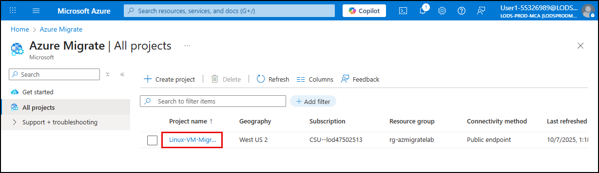

3. [] On the **Linux-VM-Migration** project blade, select **Assessments** under **Decide and plan** in the left menu, and then select the assessment named `LabAssessment`.

    

4. [] The overview blade should show **3 servers** and **2 DB instances** as part of the assessed workloads. If not, select **Recalculate** in the toolbar.

    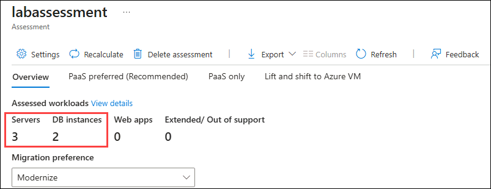

5. [] On the **Assessment** blade, select the **PaaS preferred (Recommended)** tab, then select the **Databases to Azure SQL Database** item.

    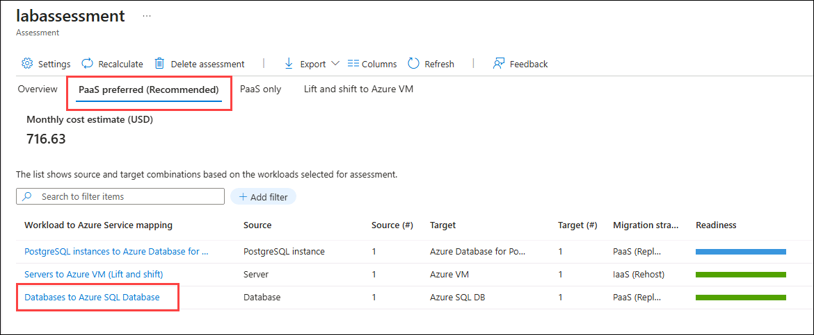

6. [] On the **Databases to Azure SQL Database** blade, select the **AdventureWorksPTO** database to view the detailed assessment report. We will not be migrating the `WideWorldImporters` or `WideWorldImportersDW` databases in this lab.

    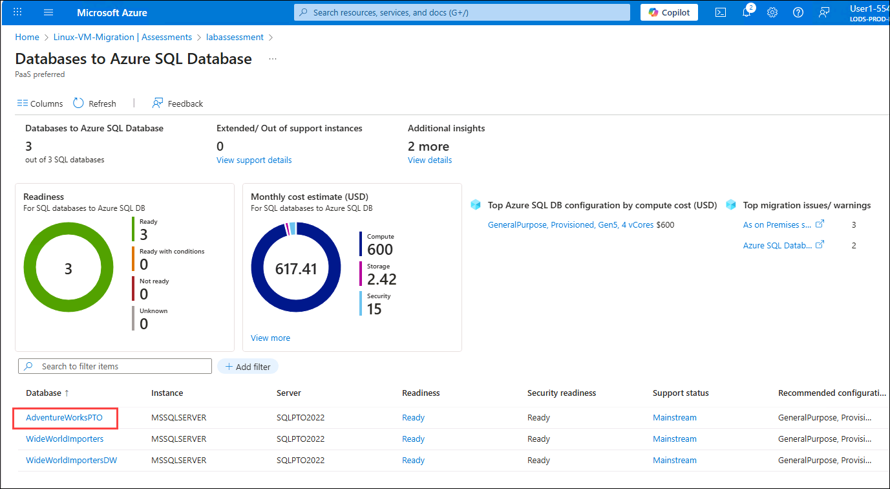

    > **NOTE**: The **AdventureWorksPTO** page in the assessment report includes tabs that provide a summary of the assessment, readiness details, source properties, and target recommendations with estimated monthly total cost of ownership (TCO). Review each tab to understand the assessment findings and any recommendations for migration.

7. [] Select the **Readiness** tab and review any issues or warnings that may impact the migration by selecting the number specified for **Migration warnings**.

    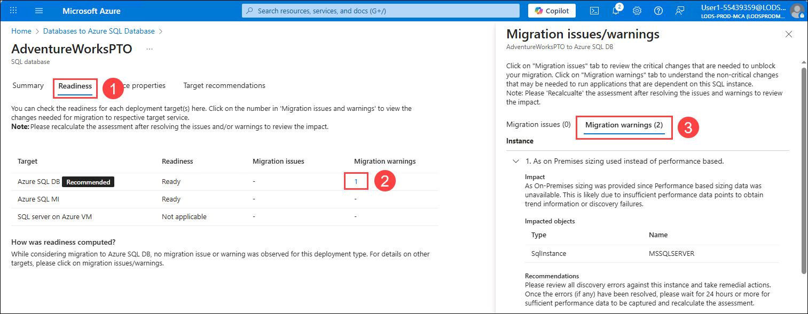

    > **NOTE**: The readiness details will highlight any unsupported features, extensions, or configurations that may require remediation before proceeding with the migration. Review the migration issues and warnings to understand any potential blockers. The final section of the **Migration issues/warnings** dialog provides details about if any databases on the source server have migration blockers.

# Task 2: Create an Azure Database Migration Service

## Introduction

Azure Database Migration Service (DMS) is a fully managed service that enables seamless migrations from on-premises or cloud-hosted databases to Azure data platforms. It supports both offline and online migration modes, allowing organizations to choose between minimal downtime or simplified cutover depending on their operational needs. In this lab, you will use DMS to migrate a SQL Server database to Azure SQL Database.

## Description

In this task, you will provision a new instance of Azure Database Migration Service using the Azure portal. This service will be used to orchestrate the migration of the on-premises SQL Server database to Azure SQL Database. Provisioning the service is a prerequisite for configuring and launching the migration project in later tasks.

## Success criteria

- A new Azure Database Migration Service instance has been successfully created in the correct resource group and region.
- The migration scenario has been configured to support SQL Server to Azure SQL Database.
- The deployment status shows **Succeeded**, and the resource is accessible from the Azure portal.

## Learning resources

- [What is Azure Database Migration Service?](https://learn.microsoft.com/azure/dms/dms-overview)
- [Create a Database Migration Service instance](https://learn.microsoft.com/data-migration/sql-server/database/database-migration-service?toc=%2Fazure%2Fdms%2Ftoc.json&tabs=portal#create-a-database-migration-service-instance)

## Key tasks

In this task, you will provision a new Azure Database Migration Service using the Azure portal.

1. [] Open a web browser on the Lab VM and navigate to the [Azure portal](https://portal.azure.com/).

2. [] Sign in using your lab credentials from the **Resources** tab in the instructions panel.

    

    > **IMPORTANT**: You will be prompted to use a Temporary Access Pass (TAP) for login. This value is also listed on the **Resources** tab.
    >
    > 

3. [] Click **Yes** if prompted to stay signed in.

4. [] On the Azure portal home page, select **Resource groups** under **Azure services**.

    

5. [] Select the **RG-Techsummit** resource group.

    

6. [] On the **RG-Techsummit** blade, note the **Location** of the resource group and its resources, then select **Create** in the toolbar.

    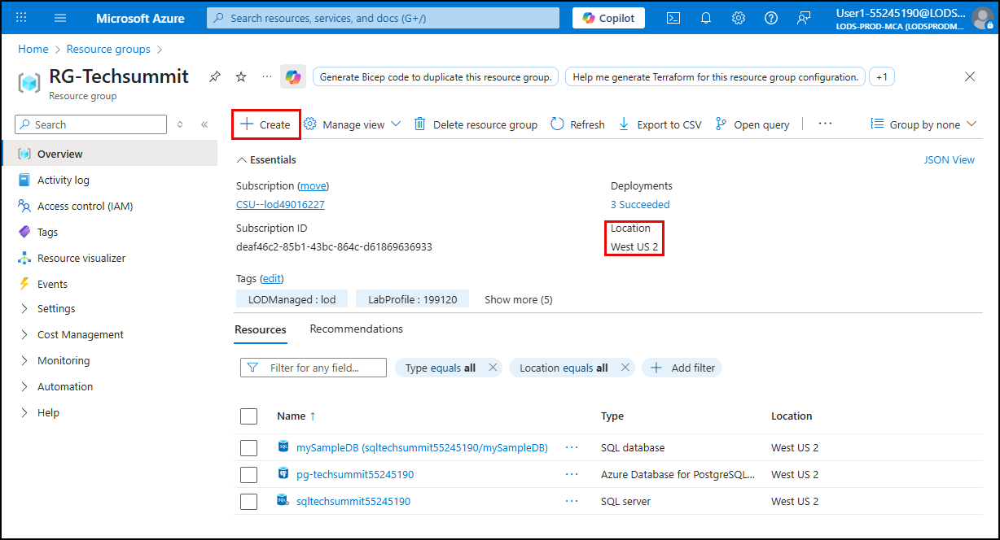

7. [] On the **Marketplace** blade, search for "database migration," and select the **Azure Database Migration Service** from the search results.

    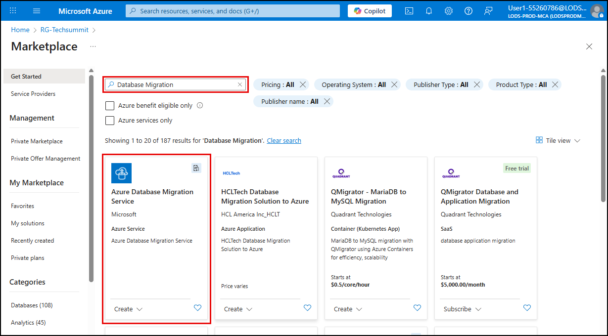

8. [] On the **Azure Database Migration Service** blade, select **Create**.

    

9. [] On the **Select migration scenario and Database Migration Service** page, use the following settings:

    1. [] **Source server type**: `SQL Server`
    2. [] **Target server type**: `Azure SQL Database`
    3. [] **Database Migration Service**: `Database Migration Service`
    4. [] Choose **Select**

    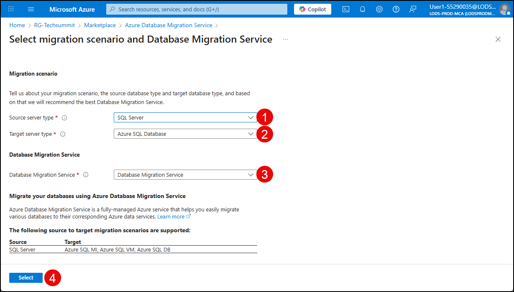

10. [] On the **Basics** tab of the **Create Data Migration Service** blade, enter the following:

    1. [] **Subscription**: Accept the default subscription
    2. [] **Resource group**: Ensure `RG-Techsummit` is selected
    3. [] **Location**: Choose the region noted earlier
    4. [] **Migration service name**: `dms-sql-migration-lab`
    5. [] Select **Review + create**

    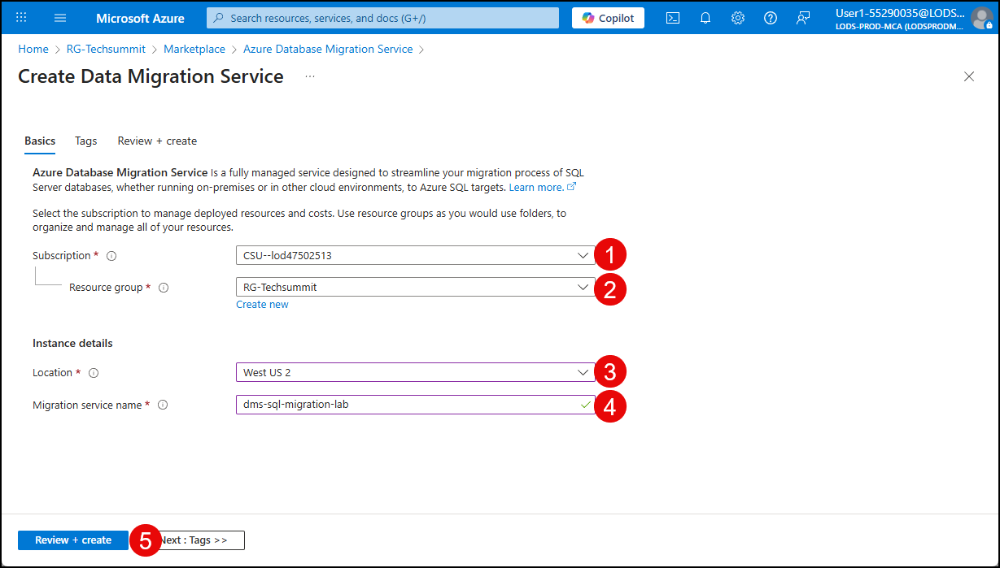

11. [] On the **Review + create** tab, select **Create** to provision the Database Migration Service.

    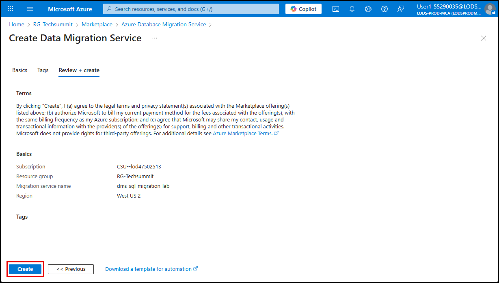

12. [] Monitor the deployment progress and select **Go to resource** when the deployment is complete.

    

===

# Task 3: Configure a self-hosted integration runtime

## Introduction

An Integration Runtime (IR) provides the compute infrastructure used by the Azure Database Migration Service (DMS) to securely move data between source and target environments. A self-hosted integration runtime (SHIR) is required when the source database resides in a private network, such as an on-premises data center or a VM-hosted SQL Server, because it enables secure connectivity between the local environment and Azure.

> **Note**  
> When migrating from SQL Server to Azure SQL Database, a SHIR is required because Azure DMS cannot directly access on-premises SQL Server instances over the public internet. The SHIR acts as a secure bridge, running inside the source network and relaying data to Azure through encrypted channels.

## Description

In this task, you will download and configure the self-hosted integration runtime (SHIR) associated with your Azure Database Migration Service. You will install the SHIR on the Lab VM to allow DMS to connect to the on-premises SQL Server and perform the migration. Once registered, the SHIR will appear in the Azure portal with a status of **Online**, confirming that it is ready to be used in the migration workflow.

## Success criteria

- The self-hosted integration runtime has been successfully installed and registered using the authentication key from Azure DMS.
- The SHIR is running on the Lab VM, enabling secure connectivity to the on-premises SQL Server instance.
- The SHIR node appears in the Azure portal with a status of **Online**, confirming that it is ready to facilitate migration.
- The IP address of the SHIR has been added to the firewall of the Azure SQL database.

## Learning resources

- [Recommendations for using a self-hosted integration runtime for database migrations](https://learn.microsoft.com/azure/dms/migration-using-azure-data-studio?tabs=azure-sql-mi#recommendations-for-using-a-self-hosted-integration-runtime-for-database-migrations)
- [Create a new instance of Database Migration Service](https://learn.microsoft.com/data-migration/sql-server/database/database-migration-service?toc=%2Fazure%2Fdms%2Ftoc.json&tabs=portal#create-a-new-instance-of-database-migration-service)

## Key tasks

1. [] On the Azure Database Migration Service **Overview** blade you opened at the end of the previous task, select **View integration runtime** in the **View integration runtime** tile in the **Getting started** tab.

    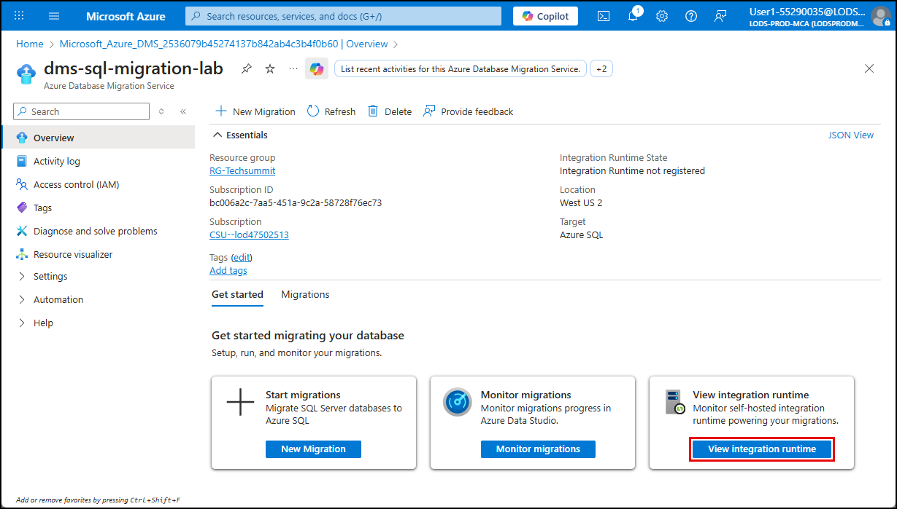

2. [] On the **Integration runtime** blade, select **Configure integration runtime** on the toolbar.

    

    > **NOTE**: Typically you would select the download link for the integration runtime. However, to save time in this exercise, the Microsoft Integration Runtime has already been downloaded into the **Downloads** folder on the Lab VM desktop.

3. On the Lab VM, open **File Explorer** and navigate to the **Downloads** folder. Run the Integration Runtime MSI to install the integration runtime.

    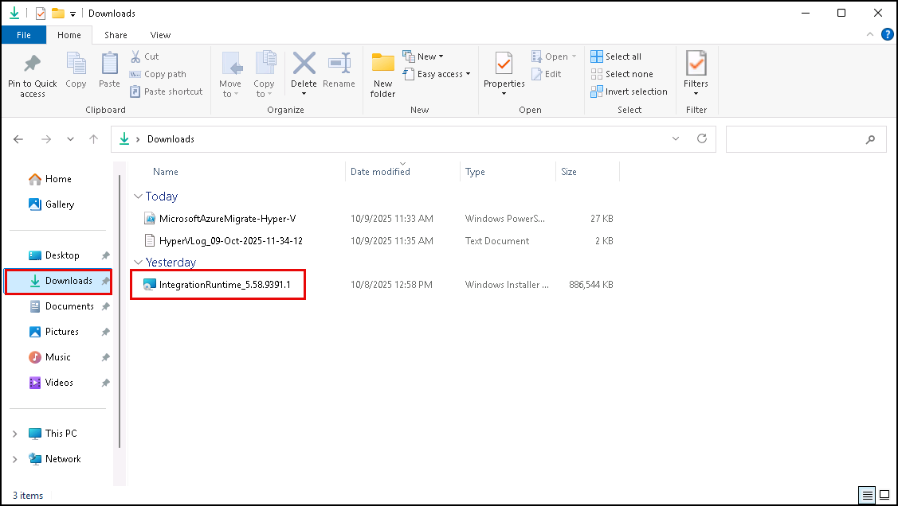

4. [] Complete the installation, accepting the license agreement and default values on each screen. On the final screen, select **Finish**, which will launch the **Microsoft Integration Runtime Configuration Manager**.

5. [] Return to the Azure portal and copy the **Authentication key** from the **Configure integration runtime** dialog (use **key 1**).

    

6. [] Paste the key into the **Authentication key** box in the Configuration Manager and select **Register**.

    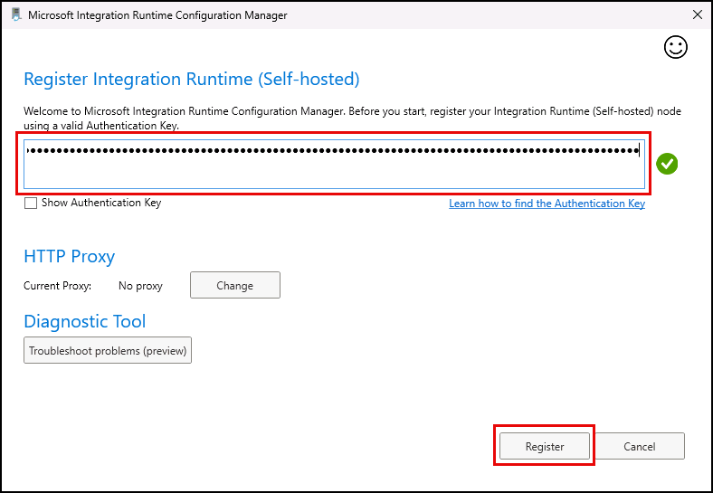

7. [] Select **Finish** on the **New Integration Runtime (Self-hosted) Node** dialog.

    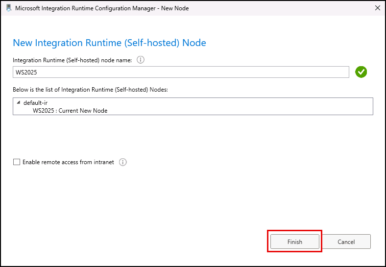

8. [] Confirm that the integration runtime node has been registered successfully.

    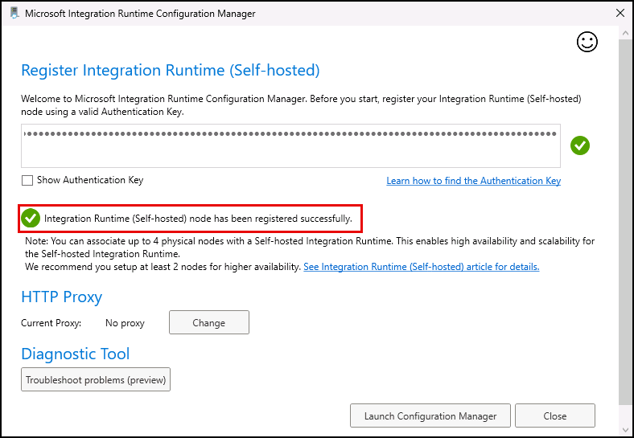

9. [] Select **Close** to exit the Microsoft Integration Runtime Configuration Manager.

10. [] Return to the **Integration runtime** blade in the Azure portal, select **Ok** to close the **Configuration integration runtime** dialog, then select **Refresh** on the **Integration runtime** page and confirm the node status appears as **Online**.

    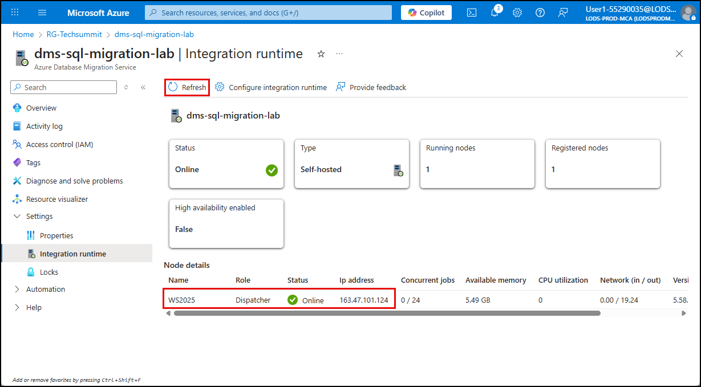

11. [] Before leaving the **Integration runtime** blade, copy the IP address of the SHIR node so it can be added to the firewall of your Azure SQL Server.

    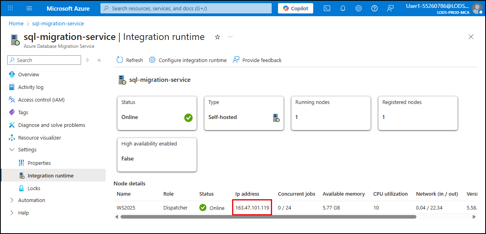

12. To get to your SQL server resource, enter "sql" in the Azure search bar and select your SQL server under **Resources** in the search results.

    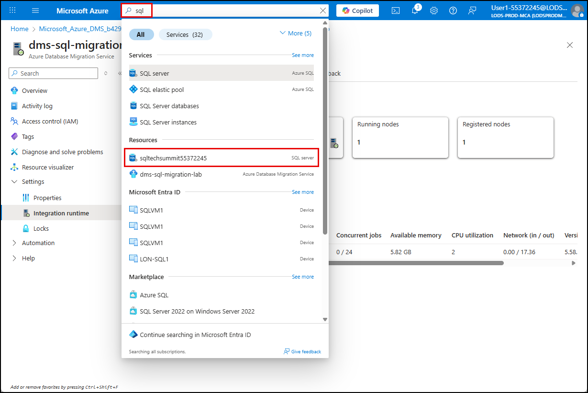

13. On the SQL server blade, expand **Security** in the left menu, select **Networking**, then select **Add a firewall rule**.

    

14. In the **Add a firewall rule** dialog, enter `SHIR` for the rule name, then paste the IP address of your SHIR node into both the start and end IP boxes, and select **OK**.

    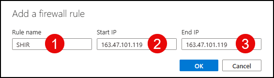

15. Select **Save** on the Network blade to create the firewall rule.

===

# Task 4: Create a migration project

## Introduction

### Additional context: Online migration and real-world networking

While this lab demonstrates an offline migration of SQL Server to Azure SQL Database, it's important to note that online migrations are not currently supported for this specific target platform. Offline migration involves a one-time data and schema transfer, followed by a cutover that typically incurs downtime. This approach is suitable for development, testing, and smaller production workloads where brief downtime is acceptable.

For enterprise scenarios requiring minimal downtime, online migration is supported when targeting Azure SQL Managed Instance or SQL Server on Azure VMs, but not Azure SQL Database. Organizations with high availability requirements should plan for coordinated cutover windows, pre-migration validation, and post-migration testing to minimize disruption.

In real-world environments, networking is often more complex than the lab setup. On-premises SQL Server instances typically connect to Azure through VPN gateways, ExpressRoute circuits, or private endpoints within Azure Virtual Networks (VNets). These configurations ensure secure, high-throughput connectivity between source and target environments. You may also need to configure VNet peering, NSG rules, and firewall exceptions to allow migration traffic. For guidance on networking best practices, refer to [Azure SQL Database connectivity architecture](https://learn.microsoft.com/azure/azure-sql/database/connectivity-architecture?view=azuresql).

## Description

In this task, you will create a new migration project in the Azure Database Migration Service

## Success criteria

## Learning resources

- [Migrate SQL Server to Azure SQL Database (offline)](https://learn.microsoft.com/data-migration/sql-server/database/database-migration-service?toc=%2Fazure%2Fdms%2Ftoc.json&tabs=portal)
- [Azure Database Migration Service supported scenarios](https://learn.microsoft.com/azure/dms/resource-scenario-status)
- [Monitor database migration progress in the Azure portal](https://learn.microsoft.com/azure/dms/migration-using-azure-data-studio?tabs=azure-sql-mi#monitor-database-migration-progress-in-the-azure-portal)

## Key tasks

1. [] Return to the **Azure Database Migration Service** blade in the Azure portal, select the **Overview** item from the left menu, then select **New Migration**.

    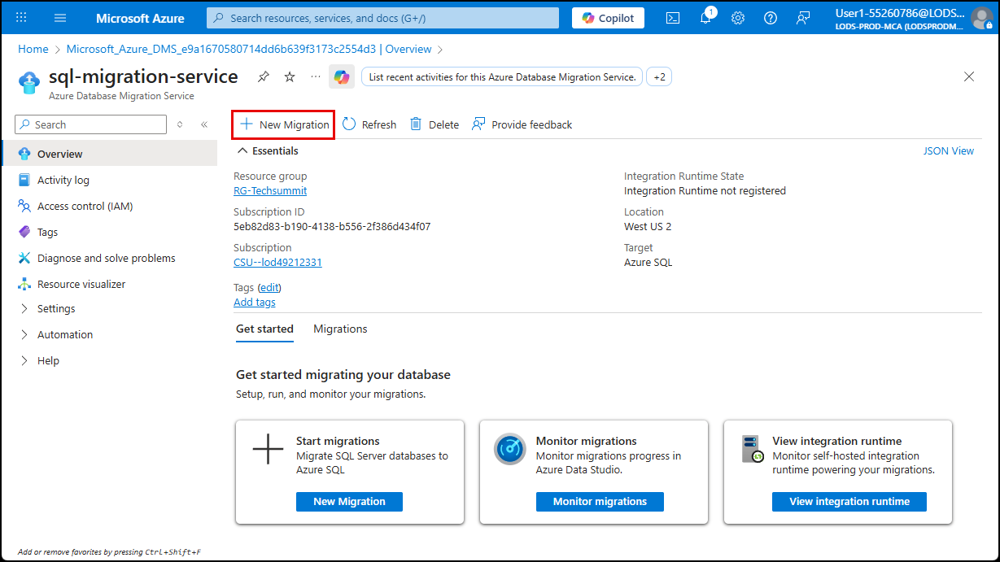

2. On the **Select new migration scenario** blade, choose `Azure SQL Database` for the **Target server type** and select **Select**.

    

3. On the **Source details** of the Azure SQL Database Offline Migration Wizard:

    - **Source Infrastruture Type**: Choose `Virtual Machine`
    - **Location**: Select the location of your `RG-Techsummit` resource group
    - **SQL Server Instance Name**: Enter `SQLPTO2022_SQLPTO`
    - Select **Next: Connect to source SQL Server**

    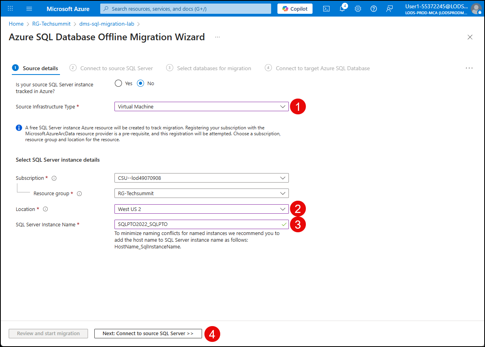

4. On the **Connect to source SQL Server** tab:

    - **Source server name**: Paste the private IP address of the `SQLPTO2022` VM, which you can copy from the `VM_IPs.txt` file on the desktop and the Lab VM.
    - **Authentication type**: Choose `SQL Authentication`
    - **User name**: `sqladmin`
    - **Password**: `Microsoft123`
    - Ensure both **Encrypt connection** and **Trust server certificate** are checked
    - Select **Next: Select databases for migration**

    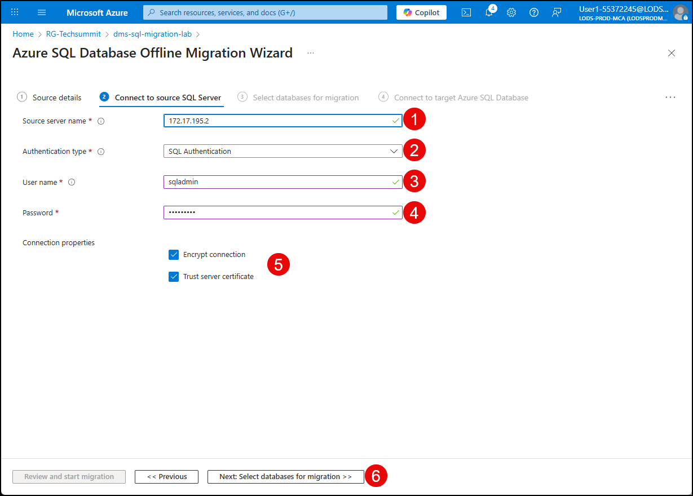

    > If you recieve a **Migration settings validation error**, verify the user name and password, the source server IP address, and that you have added the IP address of the self-hosted integration runtime (SHIR) host to the Azure SQL Server firewall.

5. On the **Select databases for migration** tab, check the box for the **AdventureWorksPTO** database and select **Next: Connect to target Azure SQL Database**.

    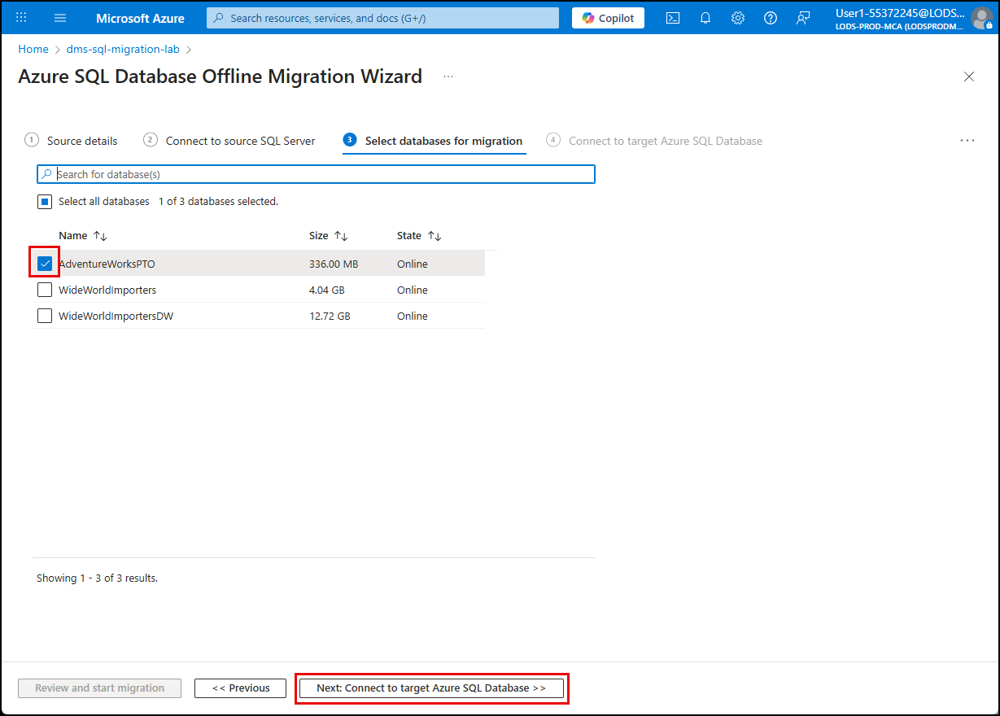

6. On the **Connect to target Azure SQL Database** tab:

    - **Authentication type**: Choose `SQL Authentication`
    - **User name**: `sqladminuser`
    - **Password**: `P@$$w0rd1` TODO: Instruct users to use the password from the lab instructions.
    - Select **Next: Map source and target databases**

    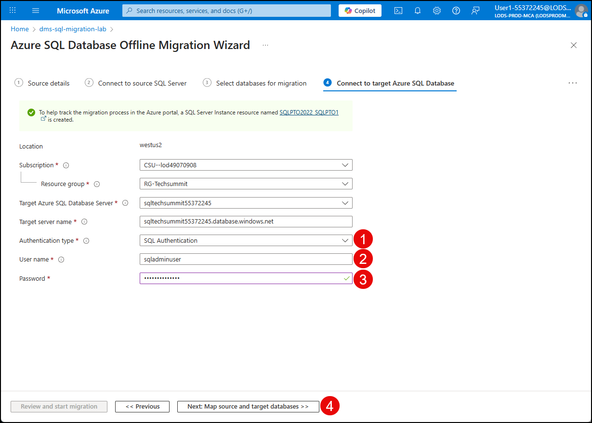

7. On the **Map source and target databases** tab, choose `mySampleDB` as the **Target database** and select **Next: Select database tables to migrate**.

    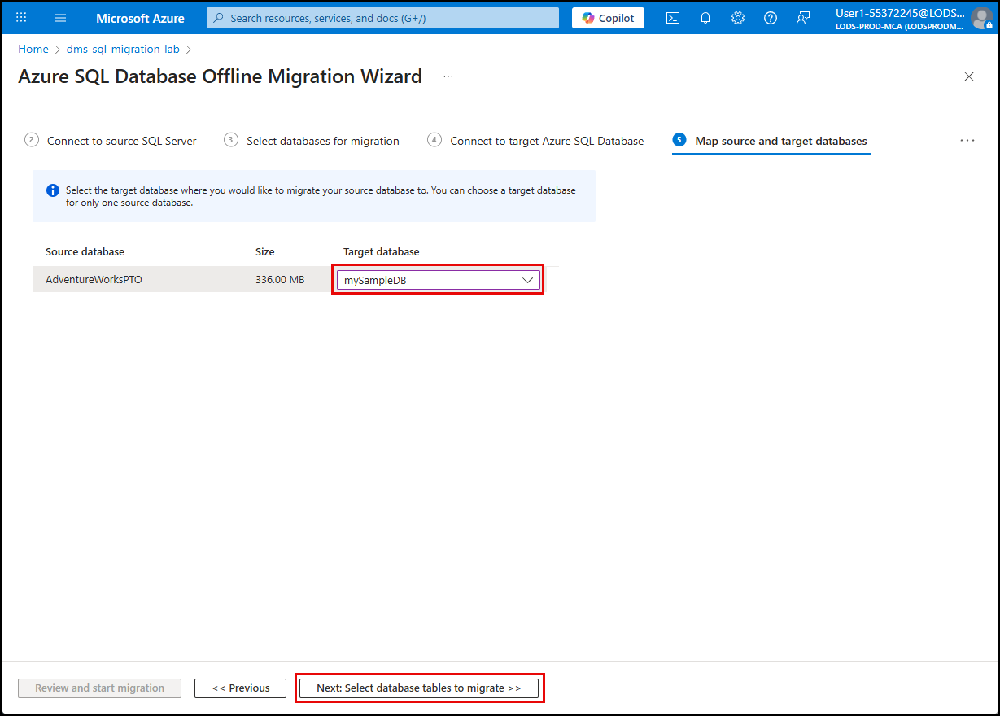

8. On the **Select database tables to migrate** tab, expand the list of AdventureWorksPTO tables to review the tables selected for migration, then select **Next: Database and migration summary**.

    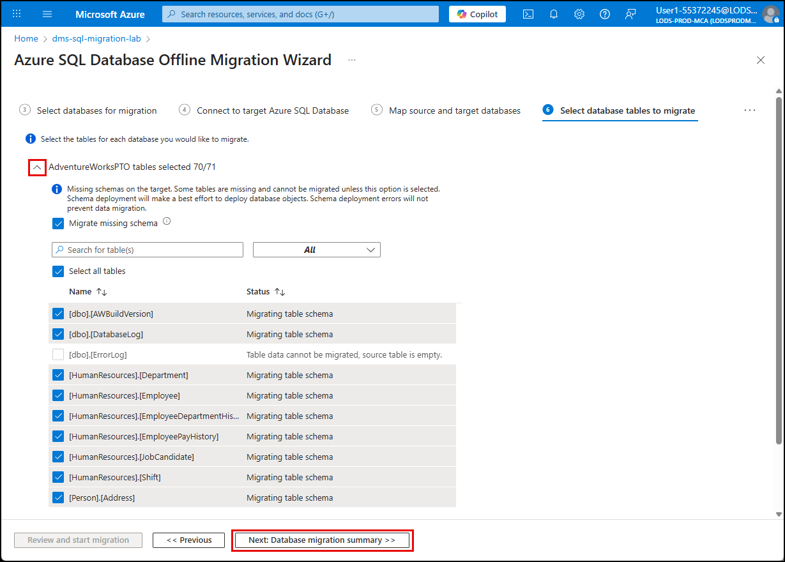

9. On the **Database migration summary** tab, review the migration details and select **Start migration**.

    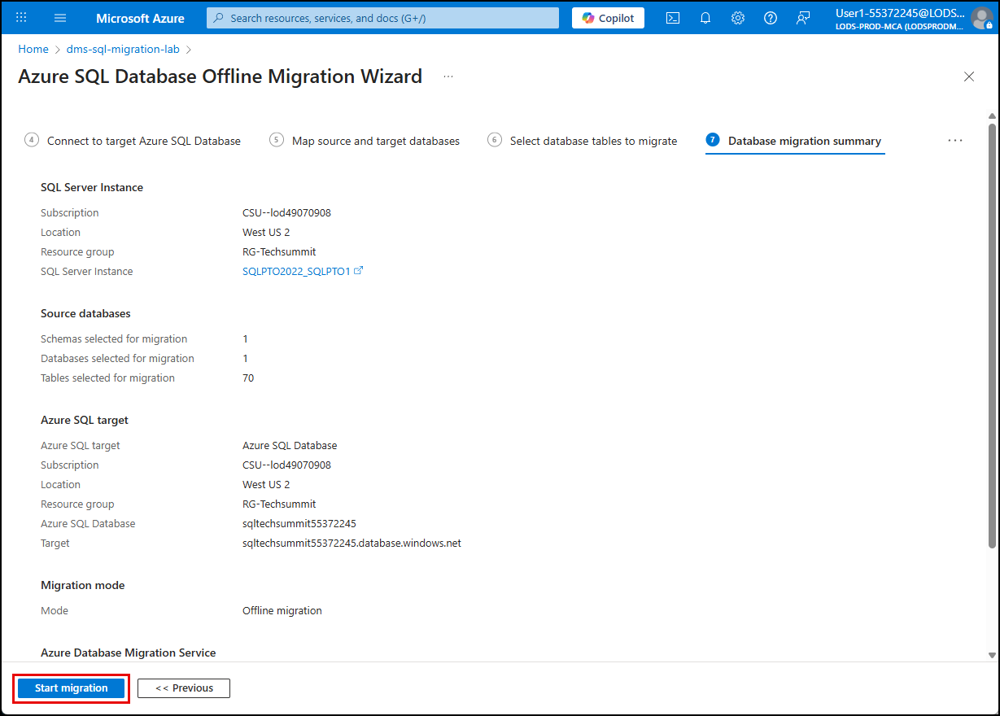

10. On the **Azure Database Migration Service** blade, view the detailed migration report by selecting the IP address in the **Source name** field.

    

11. The migration will take about 12-15 minutes to run. Select **Refresh** in the toolbar on the migration details screen until the migration has completed and shows a status of success.

    **NOTE**: During the migration, you may see warnings related to unsupported features or schema conversion issues. These warnings do not necessarily indicate a failed migration but highlight areas that may require attention post-migration. Hover over **Deployment errors** to view the details about a stored procedure that could not be migrated:

    

    You will see the following when you hover over **Deployment errors**: `Deployed failure: Cannot use a CONTAINS or FREETEXT predicate on table or indexed view 'HumanResources.JobCandidate' because it is not full-text indexed. Object element: [dbo].[uspSearchCandidateResumes].`

    - You can safely ignore this warning for the purposes of this lab, as it does not impact the overall migration success.
    - How you would handle this in the real world: After the migration, you would need to manually recreate the full-text index on the `HumanResources.JobCandidate` table in the Azure SQL Database to restore the functionality of the `uspSearchCandidateResumes` stored procedure. This involves using the `CREATE FULLTEXT INDEX` statement in T-SQL to define the full-text index on the appropriate columns of the table. Finally, you would need to copy the contents of the stored procedure from the source SQL Server and re-create it in the Azure SQL Database.

12. To verify the migration, navigate to the `mySampleDatabase` Azure SQL Database resource in the Azure portal, select the **Query editor (preview)** item in the left naviation menu, enter the password for the `sqladminuser` account in the **SQL server authentication** form, and select **OK**.

    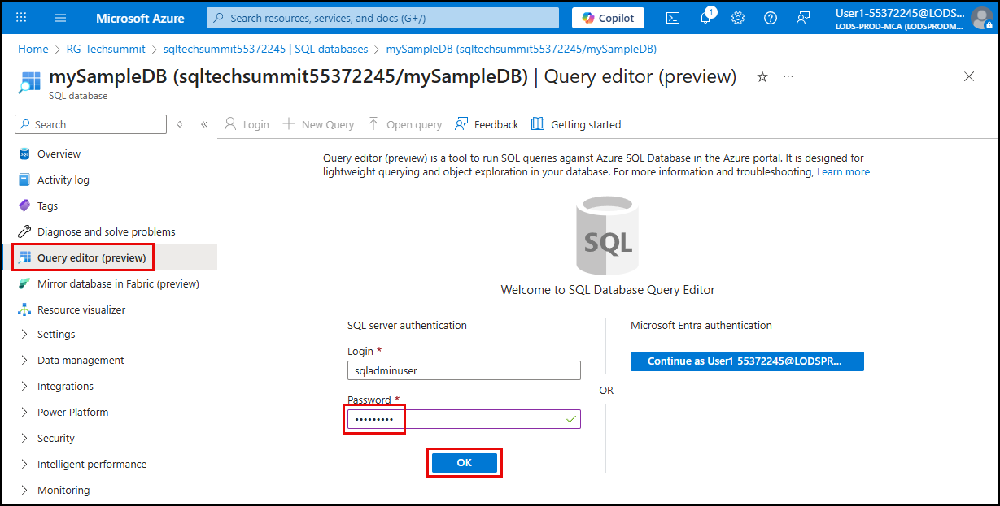

13. Expand the tables folder for `mySampleDB` and observe the `HumanResources` and `Person` tables added by the migration. In the query editor, run the following query and observe the results:

    ```sql
    SELECT * FROM Person.Person
    ```

    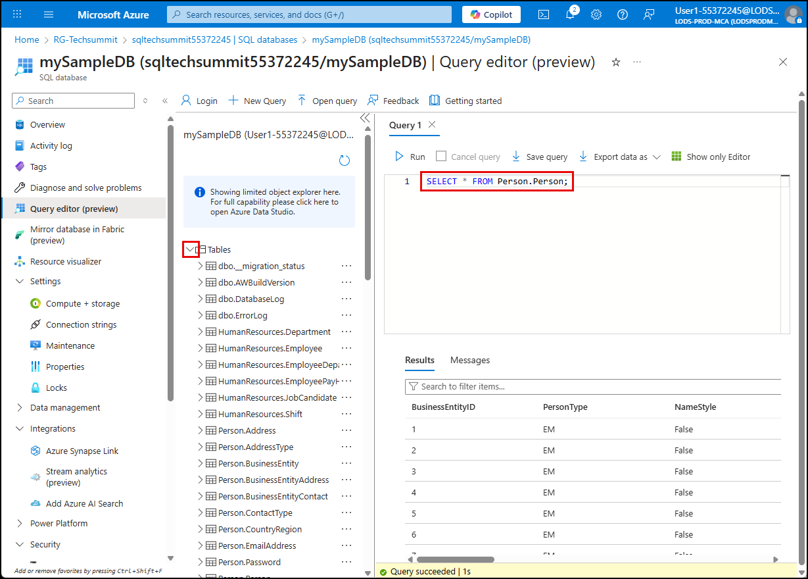

===

# Task 5: Enable Defender for Cloud for Databases

## Introduction

In Microsoft Defender for Cloud, the Defender for Databases plan helps protect your database estate from threats and vulnerabilities. The Defender for Databases plan provides threat protection and security management across cloud environments.

In Microsoft Defender for Cloud, the Defender for Azure SQL Databases plan within Defender for Databases helps you discover and mitigate potential database vulnerabilities. It alerts you to anomalous activities that might indicate a threat to your databases.

When you enable Defender for Azure SQL Databases, all supported resources within the subscription are protected.

## Description

In this task, you will enable SQL vulnerability assessments in Microsoft Defender for Cloud on your newly migrated SQL database.

## Success criteria

## Learning resources

- [SQL server post-migration steps](https://learn.microsoft.com/data-migration/sql-server/database/guide?toc=%2Fazure%2Fazure-sql%2Ftoc.json&bc=%2Fazure%2Fbread%2Ftoc.json&view=azuresql#post-migration)
- [Overview of Microsoft Defender for Databases](https://learn.microsoft.com/azure/defender-for-cloud/defender-for-databases-overview)
- [Overview of Microsoft Defender for Azure SQL Databases](https://learn.microsoft.com/azure/defender-for-cloud/defender-for-sql-introduction)
- [SQL Advanced Threat Protection](https://learn.microsoft.com/azure/azure-sql/database/threat-detection-overview)

## Key tasks

1. Navigate to the `mySampleDB` Azure SQL Database resource in the Azure portal and select **Microsoft Defender for Cloud** under Security in the left navigation menu.

2. Select **Enable SQL vulnerability assessment** under **Enablement Status**.

    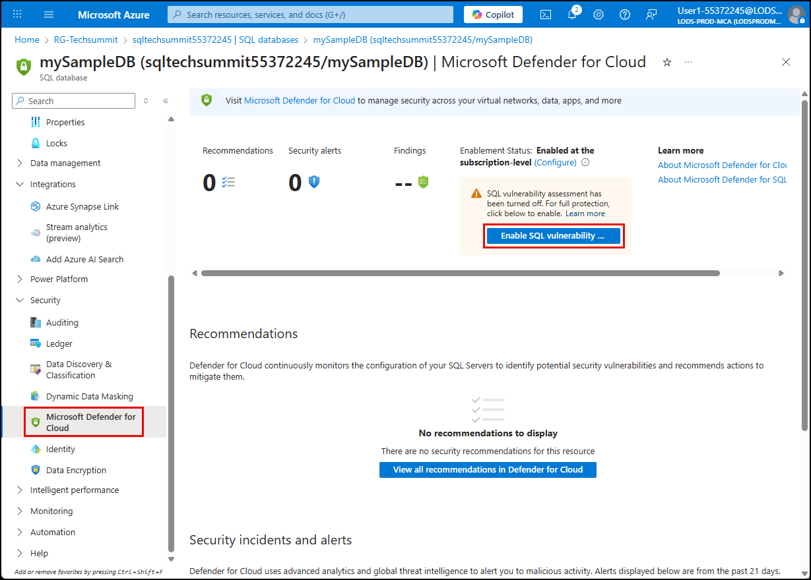

3. After vulnerability assessments are enabled, scroll down on the page and select the **View additional findings in Vulnerability Assessment** link.

    

4. On the **Vulnerability Assessment** page, select **Scan** on the toolbar, then select **Refresh** when you get a notification that the scan has completed.

    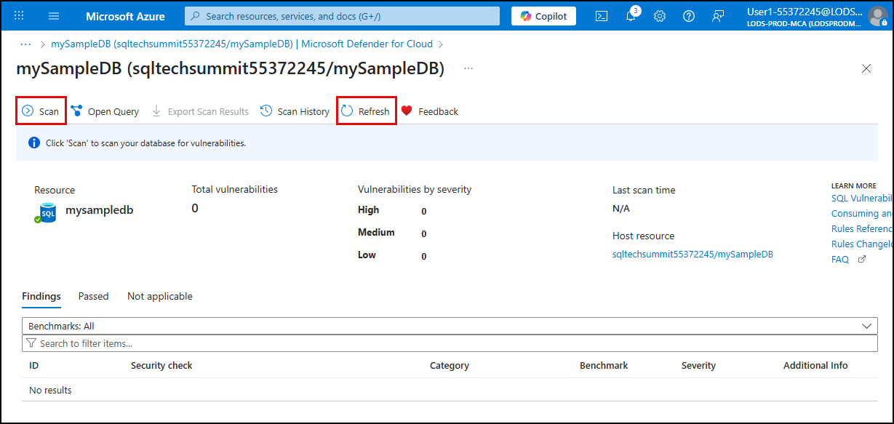

5. Review the assessment by selecting the **Findings** and **Passed** tabs and reviewing the items listed.

    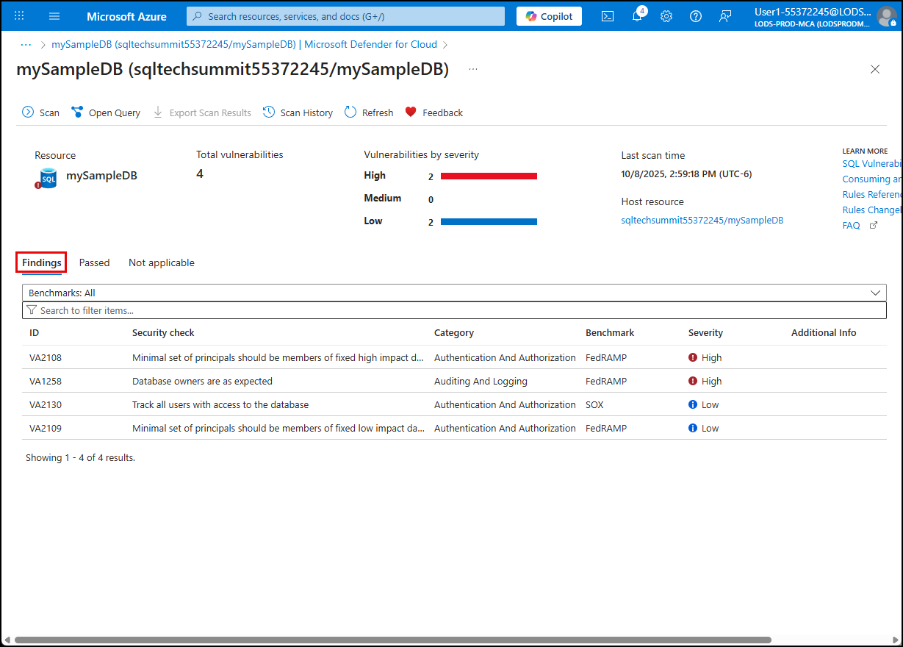

    
