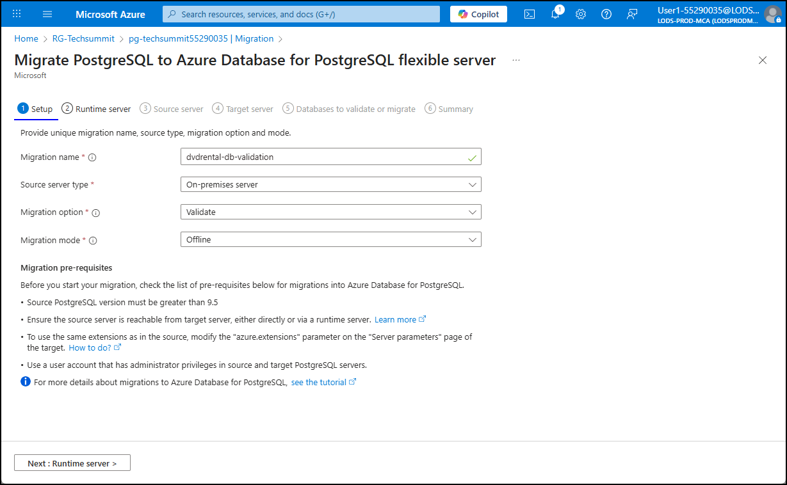
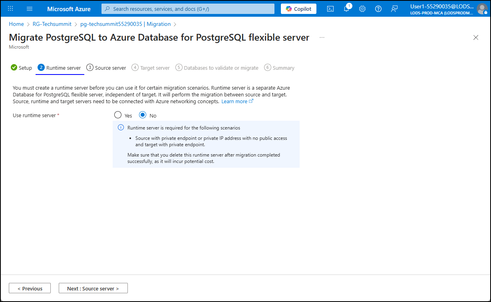
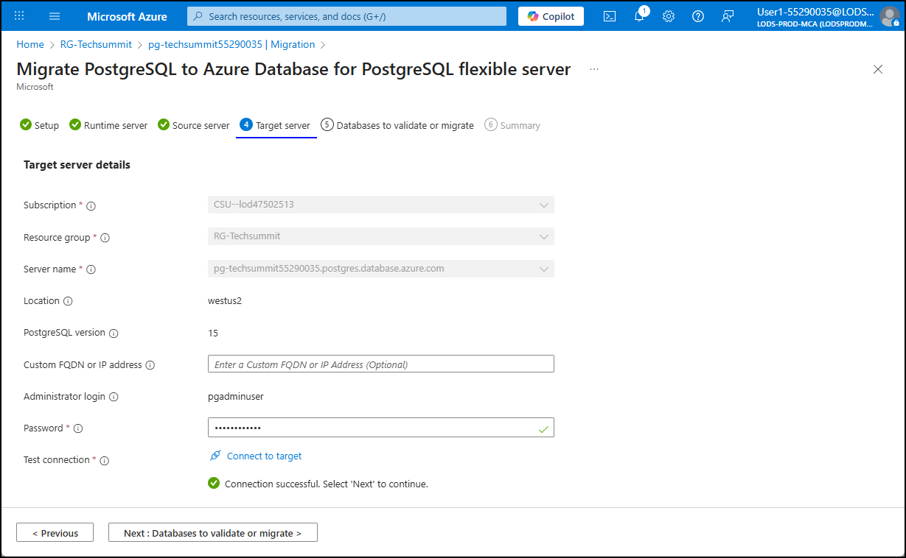
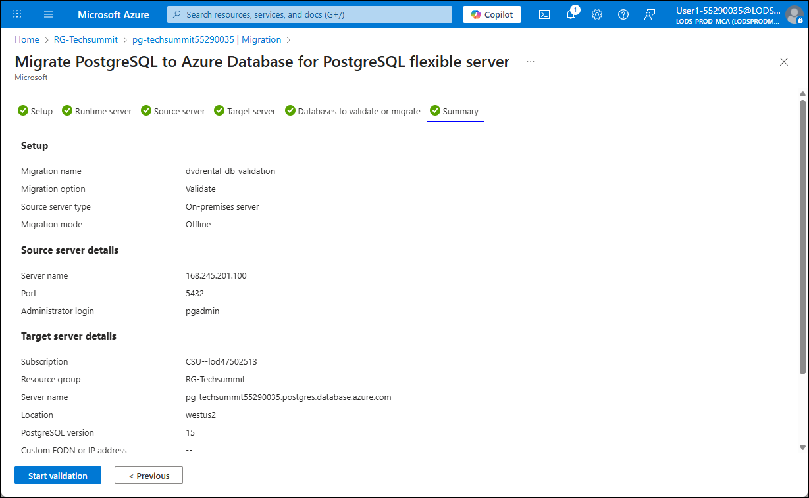
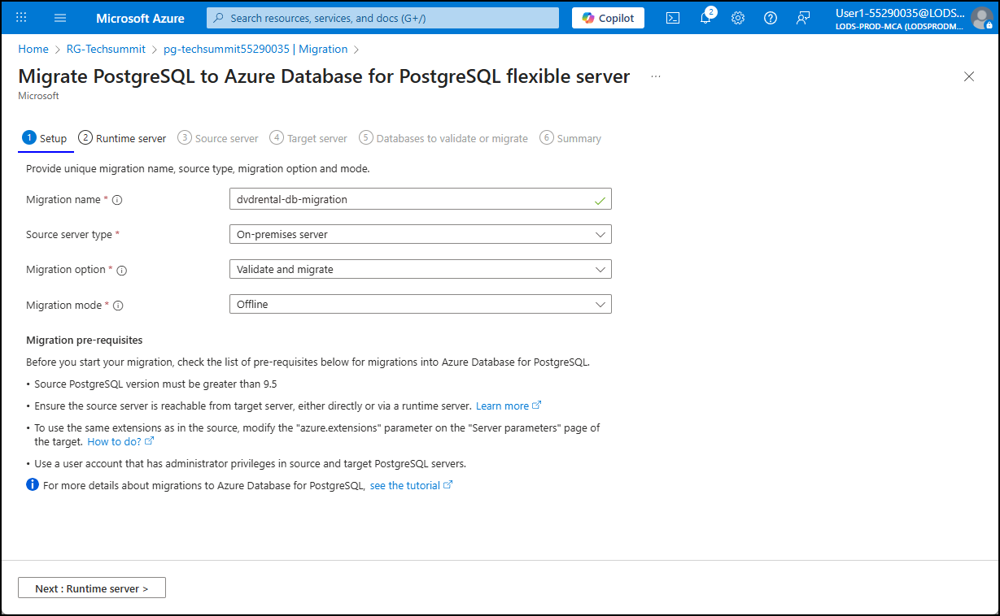
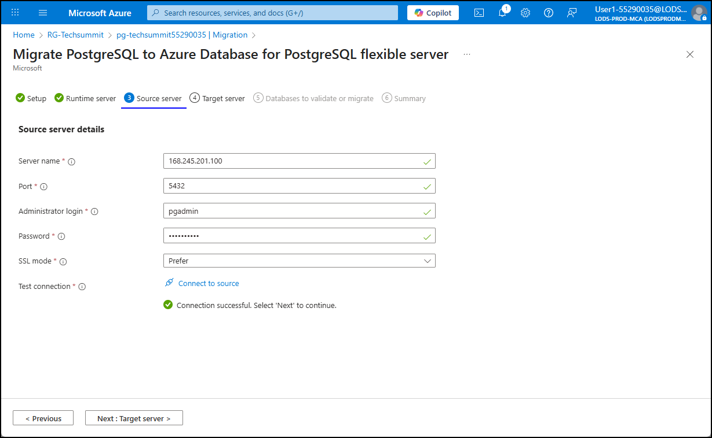
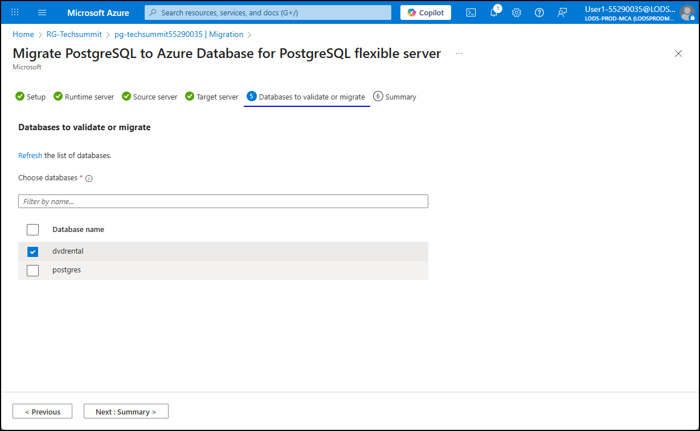

# Exercise 2: PostgreSQL migration to Azure Database for PostgreSQL Flexible Server

TODO: Provide introduction to this aspect of the scenario.

Contoso Inc. wants to take advantage of the security, performance and scalability of Azure by migrating their [INSERT_NAME] application. To accommodate this, they first need to move the `dvdrental` database used by the application from their on-premises PostgreSQL server to an instance of Azure Database for PostgreSQL - Flexible Server.

In this exercise, you will use the [migration service in Azure Database for PostgreSQL](https://learn.microsoft.com/azure/postgresql/migrate/migration-service/overview-migration-service-postgresql) to move the PostgreSQL database to Azure.

TODO: Create a simplified migration image (on-premises VM running PostgreSQL --> Managed service built into Azure Database for PostgreSQL - Flexible Server --> Azure Database for PostgreSQL flexible server)

## Task 1: Verify migration readiness

The migration service in Azure Database for PostgreSQL has several prerequisite requirements that should be reviewed before beginning any migration.

1. The source PostgreSQL server version must be greater than 9.5.

    > **Note**
    > If you need to migrate a PostgreSQL database running on a server version less than 9.5, you must upgrade it before migration.

2. The source server must be reachable from target server, either directly or via a runtime server.
3. The target server must be configured to use the same extensions and server parameters as in the source.

In this task, you will verify that each of the above prerequisites have been met.

### Subtask 1: Check source PostgreSQL server version

The migration service in Azure Database for PostgreSQL supports migrations of databases running on PostgreSQLserver version greater than 9.5.

> **Note**
> If you need to migrate a PostgreSQL database running on a server version less than 9.5, you must upgrade it before migration.

1. To verify the version of PostgreSQL server running on the `LinuxLabVM-CentOS-7-PostGreSQL` VM, you will use the VM's IP address to connect using PuTTY. You can find the IP address in the `VM_IPs.txt` file located on the Lab VM's desktop.

    

2. From the `VM_IPs.txt` file, copy the **private IP** address of the `LinuxLabVM-CentOS-7-PostGreSQL` VM.

    

3. Connect to the VM by opening **PuTTY** from the Lab VM's desktop or Start menu, pasting the private IP address of the `LinuxLabVM-CentOS-7-PostGreSQL` VM into the **Host Name (or IP address)** box in the PuTTY Configuration dialog, and selecting the **Open** button.

    

4. In the PuTTY console, login using the following credentials:

   - **Login**: root
   - **Password**: Pa$$w0rd

5. From the PuTTY command line, you will use the `psql` client to log into the `dvdrental` PostgreSQL database and verify the server version. Before that, however, it is useful to verify the installation of `psql`. Run the following command to check its version and ensure it is installed:

    ```bash
    psql --version
    ```

6. Connect to the `dvdrental` database on the PostgreSQL server by running the following `psql` command:

    > **IMPORTANT**:
    > Before running, ensure you replace the `<PRIVATE_IP_OF_YOUR_POSTGRESQL_SERVER>` token in the command with the private IP address of the `LinuxLabVM-CentOS-7-PostGreSQL` VM you copied above.

    ```bash
    psql -h <PRIVATE_IP_OF_YOUR_POSTGRESQL_SERVER> -U pgadmin -d dvdrental
    ```

7. When prompted, enter "pgadmin123" for the password for the **pgadmin** user.

8. At the `dvdrental` database prompt, run the following query to retrieve the version of the PostgreSQL server:

    ```sql
    SELECT version();
    ```

    The output from the version query should look like:

    ```bash
                                                     version
    ----------------------------------------------------------------------------------------------------------
     PostgreSQL 14.19 on x86_64-pc-linux-gnu, compiled by gcc (GCC) 4.8.5 20150623 (Red Hat 4.8.5-44), 64-bit
    ```

### Subtask 2: Ensure connectivity between source and target PostgreSQL servers

When dealing with on-premises or VM-hosted PostgreSQL servers, the PostgreSQL Client Authentication Configuration file (`pg_hba.conf`) is typically used to manage and configure which hosts are allowed to connect to the server, what databases and users they can access, and the authentication methods they can use.

1. From the open database connection at the PuTTY terminal on the Lab VM, run the following command to get the location of the `pg_hba.conf` file.

    ```sql
    SHOW hba_file;
    ```

2. Copy the file path from the output, which should be `/var/lib/pgsql/14/data/pg_hba.conf`.

3. You need to disconnect from the `dvdrental` database to run the next command. Run the following command to close the database connection:

    ```sql
    \q
    ```

4. At the PuTTY command prompt, run the following to view the contents of the `pg_hba.conf` file, replacing the `<YOUR_HBA_FILE_LOCATION>` token with the file path you copied above.

    ```bash
    cat <YOUR_HBA_FILE_LOCATION>
    ```

    The database server has already been configured to allow connections from the target server, so you should see `host` records in the output of the above `cat` that resemble the following:

    ```bash
    # TYPE  DATABASE        USER            ADDRESS                 METHOD
    
    # "local" is for Unix domain socket connections only
    local   all             all                                     md5
    # IPv4 local connections:
    host    all             all             127.0.0.1/32            scram-sha-256
    # IPv6 local connections:
    host    all             all             ::1/128                 scram-sha-256
    # Allow replication connections from localhost, by a user with the
    # replication privilege.
    local   replication     all                                     peer
    host    replication     all             127.0.0.1/32            scram-sha-256
    host    replication     all             ::1/128                 scram-sha-256
    host    all     all             0.0.0.0/0                 md5
    
    ```

### Subtask 3: Prepare the target Azure Database for PostgreSQL flexible server

Before beginning any PostgreSQL migration, the target Azure Database for PostgreSQL flexible server must be configured to use the same extensions and server parameters as the source. Extensions and server parameters are supported in Azure Database for PostgreSQL, but must be enabled manually.

Extensions in PostgreSQL are modular packages that add functionality such as new data types, functions, or indexing methods without changing the core database engine. Server parameters are configuration settings that control database behavior, performance, security, and resource usage at the system or session level.

1. To view the extensions installed in the on-premises PostgreSQL server, reconnect to the `dvdrental` database in the PuTTY terminal window by running the following `psql` command:

    > **IMPORTANT**:
    > Before running, ensure you replace the `<PRIVATE_IP_OF_YOUR_POSTGRESQL_SERVER>` token in the command with the private IP address of the `LinuxLabVM-CentOS-7-PostGreSQL` VM you copied above.

    ```bash
    psql -h <PRIVATE_IP_OF_YOUR_POSTGRESQL_SERVER> -U pgadmin -d dvdrental
    ```

2. When prompted, enter "pgadmin123" for the password for the **pgadmin** user.

3. To list all installed extensions in the PostgreSQL database, you can use the `\dx` meta-command in `psql` or query the `pg_extension` catalog. At the `dvdrental` command prompt in the PuTTY terminal, run the following command:

    ```bash
    \dx
    ```

    > The `\dx` command is a meta-command in `psql` that retrieves the list of installed extensions along with their details such as name, version, schema, and description.

    The output of the `\dx` command should show a single installed extension:

    ```bash
                     List of installed extensions
      Name   | Version |   Schema   |         Description
    ---------+---------+------------+------------------------------
     plpgsql | 1.0     | pg_catalog | PL/pgSQL procedural language
    ```

    > **NOTE**: You can alternatively get the list of installed extensions by running the `SELECT extname, extversion FROM pg_extension;` query.

4. Next, you need to configure any required extensions.

5. To install the require extension on the target server, open a new web browser window and navigate to the [Azure portal](https://portal.azure.com/) on the Lab VM.

6. Sign into Azure with your lab user credentials, found on the **Resources** tab in the lab instructions panel.

    

    > **IMPORTANT**: By default, you will be prompted to use a TAP (Temporary Access Pass) when logging in. You can find this* value on the **Resources** tab in the instructions panel with the **TAP** label.
    >
    > 

7. Click **Yes** if prompted to stay signed in.

8. On the Azure portal home page, select **Resource groups** under **Azure services**.

    

9. On the Resource groups page, select the **RG-Techsummit** resource group.

    

10. Select the **Azure Database for PostgreSQL flexible server** resource on the **RG-Techsummit** page.

    

11. To add the `plpgsql` extension to the Azure Database for PostgreSQL flexible server:

    1. Select **Server parameters** under **Settings** in the left menu of the Azure Database for PostgreSQL flexible server blade.
    2. Enter "azure.extensions" into the search filter box.
    3. Check the box next to the **PLPGSQL** extension in the dropdown list.
    4. Select **Save** on the toolbar.

    

> Server parameters are not automatically migrated to the target environment and must be manually configured. To match server parameter values from the source PostgreSQL database to the Azure Database for PostgreSQL, you must access the "Server parameters" section in the Azure portal and manually updates values accordingly. For this lab, there are no additional server parameters that must be configured, but you can view the server parameters on the source server by running the following query:
>
> ```sql
> SELECT name, setting, source, sourcefile, sourceline FROM pg_settings WHERE source = 'configuration file';
>  ```
>
> To ensure a smooth migration process, it is also essential that the target Azure Database for PostgreSQL flexible server have the high availability (reliability) and read replicas features disabled. Once the migration is complete and the database is stable, you can proceed to enable these features to enhance the availability and scalability of your database environment in Azure. For this lab, those features are already disabled.

## Task 2: Validate the source database

In this task, you use the migration service to validate that the source database is able to be migrated.

1. On the Azure Database for PostgreSQL flexible server blade in the Azure portal, select **Migration** from the left menu and select **Create**.

    

2. On the **Setup** tab of the **Migrate PostgreSQL to Azure Database for PostgreSQL flexible server** dialog, enter the following values:

    - **Migration name**: Enter "dvd-rental-db-validation".
    - **Source server type**: Select **On-premises server** from the list.
    - **Migration option**: Select **Validate**.
    - **Migration mode**: Select **Offline**.
    - Select **Next: Runtime server >** to move to the next tab.

    

3. On the **Runtime server** tab, leave the default selection of **No** for **Use runtime server** and select **Next: Source server >**

    

4. On the **Source server** tab, enter the following values:

    - **Server name**: Enter the public IP address of the `LinuxLabVM-CentOS-7-PostGreSQL` VM, which you can retrieve from the `VM_IPs.txt` file on the Lab VM.

        

    - **Port**: Enter "5432".
    - **Administrator login**: Enter "pgadmin".
    - **Password**: Enter "pgadmin123".
    - **SSL mode**: Leave **Prefer** selected.
    - Select **Connect to source** and ensure you recieve the **Connection successful** message.
    - Select **Next: Target server >**.

    

5. On the **Targer server** tab, enter the **Password** for your lab user account, found on the **Resource** tab of the lab instructions panel.

    

6. On the **Databases to validate and migrate** tab, select the `dvdrental` database and select **Next: Summary >**.

    

7. On the **Summary** tab, review the validation configuration, then select **Start validation**.

    

8. Monitor the progress of the validation on the **Migration** page.

    TODO: Need proper screenshots when this actually works...

## Task 3: Migrate the database

In this task, you use the migration service to migrate that the source database to Azure Database for PostgreSQL flexible server.

1. On the Azure Database for PostgreSQL flexible server blade in the Azure portal, select **Migration** from the left menu and select **Create**.

    

2. On the **Setup** tab of the **Migrate PostgreSQL to Azure Database for PostgreSQL flexible server** dialog, enter the following values:

    - **Migration name**: Enter "dvd-rental-db-migration".
    - **Source server type**: Select **On-premises server** from the list.
    - **Migration option**: Select **Validate and migrate**.
    - **Migration mode**: Select **Offline**.
    - Select **Next: Runtime server >** to move to the next tab.

    

3. On the **Runtime server** tab, leave the default selection of **No** for **Use runtime server** and select **Next: Source server >**

    

4. On the **Source server** tab, enter the following values:

    - **Server name**: Enter the public IP address of the `LinuxLabVM-CentOS-7-PostGreSQL` VM, which you can retrieve from the `VM_IPs.txt` file on the Lab VM.

        

    - **Port**: Enter "5432".
    - **Administrator login**: Enter "pgadmin".
    - **Password**: Enter "pgadmin123".
    - **SSL mode**: Leave **Prefer** selected.
    - Select **Connect to source** and ensure you recieve the **Connection successful** message.
    - Select **Next: Target server >**.

    

5. On the **Targer server** tab, enter the **Password** for your lab user account, found on the **Resource** tab of the lab instructions panel.

    

6. On the **Databases to validate and migrate** tab, select the `dvdrental` database and select **Next: Summary >**.

    

7. On the **Summary** tab, review the validation configuration, then select **Start validation**.

    

8. Monitor the progress of the validation and migration on the **Migration** page.

    TODO: Need proper screenshots when this actually works...

## Task 4: Verify the migration

TODO: Run a simple query to verify the database exists and that the data was migrated correctly.

```sql
SELECT * FROM film LIMIT 5;
```
