# Exercise 3: Enable replication of Linux VM to App Service Plan

In this exercise, you will deploy an App Service Plan in Azure and migrate a web application to the App Service Plan. You will then configure the web application to connect to the migrated PostgreSQL database.

## Objectives

After you complete this exercise, you will be able to:

- Deploy an App Service Plan in Azure.
- Deploy a web application to the App Service Plan.
- Migrate the web application so that it is hosted in the App Service in Azure.
- Configure the web application to connect to the migrated PostgreSQL database.
- Validate that the web application is functioning correctly.

## Duration

**Estimated time**: 45 minutes

===

# Task 1: Provision Azure App Service and deploy web application

## Introduction

In the previous exercises, you migrated a PostgreSQL database from an on-premises Linux VM to Azure Database for PostgreSQL - Flexible Server. In this task, you will provision an Azure App Service Plan and deploy a web application to it. This will involve creating the necessary resources in Azure and configuring the web application to run in the App Service environment.

## Description

In this task, you will use the Azure CLI in the Cloud Shell to deploy a web application to an App Service Plan in Azure. The web application code is hosted in a public GitHub repository. You will clone the repository, then use the `az webapp up` command to deploy the web application to an App Service Plan in your existing Resource Group named `RG-Techsummit`. The web application will be deployed using the PHP 8.2 runtime on Linux.

## Success criteria

- The App Service Plan is provisioned successfully.
- The web application is deployed to the App Service Plan and is accessible.

## Learning resources

- [az webapp up CLI command](https://learn.microsoft.com/cli/azure/webapp?view=azure-cli-latest#az-webapp-up)

## Key tasks

1. [] Open a web browser on the Lab VM and navigate to the [Azure portal](https://portal.azure.com/).

2. [] Sign in using your lab credentials from the **Resources** tab in the instructions panel.

    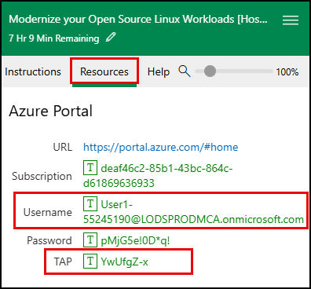

    > **IMPORTANT**: You will be prompted to use a Temporary Access Pass (TAP) for login. This value is also listed on the **Resources** tab.
    >
    > 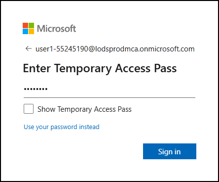

3. [] Click **Yes** if prompted to stay signed in.

4. [] In the Azure portal, open **Cloud Shell** from the top-right corner of the portal.

    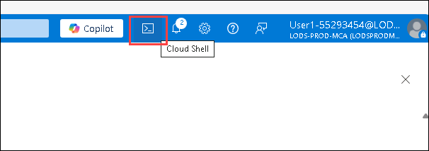

5. [] In the Cloud Shell, ensure that you are using the Bash environment. If not, switch to Bash by clicking on the **Bash** icon.

    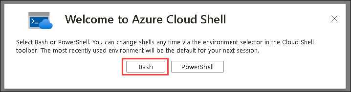

6. [] In the **Getting started** dialog, select **No storage account required**, select the only available **Subscription**, then select **Apply**.

    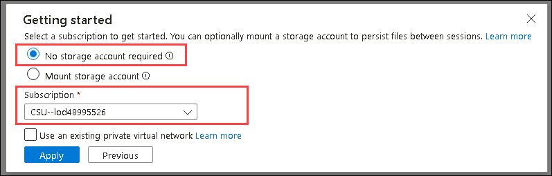

7. [] In the Cloud Shell, run the following command to clone the repository containing the web application code:

    ```bash
    git clone https://github.com/Tahubu-AI/microsoft-tmw-linux-migration-files.git
    ```

    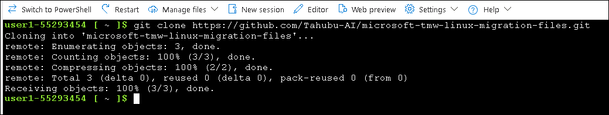

8. [] Change to the directory containing the web application code:

    ```bash
    cd microsoft-tmw-linux-migration-files
    ```

9. [] Execute the following `az webapp up` command to deploy the web application to an App Service in Azure. This will provision a new App Service Plan and a new Web App in your existing Resource Group named `RG-Techsummit`. The web application will be deployed using the PHP 8.2 runtime on Linux and be provided a generated name. You can customize the name by using the `--name` parameter.

     > **Note**: The first time you run the `az webapp up` command, it may take several minutes to complete as it provisions the necessary resources in Azure.

    ```bash
    az webapp up --resource-group "RG-Techsummit" --runtime "PHP:8.2" --os-type=linux
    ```

    After the command completes, you will see output similar to the following, indicating that the web application has been successfully deployed:

    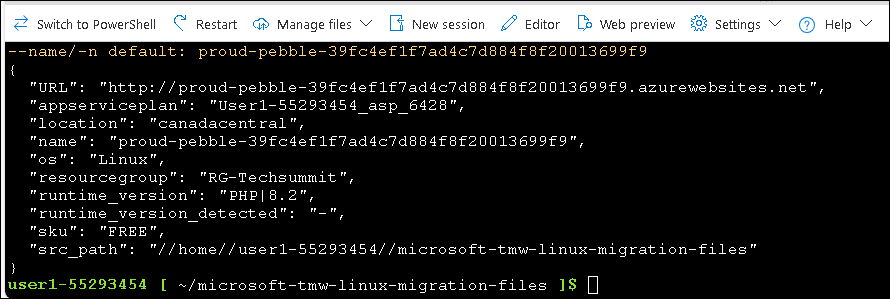

10. [] After the deployment is complete, navigate to the **RG-Techsummit** resource group in the Azure portal. You should see a new App Service Plan and a new Web App created.

    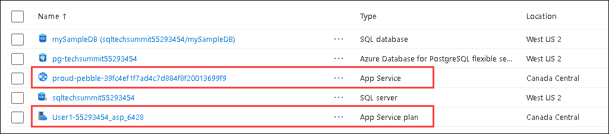

# Task 2: Configure web application to connect to PostgreSQL database

## Introduction

In the previous task, you deployed a web application to an App Service Plan in Azure. However, it is still configured to connect to a PostgreSQL database hosted on an on-premises Linux VM. In this task, you will update the web application's configuration to connect to the PostgreSQL database that you migrated to Azure Database for PostgreSQL - Flexible Server in Exercise 2.

## Description

In this task, you will update the web application's configuration file to connect to the PostgreSQL database hosted in Azure Database for PostgreSQL - Flexible Server. You will retrieve the necessary connection details from the Azure portal and modify the configuration file accordingly.

## Success criteria

- The web application is configured to connect to the PostgreSQL database in Azure Database for PostgreSQL - Flexible Server.
- The web application is functioning correctly and can retrieve data from the database.

## Key tasks

1. [] In the Azure portal, navigate to the **RG-Techsummit** resource group and select the PostgreSQL server.

    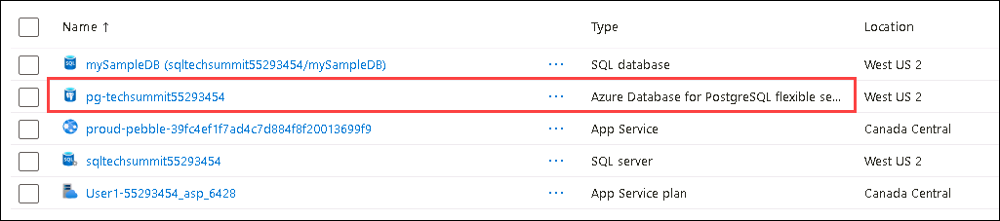

2. [] In the PostgreSQL server overview, copy the **Endpoint**. You will need this to configure the web application.

    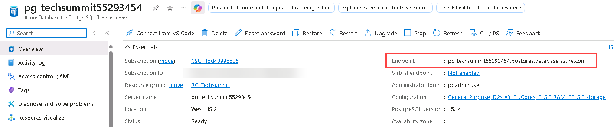

    **TODO:** Provide the textbox widget to store the endpoint value.

    ```plaintext
    [ Textbox widget here ]
    ```

3. [] Expand the **Settings** section in the left-hand menu and select **Networking**.

    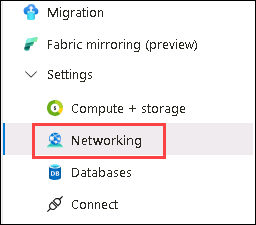

4. [] In the **Networking** settings, ensure that the **Public access** option is selected and that the **Allow public access from any Azure service within Azure to this server** option is enabled. This allows the App Service to connect to the PostgreSQL server. Select **Save** if you made any changes.

    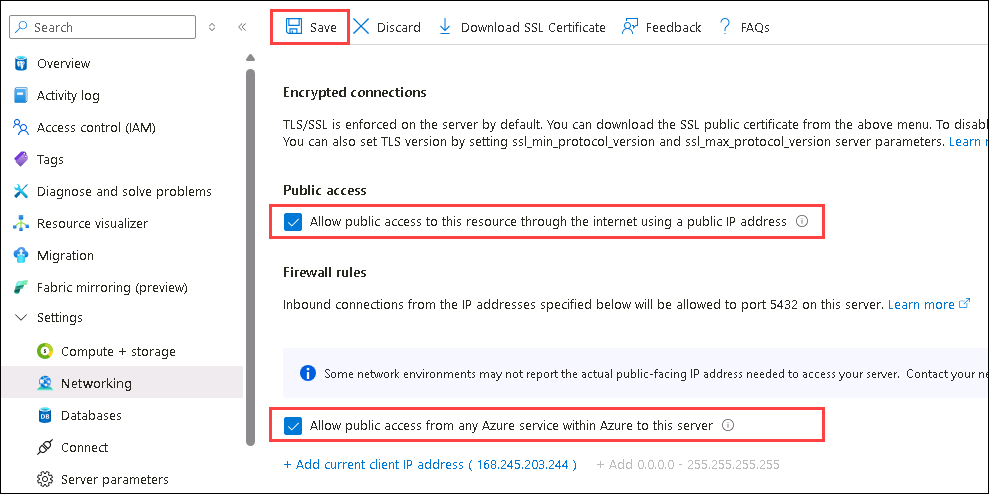

5. [] Navigate back to the **RG-Techsummit** resource group and select the Web App that you deployed in Task 1.

    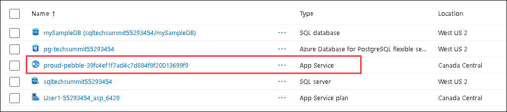

6. [] In the Web App overview, expand the **Development Tools** section, then select **Advanced Tools** from the left-hand menu, then select **Go** to open the Kudu console in a new tab.

    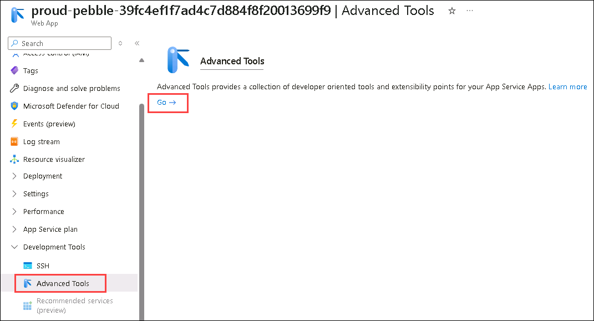

7. [] In the Kudu console, select the **Debug console** menu, then select **SSH** to open a remote SSH session to the App Service.

    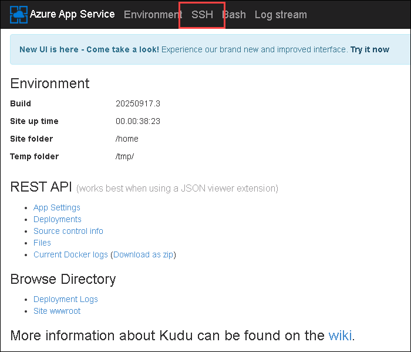

    This will open a terminal window where you can run commands in the context of the App Service.

    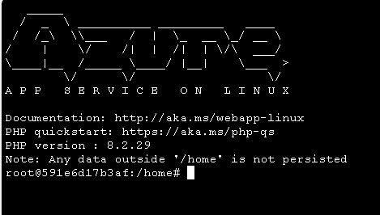

8. [] In the SSH session, navigate to the `/home/site/wwwroot` directory where the web application files are located (you automatically start in the `/home` directory):

    ```bash
    cd site/wwwroot
    ```

9. [] Run the following command to open the `index.php` file in the `nano` text editor:

    ```bash
    nano index.php
    ```

10. [] In the `index.php` file, locate the section that defines the database connection parameters. It should look similar to the following:

    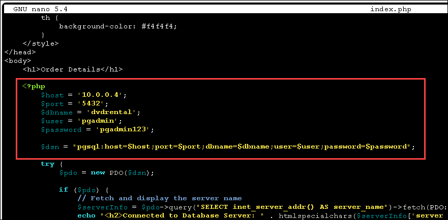