# Exercise 3: PostgreSQL migration to Azure Database for PostgreSQL Flexible Server

Contoso Inc. is modernizing its infrastructure to improve scalability, security, and operational efficiency. As part of this initiative, the company plans to migrate its legacy [INSERT_NAME] application to Azure. This application relies on a PostgreSQL database named `dvdrental`, which currently resides on an on-premises Linux VM. To ensure a smooth transition, Contoso will use the built-in migration service in Azure Database for PostgreSQL - Flexible Server to move the database to a managed Azure environment.

In this exercise, you will use the [migration service in Azure Database for PostgreSQL](https://learn.microsoft.com/azure/postgresql/migrate/migration-service/overview-migration-service-postgresql) to validate the source database and perform a full migration to Azure. This approach allows Contoso to benefit from Azure’s built-in high availability, automated backups, and performance tuning features while minimizing downtime and manual effort.

## Objectives

After completing this exercise, you will be able to:

- Evaluate the compatibility of an on-premises PostgreSQL database for migration to Azure using built-in validation tools.
- Perform a full offline migration of a PostgreSQL database to Azure Database for PostgreSQL - Flexible Server using the integrated migration service.
- Verify the integrity of the migrated schema and data in Azure Database for PostgreSQL.

## Duration

**Estimated time**: 45 minutes

===

# Task 1: Verify migration readiness

## Introduction

Before initiating a migration, it is critical to confirm that the source and target environments meet the prerequisites required by the migration service in Azure Database for PostgreSQL. These checks help avoid runtime errors and ensure that the migration process completes successfully. The key requirements include:

1. The source PostgreSQL server version must be greater than 9.5.

    > **Note**
    > If you need to migrate a PostgreSQL database running on a server version less than 9.5, you must upgrade it before migration.

2. The source server must be reachable from the target server, either directly or via a runtime server.
3. The target server must be configured to use the same extensions and server parameters as the source.

## Description

In this task, you will verify that each of these prerequisites has been met before proceeding with the migration.

## Success criteria

- The source PostgreSQL server has been verified to run version 9.5 or higher, ensuring compatibility with the migration service in Azure Database for PostgreSQL.
- Network connectivity between the source and target servers has been confirmed, allowing secure and reliable data transfer.
- All required extensions and server parameters have been identified and successfully enabled on the target Azure Database for PostgreSQL flexible server.

## Learning resources

- [Prerequisites for migrating from an on-premises PostgreSQL server to Azure Database for PostgreSQL](https://learn.microsoft.com/azure/postgresql/migrate/migration-service/tutorial-migration-service-iaas-offline?tabs=portal#prerequisites)

## Key tasks

### Subtask 1: Check source PostgreSQL server version

The migration service in Azure Database for PostgreSQL only supports databases running on PostgreSQL version 9.5 or higher. Verifying the version of the source server ensures that the migration can proceed without requiring an upgrade or compatibility adjustments.

In this subtask, you will connect to the on-premises PostgreSQL server hosted on the `LinuxLabVM-CentOS-7-PostGreSQL` virtual machine and confirm the installed version of PostgreSQL.

1. [] Locate the IP address of the `LinuxLabVM-CentOS-7-PostGreSQL` VM by opening the `VM_IPs.txt` file on the Lab VM's desktop.

    

2. [] From the `VM_IPs.txt` file, copy the **private IP** address of the `LinuxLabVM-CentOS-7-PostGreSQL` VM.

    

3. [] Open **PuTTY** from the Lab VM's desktop or Start menu. Paste the private IP address into the **Host Name (or IP address)** field in the PuTTY Configuration dialog, then select **Open**.

    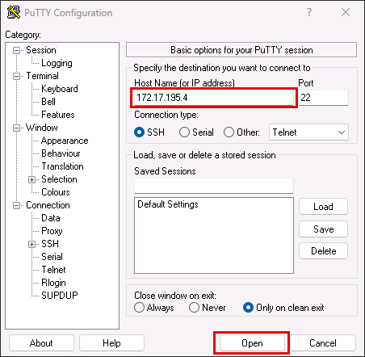

4. [] In the PuTTY console, log in using the following credentials:

   - **Login**: root
   - **Password**: Pa$$w0rd

5. [] Verify that the `psql` client is installed by running the following command:

    ```bash
    psql --version
    ```

6. [] Connect to the `dvdrental` database using the `psql` client:

    > **IMPORTANT**  
    > Replace `<PRIVATE_IP_OF_YOUR_POSTGRESQL_SERVER>` with the private IP address you copied earlier.

    ```bash
    psql -h <PRIVATE_IP_OF_YOUR_POSTGRESQL_SERVER> -U pgadmin -d dvdrental
    ```

7. [] When prompted, enter the password for the **pgadmin** user: `pgadmin123`

8. [] At the `dvdrental` database prompt, run the following query to retrieve the PostgreSQL server version:

    ```sql
    SELECT version();
    ```

    The output should resemble:

    ```bash
                                                     version
    ----------------------------------------------------------------------------------------------------------
     PostgreSQL 14.19 on x86_64-pc-linux-gnu, compiled by gcc (GCC) 4.8.5 20150623 (Red Hat 4.8.5-44), 64-bit
    ```

This confirms that the source server meets the minimum version requirement for migration using the migration service in Azure Database for PostgreSQL.

### Subtask 2: Ensure connectivity between source and target PostgreSQL servers

Before a migration can begin, the source PostgreSQL server must be reachable by the target Azure Database for PostgreSQL flexible server. Connectivity to the source database in typically controlled by the PostgreSQL Client Authentication Configuration file (`pg_hba.conf`), which defines which hosts are allowed to connect, which users and databases they can access, and what authentication methods are permitted. Ensuring that the target server is authorized in this file is a critical prerequisite for a successful migration.

In this subtask, you will inspect the `pg_hba.conf` file on the source server to verify that it allows connections from external hosts, including the Azure target server.

1. [] From the open database connection in the PuTTY terminal on the Lab VM, run the following command to locate the active `pg_hba.conf` file:

    ```sql
    SHOW hba_file;
    ```

2. [] Copy the file path from the output, which should be `/var/lib/pgsql/14/data/pg_hba.conf`.

3. [] Disconnect from the `dvdrental` database to return to the shell prompt:

    ```sql
    \q
    ```

4. [] At the PuTTY command prompt, run the following command to view the contents of the `pg_hba.conf` file. Replace `<YOUR_HBA_FILE_LOCATION>` with the path you copied above:

    ```bash
    cat <YOUR_HBA_FILE_LOCATION>
    ```

    The output should include `host` records that allow connections from external IP ranges. For example:

    ```bash
    # TYPE  DATABASE        USER            ADDRESS                 METHOD
    host    all             all             0.0.0.0/0               md5
    ```

    This entry allows any host to connect using MD5 password authentication. For production environments, this rule should be scoped to specific IP ranges for security, but for this lab, it ensures that the migration service in Azure Database for PostgreSQL can reach the source server.

### Subtask 3: Prepare the target Azure Database for PostgreSQL flexible server

To ensure compatibility between the source and target environments, the Azure Database for PostgreSQL flexible server must be configured to match the source server’s extensions and server parameters. Extensions and parameters are not automatically migrated, so they must be reviewed and manually enabled before starting the migration.

Extensions in PostgreSQL are modular packages that add functionality such as new data types, functions, or indexing methods. Server parameters are configuration settings that control database behavior, performance, and resource usage. In this subtask, you will identify the extensions used by the source database and enable them on the target Azure server.

1. [] Reconnect to the `dvdrental` database in the PuTTY terminal by running the following command. Replace `<PRIVATE_IP_OF_YOUR_POSTGRESQL_SERVER>` with the private IP address of the source VM:

    ```bash
    psql -h <PRIVATE_IP_OF_YOUR_POSTGRESQL_SERVER> -U pgadmin -d dvdrental
    ```

2. [] When prompted, enter the password for the **pgadmin** user: `pgadmin123`

3. [] At the `dvdrental` prompt, run the following `psql` meta-command to list installed extensions:

    ```bash
    \dx
    ```

    The output should show the `plpgsql` extension, which is required for procedural logic in PostgreSQL:

    ```bash
                     List of installed extensions
      Name   | Version |   Schema   |         Description
    ---------+---------+------------+------------------------------
     plpgsql | 1.0     | pg_catalog | PL/pgSQL procedural language
    ```

    > You can also query installed extensions using:
    >
    > ```sql
    > SELECT extname, extversion FROM pg_extension;
    > ```

4. [] Disconnect from the `dvdrental` database to return to the shell prompt:

    ```sql
    \q
    ```

5. [] Next, you will enable the required extension on the target Azure Database for PostgreSQL flexible server.

6. [] Open a web browser on the Lab VM and navigate to the [Azure portal](https://portal.azure.com/).

7. [] Sign in using your lab credentials from the **Resources** tab in the instructions panel.

    

    > **IMPORTANT**: You will be prompted to use a Temporary Access Pass (TAP) for login. This value is also listed on the **Resources** tab.
    >
    > 

8. [] Click **Yes** if prompted to stay signed in.

9. [] On the Azure portal home page, select **Resource groups** under **Azure services**.

    

10. [] Select the **RG-Techsummit** resource group.

    

11. [] Select the **Azure Database for PostgreSQL flexible server** resource.

    

12. [] To enable the `plpgsql` extension:

    1. [] Select **Server parameters** under **Settings** in the left menu.
    2. [] Enter `azure.extensions` in the search box.
    3. [] Locate and check the box next to **PLPGSQL** in the extensions list.
    4. [] Select **Save** on the toolbar.

    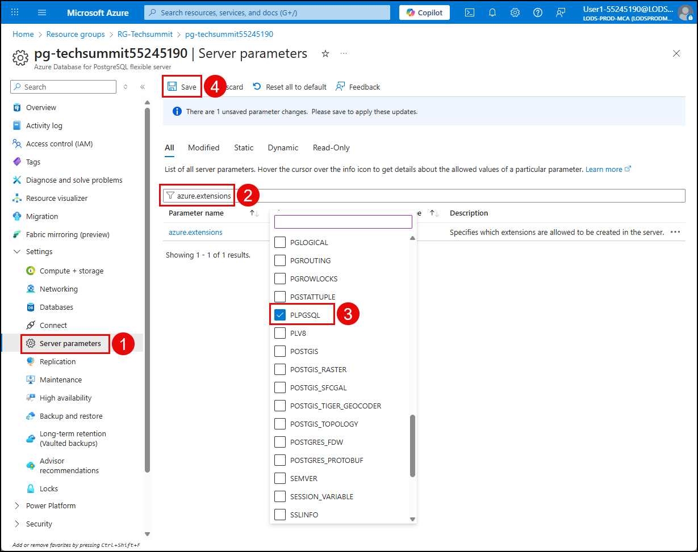

> Server parameters are not automatically migrated and must be manually configured. To view the source server’s parameters, run:
>
> ```sql
> SELECT name, setting, source, sourcefile, sourceline FROM pg_settings WHERE source = 'configuration file';
> ```
>
> For this lab, no additional parameters need to be configured.
>
> It is also important to ensure that high availability and read replicas are disabled on the target server before migration. These features can be enabled after the migration is complete and the database is stable.
>
> These features have been disabled in the lab environment.

## Additional context: Online migration and real-world networking

For simplicity, this lab focuses on an offline migration scenario. However, the migration service for Azure Database for PostgreSQL also supports online migrations, which allow continuous data replication from the source to Azure with minimal downtime. This is especially useful for production environments where cutover windows must be tightly controlled. Read the [online migration setup documentation](https://learn.microsoft.com/azure/postgresql/migrate/migration-service/tutorial-migration-service-iaas-online?tabs=portal) to learn more.

In real-world deployments, network architecture is often more complex than the lab setup. On-premises environments typically connect to Azure through VPN gateways, ExpressRoute, or private endpoints within Azure Virtual Networks (VNets). These configurations ensure secure, low-latency connectivity between source and target environments. You may also need to configure VNet peering, NSG rules, and firewall exceptions to allow replication traffic. For guidance on networking best practices, refer to the [how to set up the network](https://learn.microsoft.com/azure/postgresql/migrate/migration-service/how-to-network-setup-migration-service) documentation for the migration service.

===

# Task 2: Validate the source database

## Introduction

Before initiating a migration to Azure Database for PostgreSQL, it is crucial to validate the readiness of the source database. The built-in migration service performs a comprehensive validation that analyzes the schema, extensions, and configuration of the source PostgreSQL instance to identify any compatibility issues. Common validation checks include unsupported procedural languages, problematic functions, and mismatched extensions. Running this step ensures that the migration plan is informed by actual constraints and allows teams to document and address any blockers—such as internal-language functions or unrecognized objects—before proceeding.

## Description

In this task, you will execute a validation run using the Azure portal and review the results to determine whether the source database meets Azure’s migration requirements.

## Success criteria

- A validation run has been successfully initiated using the migration service in Azure Database for PostgreSQL.
- The validation results show no blocking issues, confirming that the source database is compatible with Azure Database for PostgreSQL flexible server.

## Learning resources

- [What is the migration serivce in Azure Database for PostgreSQL?](https://learn.microsoft.com/azure/postgresql/migrate/migration-service/overview-migration-service-postgresql)
- [Premigration validation for the migration service in Azure Database for PostgreSQL](https://learn.microsoft.com/azure/postgresql/migrate/migration-service/concepts-premigration-migration-service?tabs=portal)

## Key tasks

1. [] On the Azure Database for PostgreSQL flexible server blade in the Azure portal, select **Migration** from the left menu and select **Create**.

    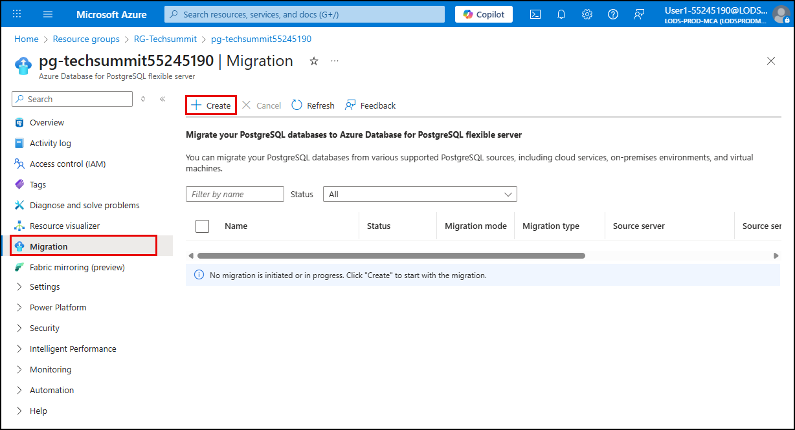

2. [] On the **Setup** tab of the **Migrate PostgreSQL to Azure Database for PostgreSQL flexible server** dialog, enter the following values:

    - [] **Migration name**: Enter `dvdrental-db-validation`
    - [] **Source server type**: Select **On-premises server**
    - [] **Migration option**: Select **Validate**
    - [] **Migration mode**: Select **Offline**
    - [] Select **Next: Runtime server >**

    

3. [] On the **Runtime server** tab, leave **Use runtime server** set to **No**, then select **Next: Source server >**

    

4. [] On the **Source server** tab, enter the following values:

    - **Server name**: Enter the public IP address of the `LinuxLabVM-CentOS-7-PostGreSQL` VM (from `VM_IPs.txt`)

        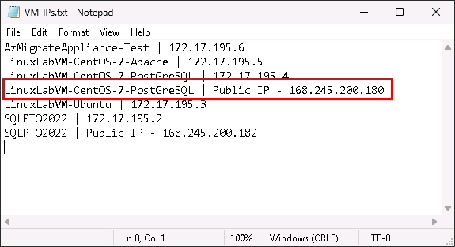

    - [] **Port**: `5432`
    - [] **Administrator login**: `pgadmin`
    - [] **Password**: `pgadmin123`
    - [] **SSL mode**: Leave set to **Prefer**
    - [] Select **Connect to source** and confirm that you receive the **Connection successful** message
    - [] Select **Next: Target server >**

    

5. [] On the **Target server** tab, enter the **Password** for your lab user account (found on the **Resources** tab of the lab instructions panel), then select **Next: Databases >**

    

6. [] On the **Databases to validate and migrate** tab, select the `dvdrental` database and choose **Next: Summary >**

    

7. [] On the **Summary** tab, review the configuration and select **Start validation**

    

8. [] Monitor the progress of the validation on the **Migration** page. Select **Refresh** on the toolbar every couple of minutes to check the validation's progress.

    

9. When complete, the **Status** will be set to **Succeeded**. You can review the results by selecting the `dvdrental-db-validation` item in the list to confirm that no blocking issues were found.

    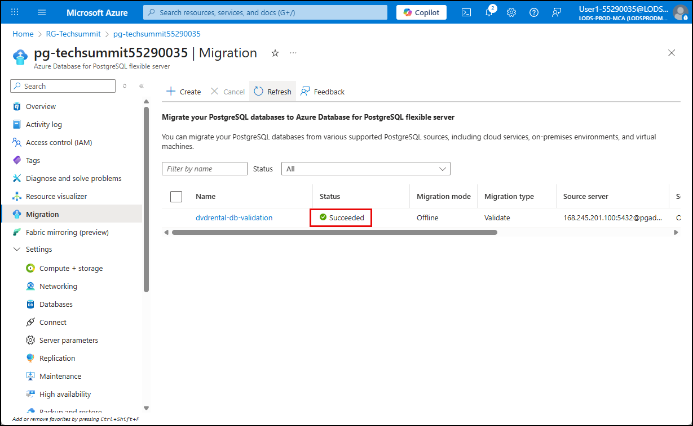

    > **Note**: If validation fails due to unsupported objects or configuration mismatches, you must resolve those issues before proceeding to migration. Refer to the validation report for details.

===

# Task 3: Migrate the database

## Introduction

After confirming that the source database is ready for migration, you can initiate the actual migration using the Azure Database for PostgreSQL migration service. This process transfers the schema and data from the source to the target server, preserving object definitions, relationships, and data integrity. The migration is performed in offline mode, meaning the source database is not actively serving traffic during the transfer.

## Description

In this task, you will configure and launch the migration and monitor its progress.

## Success criteria

- A migration job has been configured and launched using the Azure portal.
- The `dvdrental` database has been selected and migrated without errors.
- The migration status in the Azure portal shows Succeeded, indicating a complete and successful transfer.

## Learning resources

- [What is the migration serivce in Azure Database for PostgreSQL?](https://learn.microsoft.com/azure/postgresql/migrate/migration-service/overview-migration-service-postgresql)
- [Perform a migration using the migration service in Azure Database for PostgreSQL](https://learn.microsoft.com/azure/postgresql/migrate/migration-service/tutorial-migration-service-iaas-offline?tabs=portal#perform-the-migration)

## Key tasks

1. [] Select **Create** again on the toolbar of the Azure Database for PostgreSQL flexible server's Migration blade.

    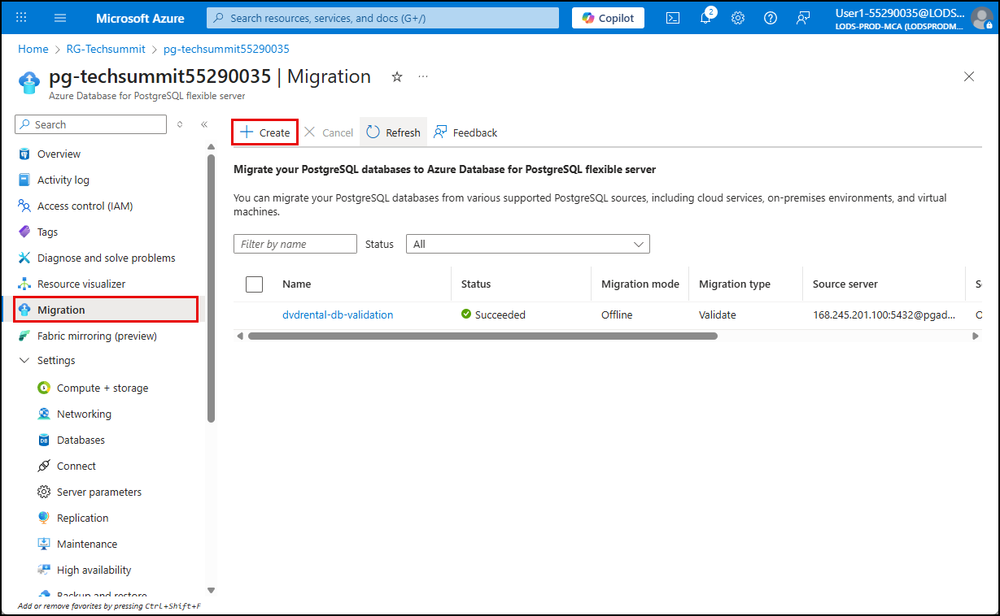

2. [] On the **Setup** tab, enter the following values:

    - [] **Migration name**: `dvdrental-db-migration`
    - [] **Source server type**: **On-premises server**
    - [] **Migration option**: **Validate and migrate**
    - [] **Migration mode**: **Offline**
    - [] Select **Next: Runtime server >**

    

3. [] On the **Runtime server** tab, leave **Use runtime server** set to **No**, then select **Next: Source server >**

    

4. [] On the **Source server** tab, enter the following values:

    - **Server name**: Public IP address of the `LinuxLabVM-CentOS-7-PostGreSQL` VM

        

    - [] **Port**: `5432`
    - [] **Administrator login**: `pgadmin`
    - [] **Password**: `pgadmin123`
    - [] **SSL mode**: **Prefer**
    - [] Select **Connect to source** and confirm the connection
    - [] Select **Next: Target server >**

    

5. [] On the **Target server** tab, enter your lab user password and select **Next: Databases >**

    

6. [] On the **Databases to validate and migrate** tab, select `dvdrental` and choose **Next: Summary >**

    

7. [] On the **Summary** tab, review the configuration and select **Start validation and migration**

    

8. [] Monitor the progress of the migration on the **Migration** page.

    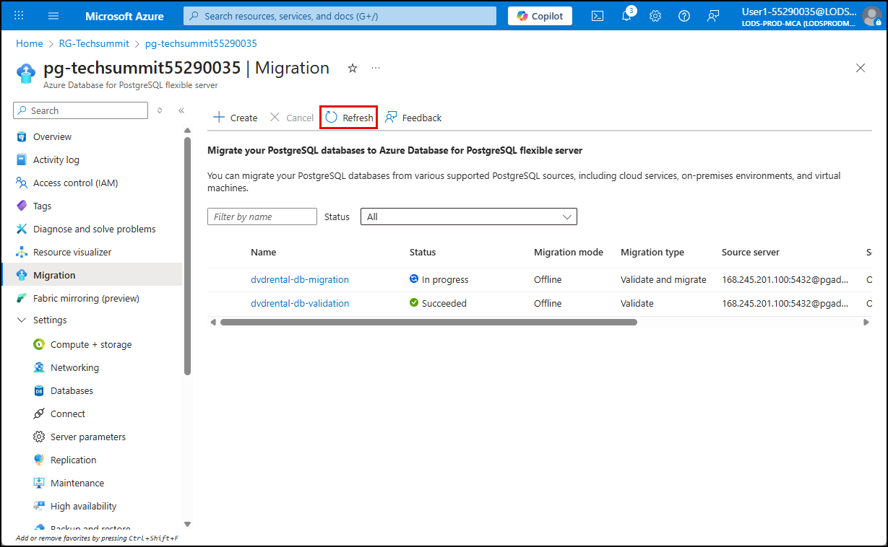

9. [] Select `dvdrental-db-migation` in the list to view the validation and migration details while monitoring.

    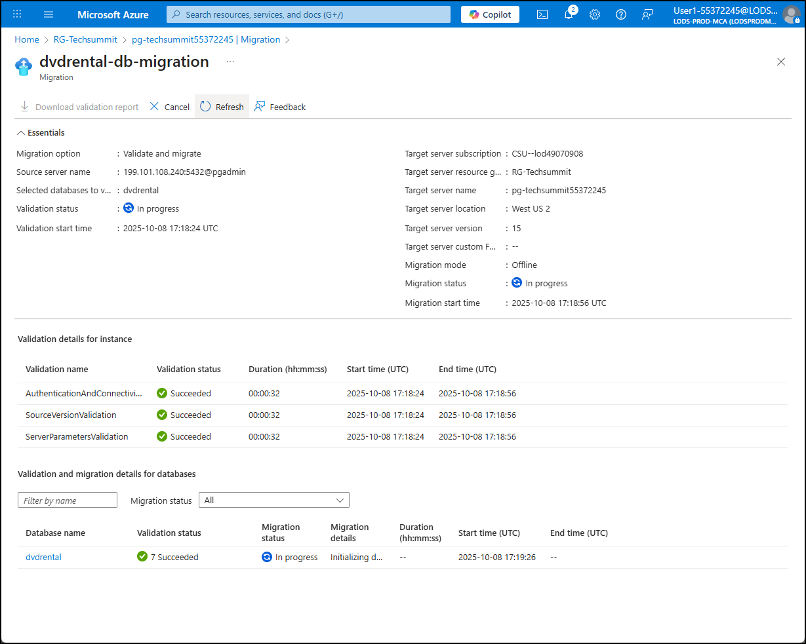

10. Once complete, confirm that the status shows **Succeeded** and that no errors were reported.

    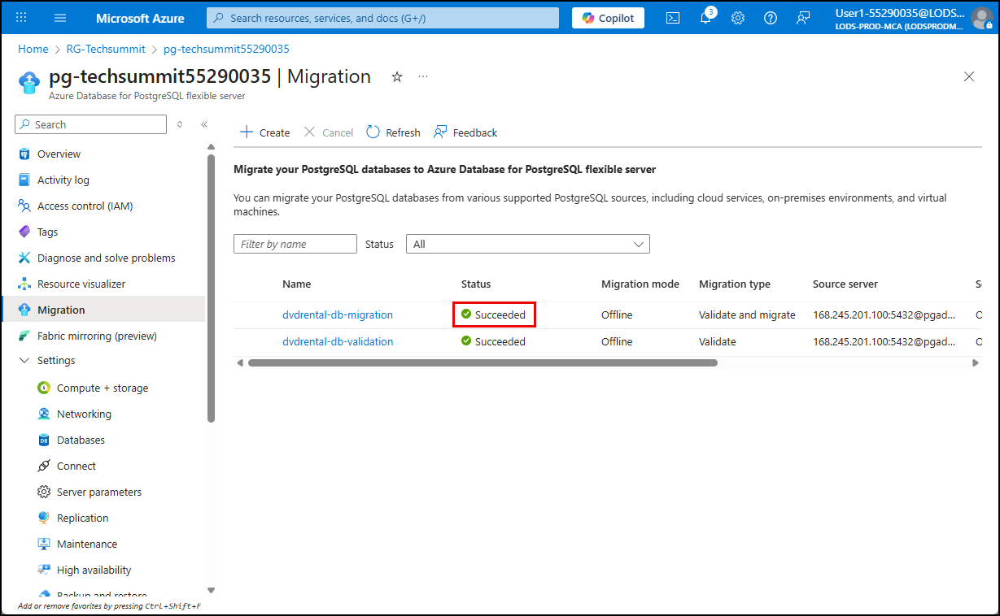

===

# Task 4: Verify the migration

## Introduction

After the migration finishes, it is important to verify that the target Azure Database for PostgreSQL flexible server contains the expected schema and data. This step confirms that the migration was successful and that the application can resume using the new database without issues.

## Description

In this task, you will connect to the target Azure database and run few a simple queries to confirm that the `dvdrental` database was migrated successfully.

## Success criteria

- A connection to the target Azure Database for PostgreSQL flexible server has been established using the Query editor.
- A query against the `dvdrental` database has returned expected results, confirming that data was successfully migrated.
- The `film` table exists and contains valid records, demonstrating that schema and data integrity were preserved during migration.

## Learning resources

- [Check PostgreSQL database migration when completed](https://learn.microsoft.com/azure/postgresql/migrate/migration-service/tutorial-migration-service-iaas-offline?tabs=portal#check-the-migration-when-completed)

## Key tasks

1. [] On the Azure Database for PostgreSQL flexible server blade in the Azure portal, select **Overview** from the left menu.

2. [] On the **Overview** blade, copy the endpoint value in the **Essentials** pane.

    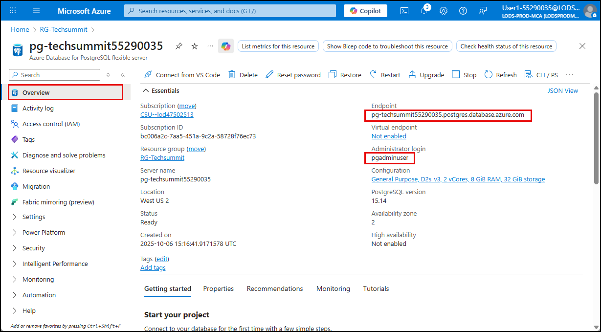

    > **NOTE**: Within the **Essentials** pane, also note the **Administrator login** value. This is the username that will be used to log in to the server. This differs from the `pgadmin` user you used to connect to the on-premises database.

3. [] Return to the open PuTTY terminal window on your Lab VM, or open a new one by connecting to the private IP address of the `LinuxLabVM-CentOS-7-PostGreSQL` VM and logging in with the `root` user and password.

4. [] At the PuTTY shell prompt, run the following command to connect to your Azure Database for PostgreSQL flexible server, replacing the `<YOUR_AZURE_POSTGRESQL_ENDPOINT>` token with the endpoint for your Azure Database for PostgreSQL flexible server.

    ```bash
    psql -h pg-techsummit55290035.postgres.database.azure.com -U pgadminuser -d dvdrental
    psql -h <YOUR_AZURE_POSTGRESQL_ENDPOINT> -U pgadminuser -d dvdrental
    ```

5. [] When prompted for the password for user `pgadminuser`, enter the **Password** from the **Resources** tab in the lab instructions.

6. [] From the `dvdrental` prompt, execute the following query to confirm that the data and schema were successfully migrated:

    ```sql
    SELECT * FROM sales_by_film_category;
    ```

    The query should return 16 rows from the `sales_by_film_category` view, confirming that the database was successfully migrated.

    > If the query fails or returns no results, revisit the migration status and validation report to identify any issues.

===

# Task 5: Post-migration Updates

## Introduction

Once your PostgreSQL database has been migrated to Azure, you can take advantage of Azure-native features to enhance performance, security, and availability. These capabilities are not available in on-premises environments and are designed to help you operate more securely and efficiently in the cloud.

One of the most impactful features is **Microsoft Defender for Open-Source Relational Databases**, which provides advanced threat protection for Azure Database for PostgreSQL. Defender continuously monitors for suspicious activity, potential vulnerabilities, and anomalous access patterns. It also integrates with Microsoft Defender for Cloud to provide centralized security recommendations and alerts.

Other post-migration enhancements include enabling high availability, configuring automated backups, and applying performance tuning recommendations, all of which help ensure your database is resilient, secure, and optimized for production workloads.

## Description

In this task, you review the Microsoft Defender for Open-Source Relational Databases configuration and how it can help to improve the security posture of your Azure Database for PostgreSQL flexible server.

## Success criteria

- You have reviewed the Microsoft Defender for Open-Source Relational Databases configuration in the Azure portal.

## Learning resources

- [What is Microsoft Defender for Cloud?](https://learn.microsoft.com/azure/defender-for-cloud/defender-for-cloud-introduction)
- [Overview of Microsoft Defender for Open-Source Relational Databases](https://learn.microsoft.com/azure/defender-for-cloud/defender-for-databases-introduction)

## Key Tasks

1. Navigate to the Azure Database for PostgreSQL resource in the Azure portal and select **Microsoft Defender for Cloud** under **Security** in the left navigation menu.

    > Microsoft Defender for Cloud provides advanced threat protection for Azure Database for PostgreSQL. When enabled, it continuously monitors for unusual activity, potential vulnerabilities, and known attack patterns. Defender for Open-Source Relational Databases helps secure your PostgreSQL environment by integrating with Microsoft Defender for Cloud to surface alerts, recommendations, and remediation guidance.

2. On the **Microsoft Defender for Cloud** blade, select **Check for alerts on this resource in Microsoft Defender for Cloud**.

    

3. Review the **Security alerts** page for your PostgreSQL resource.

    > The security alerts page displays any detected threats or suspicious activity, such as brute-force login attempts, SQL injection patterns, or anomalous access behavior. You can view alert severity, affected resources, and recommended actions. This page helps you quickly assess and respond to potential risks in your PostgreSQL environment.

    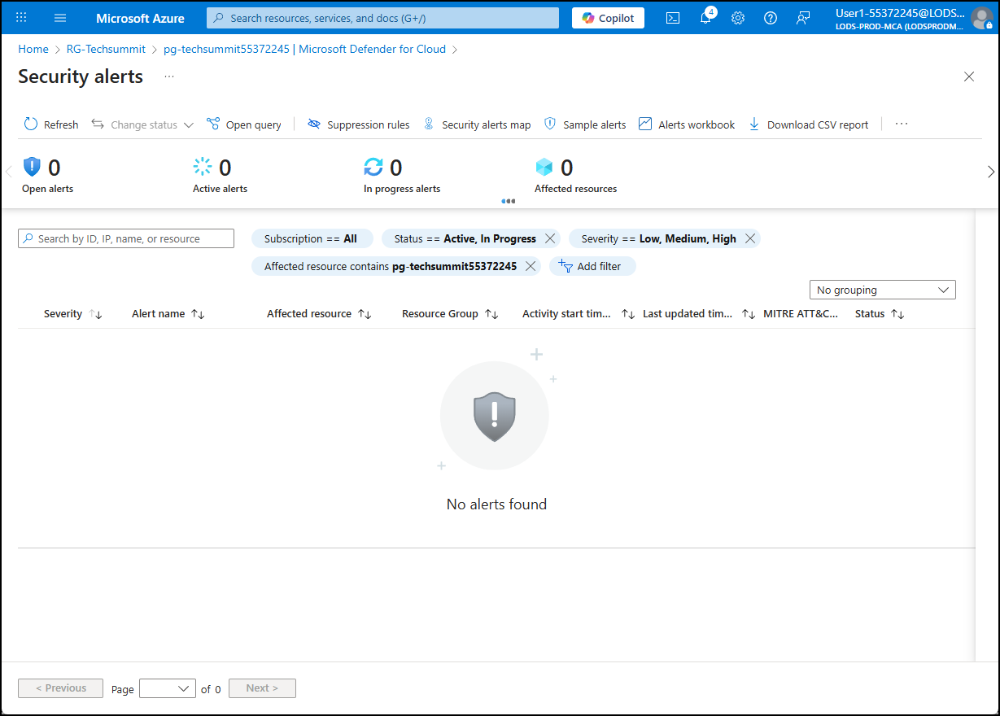
