# Exercise 4: SQL Server migration to Azure SQL Database

Contoso Inc. is continuing its infrastructure modernization journey by migrating legacy workloads to Azure in order to improve scalability, security, and operational efficiency. As part of this initiative, the company plans to move its on-premises SQL Server databases to Azure SQL Database to take advantage of the fully managed platform that offers built-in high availability, automated updates, and elastic scalability.

In this exercise, you will migrate an on-premises, VM-hosted SQL Server database to Azure SQL Database using the [Azure Database Migration Service](https://learn.microsoft.com/azure/dms/dms-overview). This process includes validating the source environment, configuring and running the migration project, verifying that the target database reflects the expected schema and data, and protecting the target database from threats and vulnerabilities.

## Objectives

After completing this exercise, you will be able to:

- Assess the compatibility of an on-premises SQL Server database for migration to Azure SQL Database.
- Configure and execute a migration using Azure Database Migration Service.
- Verify the integrity of the migrated schema and data in Azure SQL Database.

## Duration

**Estimated time**: 45 minutes

===

# Task 1: Create an Azure Database Migration Service

## Introduction

Azure Database Migration Service (DMS) is a fully managed service that enables seamless migrations from on-premises or cloud-hosted databases to Azure data platforms. It supports both offline and online migration modes, allowing organizations to choose between minimal downtime or simplified cutover depending on their operational needs. In this lab, you will use DMS to migrate a SQL Server database to Azure SQL Database.

## Description

In this task, you will provision a new instance of Azure Database Migration Service using the Azure portal. This service will be used to orchestrate the migration of the on-premises SQL Server database to Azure SQL Database. Provisioning the service is a prerequisite for configuring and launching the migration project in later tasks.

## Success criteria

- A new Azure Database Migration Service instance has been successfully created in the correct resource group and region.
- The migration scenario has been configured to support SQL Server to Azure SQL Database.
- The deployment status shows **Succeeded**, and the resource is accessible from the Azure portal.

## Learning resources

- [What is Azure Database Migration Service?](https://learn.microsoft.com/azure/dms/dms-overview)
- [Create a Database Migration Service instance](https://learn.microsoft.com/data-migration/sql-server/database/database-migration-service?toc=%2Fazure%2Fdms%2Ftoc.json&tabs=portal#create-a-database-migration-service-instance)

## Key tasks

In this task, you will provision a new Azure Database Migration Service using the Azure portal.

1. [] Open a web browser on the Lab VM and navigate to the [Azure portal](https://portal.azure.com/).

2. [] Sign in using your lab credentials from the **Resources** tab in the instructions panel.

    

    > **IMPORTANT**: You will be prompted to use a Temporary Access Pass (TAP) for login. This value is also listed on the **Resources** tab.
    >
    > 

3. [] Click **Yes** if prompted to stay signed in.

4. [] On the Azure portal home page, select **Resource groups** under **Azure services**.

    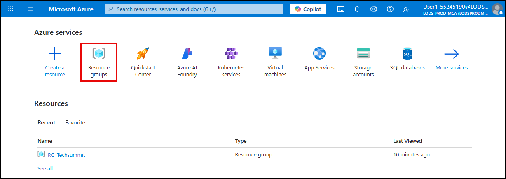

5. [] Select the **RG-Techsummit** resource group.

    

6. [] On the **RG-Techsummit** blade, note the **Location** of the resource group and its resources, then select **Create** in the toolbar.

    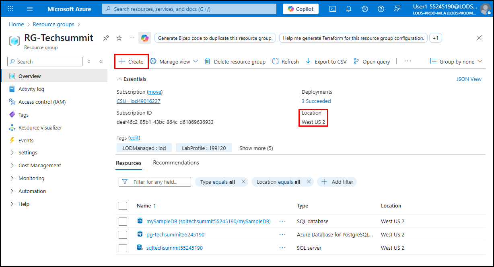

7. [] On the **Marketplace** blade, search for "database migration," and select the **Azure Database Migration Service** from the search results.

    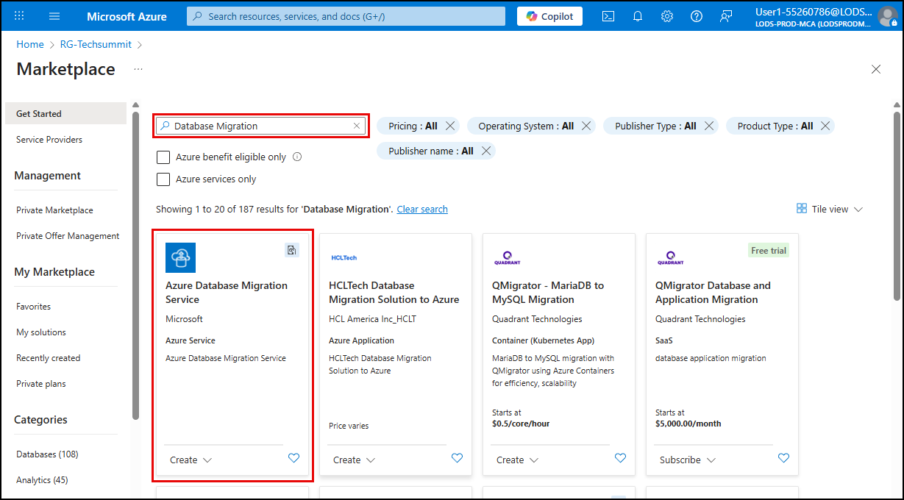

8. [] On the **Azure Database Migration Service** blade, select **Create**.

    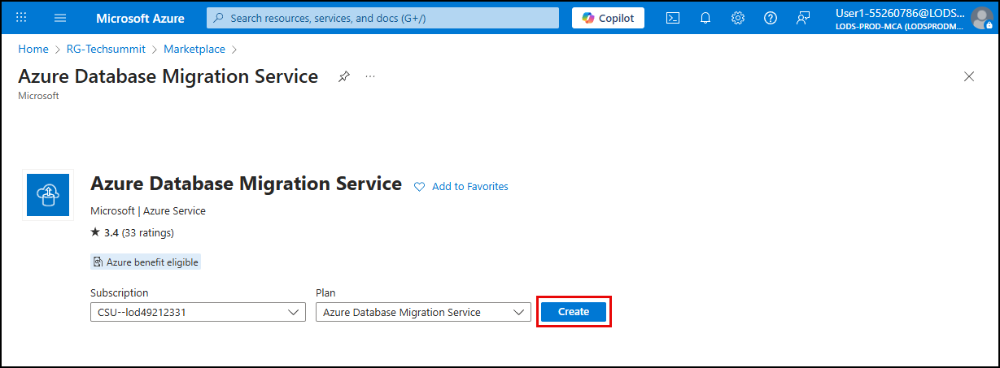

9. [] On the **Select migration scenario and Database Migration Service** page, use the following settings:

    1. [] **Source server type**: `SQL Server`
    2. [] **Target server type**: `Azure SQL Database`
    3. [] **Database Migration Service**: `Database Migration Service`
    4. [] Choose **Select**

    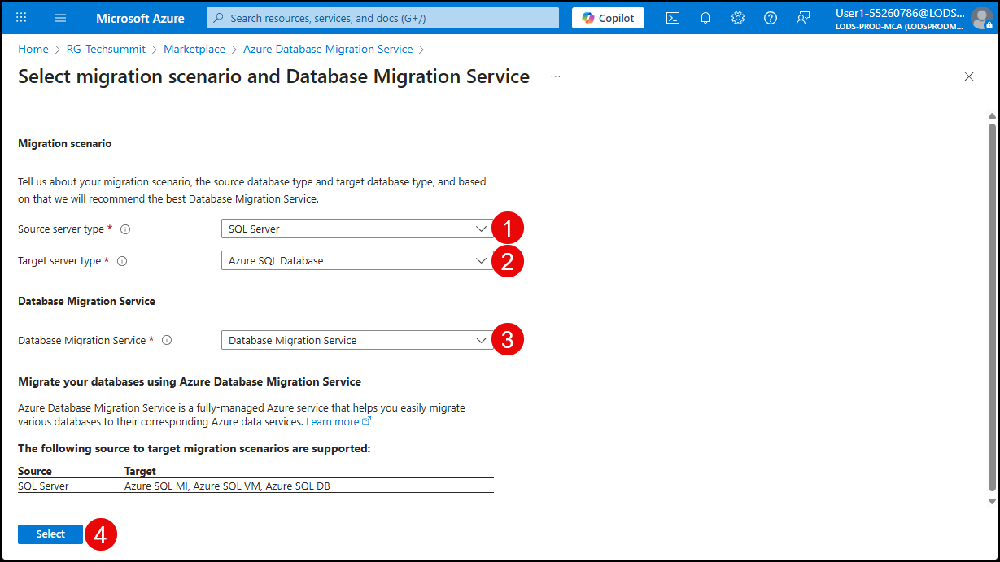

10. [] On the **Basics** tab of the **Create Data Migration Service** blade, enter the following:

    1. [] **Subscription**: Accept the default subscription
    2. [] **Resource group**: Ensure `RG-Techsummit` is selected
    3. [] **Location**: Choose the region noted earlier
    4. [] **Migration service name**: `dms-sql-migration-lab`
    5. [] Select **Review + create**

    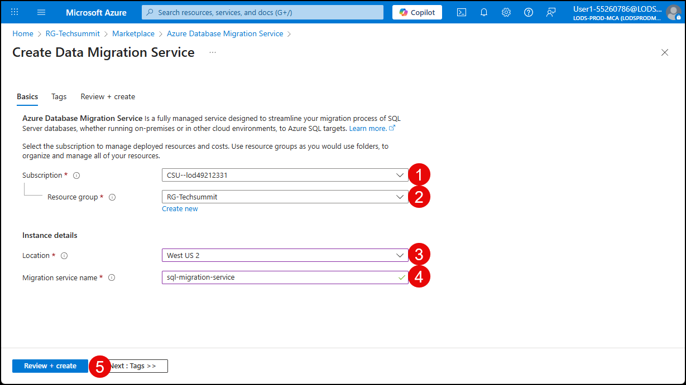

11. [] On the **Review + create** tab, select **Create** to provision the Database Migration Service.

    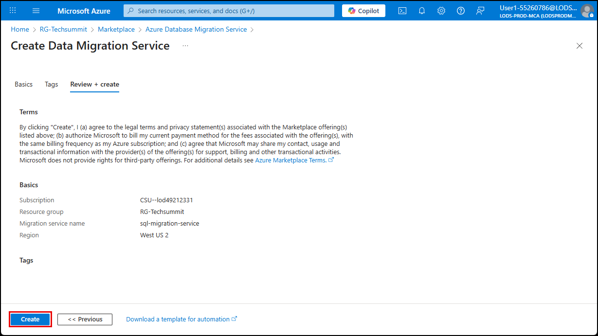

12. [] Monitor the deployment progress and select **Go to resource** when the deployment is complete.

    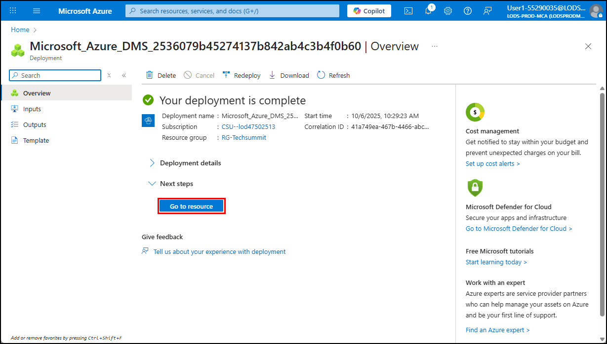

===

# Task 2: Configure a self-hosted integration runtime

## Introduction

An Integration Runtime (IR) provides the compute infrastructure used by the Azure Database Migration Service to copy data across data stores. A self-hosted integration runtime (SHIR) provides these capabilities between a cloud data store and a data store in a private network, such as an on-premises network or an Azure virtual network.

## Description

In this task, you will download and configure the self-hosted IR (SHIR) associated with your Azure Database Migration Service. You will install the SHIR on the Lab VM inside your network to allow the Database Migration Service to connect to your on-premises SQL Server and perform the database migration.

TODO: Need note in here that performing a migration from SQL Server to Azure SQL Database requires the use of a SHIR, and perhaps a brief explanation about why.

## Learning resources

- [Recommendations for using a self-hosted integration runtime for database migrations](https://learn.microsoft.com/azure/dms/migration-using-azure-data-studio?tabs=azure-sql-mi#recommendations-for-using-a-self-hosted-integration-runtime-for-database-migrations)

## Key tasks

1. [] On the Azure Database Migration Service **Overview** blade you opened at the end of the previous task, select **View integration runtime** in the **View integration runtime** tile in the **Getting started** tab.

    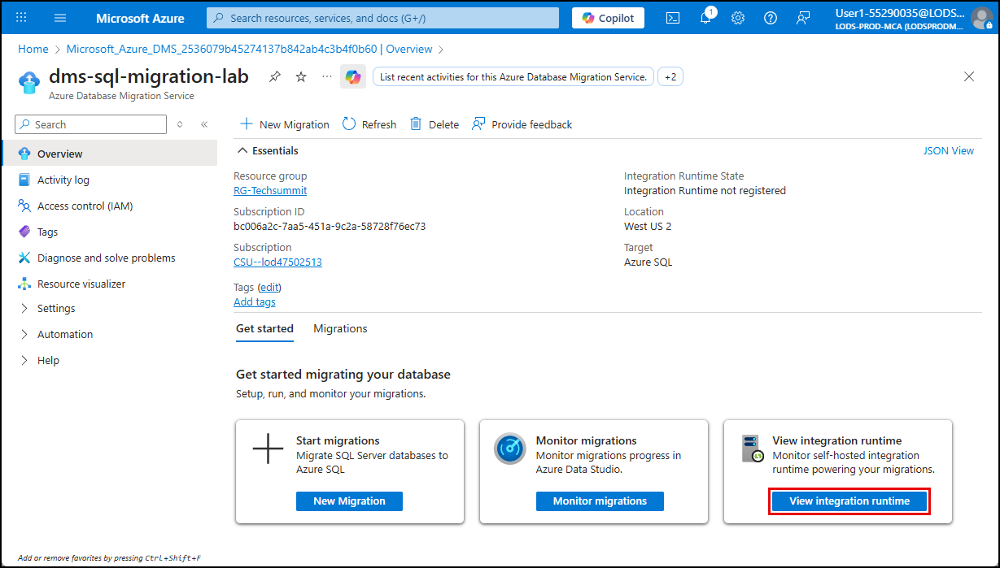

2. On the **Integration runtime** blade, select **Configure integration runtime** on the toolbar.

    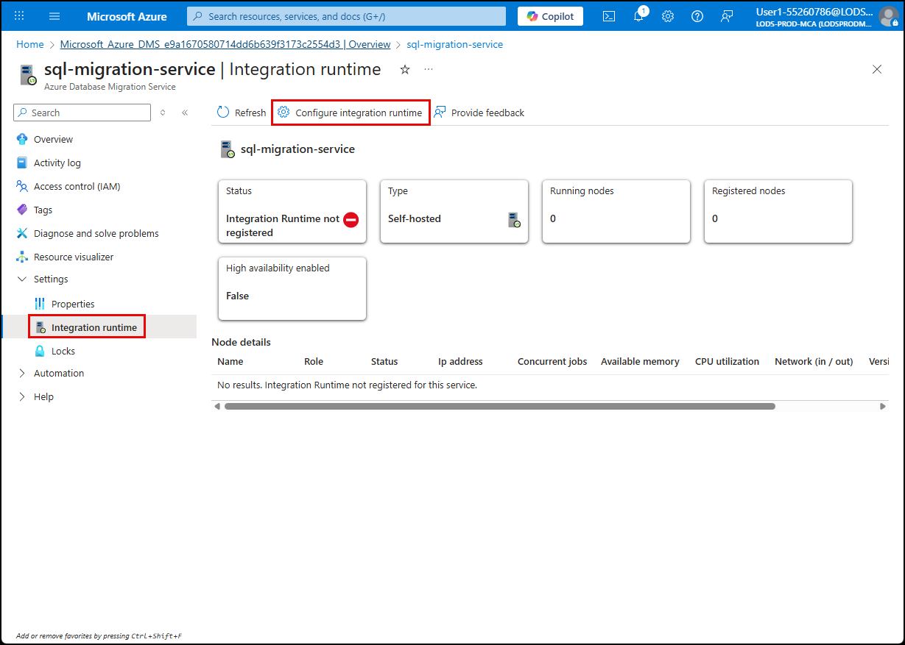

3. [] In the **Configure integration runtime** dialog, select the link to **Download and install the integration runtime**.

    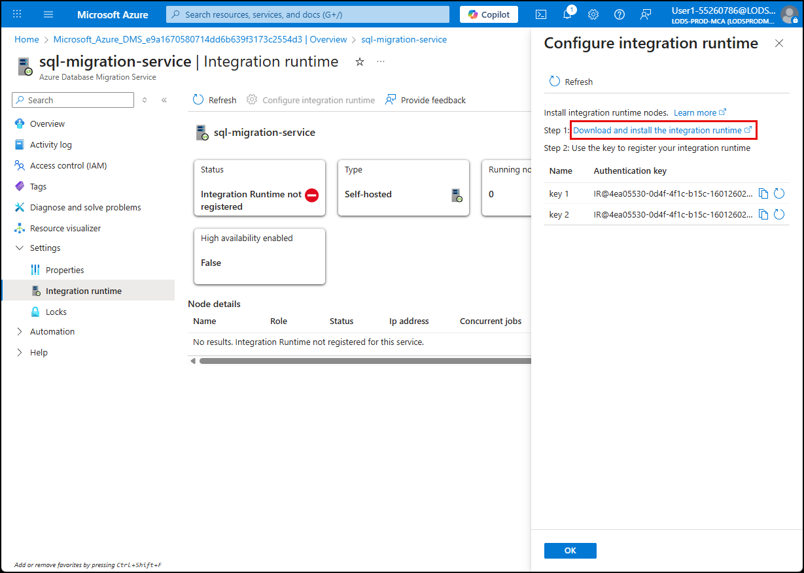

4. [] On the webpage that opens, select **Download** under the **Microsoft Integration Runtime** header.

    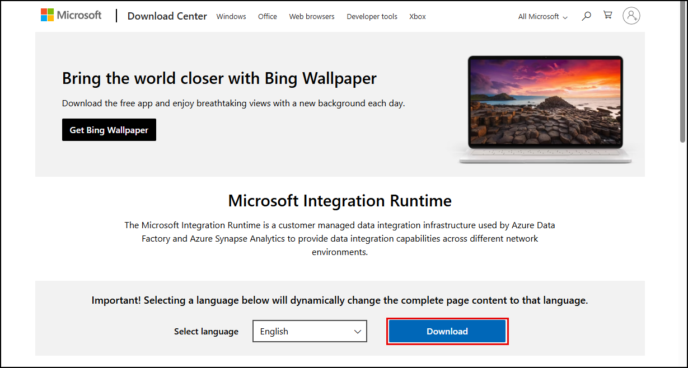

5. [] Select the latest version of the integration runtime from the **Choose the download you want** dialog and select **Download**.

    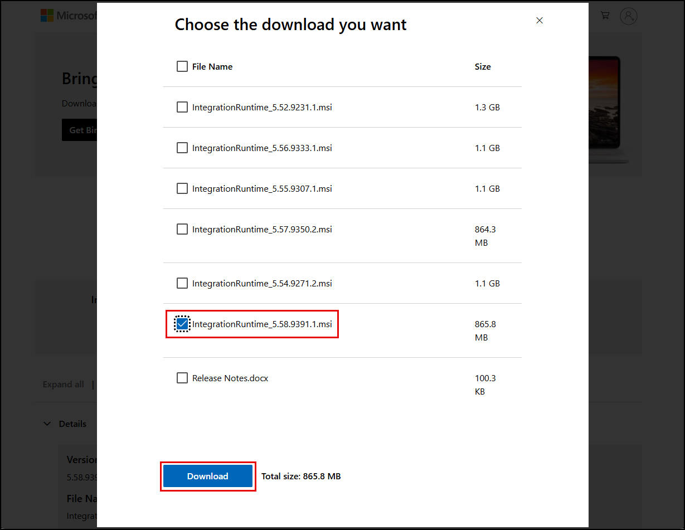

6. [] When the download completes, run the MSI to install the integration runtime.

7. [] Complete the installation by selecting **Next** on each screen of the setup dialog, and then select **Finish** on the final screen. This will launch the **Microsoft Integration Runtime Configuration Manager**.

8. [] On the **Register Integration Runtime (Self-hosted)** dialog of the **Microsoft Integration Runtime Configuration Manager**, you will need the **Authentication key** for the Azure Database Migration Service. Return to the Azure portal and select the copy button next to **key 1** in the **Configure integration runtime** dialog.

    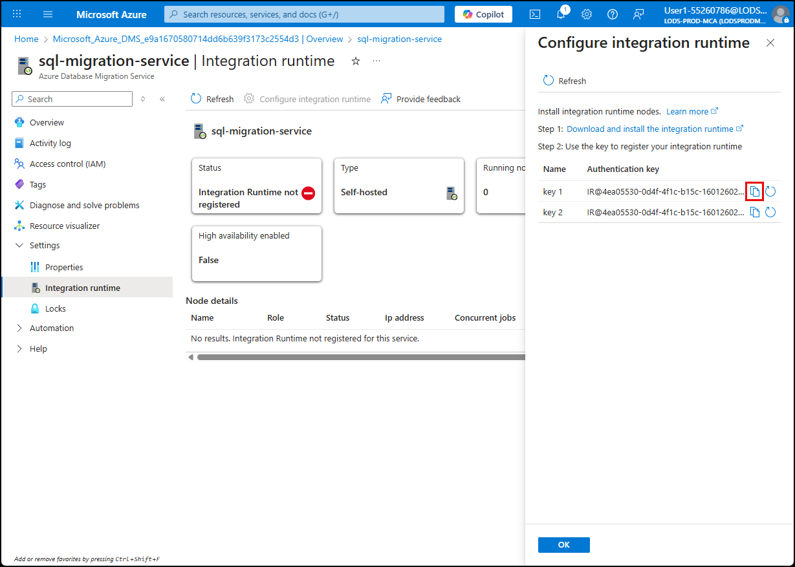

9. [] Return to the **Microsoft Integration Runtime Configuration Manager**, paste the **key 1** value into the Authentication key box on the **Register Integration Runtime (Self-hosted)** form, and select **Register**.

    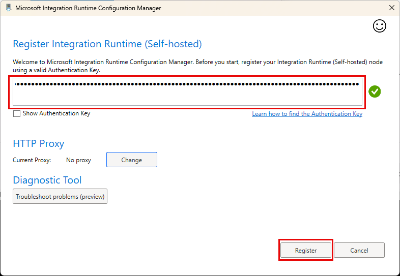

10. Select **Finish** on the **New Integration Runtime (Self-hosted) Node** dialog.

    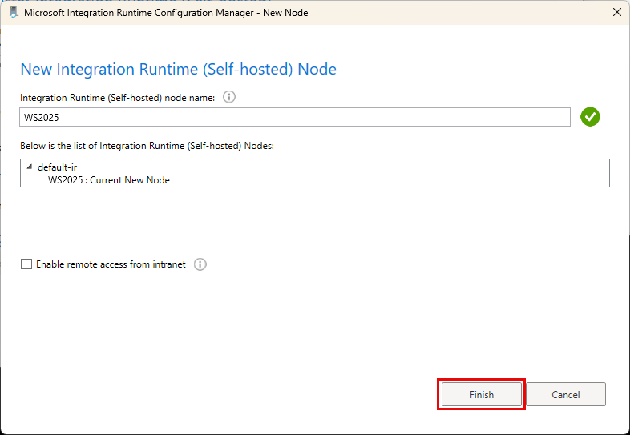

11. On the **Register Integration Runtime (Self-hosted)** form, confirm the integration runtime node has been registered successfully.

    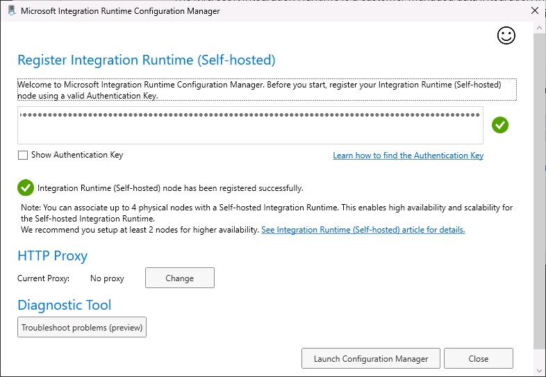

12. Return to the **Integration runtime** blade of the Azure Database Migration Service in the Azure portal, close the **Configure integration runtime** dialog, select **Refresh** on the toolbar, and confirm the node is present and has a status of **Online**.

    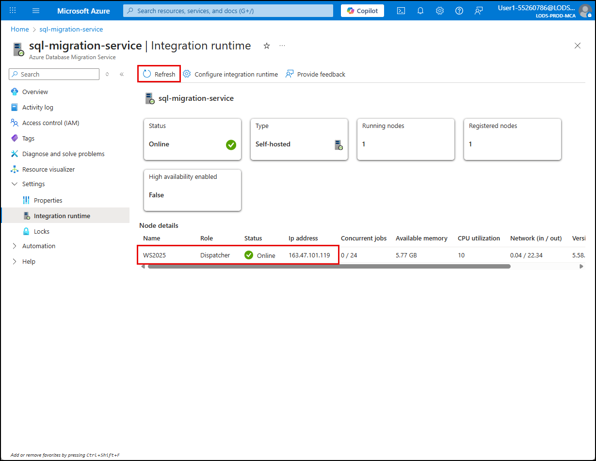

===

# Task 1: Verify migration readiness

## Introduction

TODO: Determine if there are any actual steps that must be completed before migration. 

## Description

In this task, you will confirm the version of the source SQL Server to ensure it is a supported version.

## Success criteria

## Learning resources

- [What is Azure Database Migration Service?](https://learn.microsoft.com/azure/dms/dms-overview)
- [Create a Database Migration Service instance](https://learn.microsoft.com/data-migration/sql-server/database/database-migration-service?toc=%2Fazure%2Fdms%2Ftoc.json&tabs=portal#create-a-database-migration-service-instance)

## Key tasks

Using SQL Query
•	Login to SQL Server and run the query
SELECT @@version

Test the connectivity between Source and the Target	 
Proper networking setup is essential to ensure successful connectivity between the source and target during migration. It is required for DMS functionality.
Check for SQL specific information
Check and export any SQL specific information like (Db Counts, Table Counts, SQL Logins..etc..)

## Additional context: Online migration and real-world networking

While this lab demonstrates an offline migration of SQL Server to Azure SQL Database, the Azure Database Migration Service also supports online migrations for SQL Server workloads. Online migration enables continuous replication from the source SQL Server to Azure, allowing for minimal downtime during cutover. This is particularly valuable for production systems that require high availability or operate under strict service-level agreements. Online migrations offer greater flexibility for enterprise scenarios. For more details, see Online migration for SQL Server.

In real-world environments, networking is often more complex than the lab setup. On-premises SQL Server instances typically connect to Azure through VPN gateways, ExpressRoute circuits, or private endpoints within Azure Virtual Networks (VNets). These configurations ensure secure, high-throughput connectivity between source and target environments. You may also need to configure VNet peering, NSG rules, and firewall exceptions to allow migration traffic. For guidance on networking best practices, refer to Azure SQL Database connectivity architecture.

===

# Task 4: Create a migration project

## Introduction

## Description

## Success criteria

## Learning resources

## Key tasks

1. [] Return to the Azure Database Migration Service blade in the Azure portal, select the **Overview** item from the left menu, then select **New Migration**.

    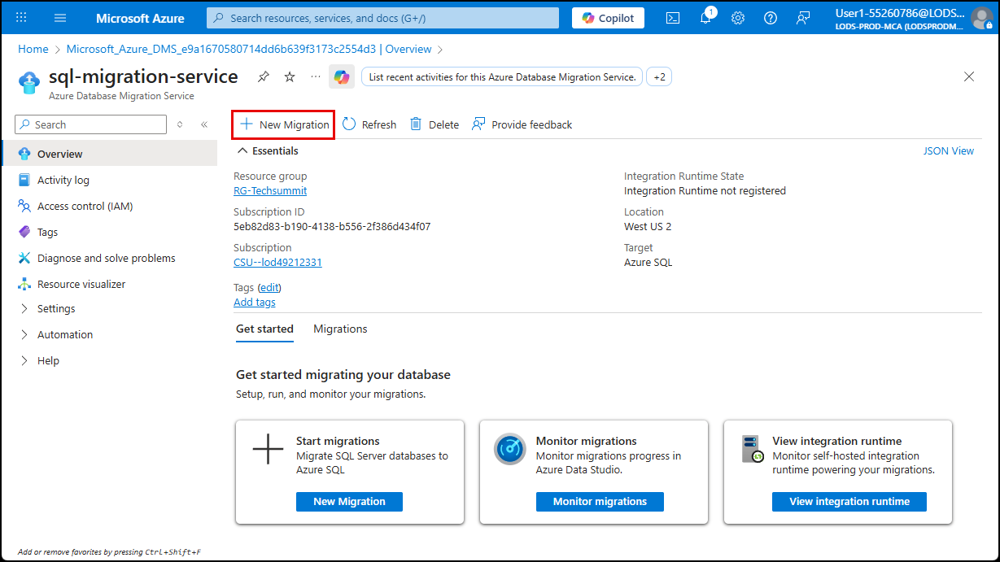

===

# Task 5: Run the migration

## Introduction

## Description

## Success criteria

## Learning resources

## Key tasks

===

TODO: Determine timing to see if a "Monitor the migration" task makes sense, or if it should just be part of the "Run the migration task." If it does make sense, rename "Run the migration" to "Start the migration."

===

# Task 6: Validate the migration

## Introduction

## Description

## Success criteria

## Learning resources

## Key tasks

===

# Task 7: Enable Defender for Cloud for Databases

## Introduction

In Microsoft Defender for Cloud, the Defender for Databases plan helps protect your database estate from threats and vulnerabilities. The Defender for Databases plan provides threat protection and security management across cloud environments.

In Microsoft Defender for Cloud, the Defender for Azure SQL Databases plan within Defender for Databases helps you discover and mitigate potential database vulnerabilities. It alerts you to anomalous activities that might indicate a threat to your databases.

When you enable Defender for Azure SQL Databases, all supported resources within the subscription are protected.

## Description

In this task, you will enable Defender for Cloud for Databases on your newly migrated SQL database.

## Success criteria

## Learning resources

- [Overview of Microsoft Defender for Databases](https://learn.microsoft.com/azure/defender-for-cloud/defender-for-databases-overview)
- [Overview of Microsoft Defender for Azure SQL Databases](https://learn.microsoft.com/azure/defender-for-cloud/defender-for-sql-introduction)
- [SQL Advanced Threat Protection](https://learn.microsoft.com/azure/azure-sql/database/threat-detection-overview)

## Key tasks

1. Enable Defender
2. Run a vulnerability assessment?