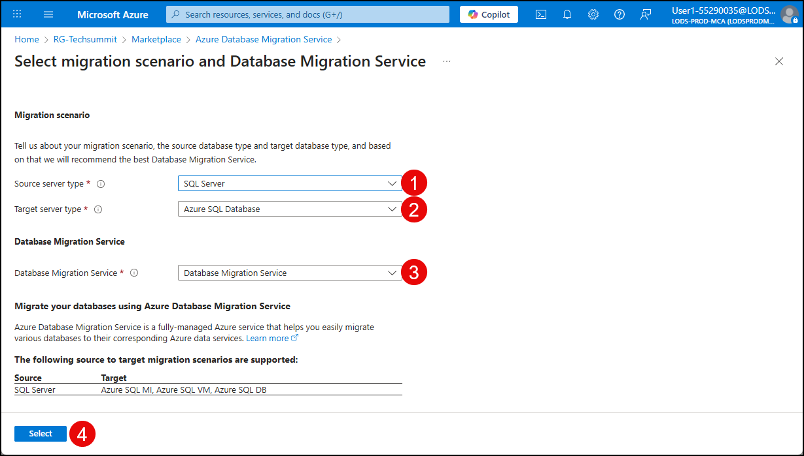
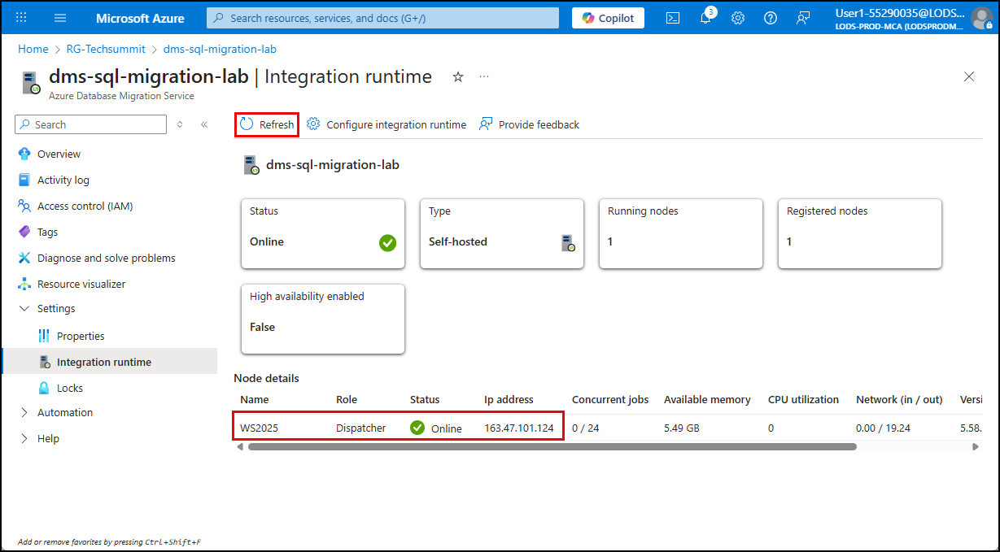

# Exercise 4: SQL Server migration to Azure SQL Database

Contoso Inc. is continuing its infrastructure modernization journey by migrating legacy workloads to Azure in order to improve scalability, security, and operational efficiency. As part of this initiative, the company plans to move its on-premises SQL Server databases to Azure SQL Database to take advantage of the fully managed platform that offers built-in high availability, automated updates, and elastic scalability.

In this exercise, you will migrate an on-premises, VM-hosted SQL Server database to Azure SQL Database using the Azure Database Migration Service. This process includes validating the source environment, configuring the migration project, and verifying that the target database reflects the expected schema and data.

## Objectives

After completing this exercise, you will be able to:

- Assess the compatibility of an on-premises SQL Server database for migration to Azure SQL Database.
- Configure and execute a migration using Azure Database Migration Service.
- Verify the integrity of the migrated schema and data in Azure SQL Database.

## Duration

**Estimated time**: 30 minutes

===

# Task X: Create an Azure Database Migration Service

## Introduction

## Description

## Success criteria

## Learning resources

- [What is Azure Database Migration Service?](https://learn.microsoft.com/azure/dms/dms-overview)
- [Create a Database Migration Service instance](https://learn.microsoft.com/data-migration/sql-server/database/database-migration-service?toc=%2Fazure%2Fdms%2Ftoc.json&tabs=portal#create-a-database-migration-service-instance)

## Key tasks

In this task, you will provision a new Azure Database Migration Service using the Azure portal.

1. [] Open a web browser on the Lab VM and navigate to the [Azure portal](https://portal.azure.com/).

2. [] Sign in using your lab credentials from the **Resources** tab in the instructions panel.

    

    > **IMPORTANT**: You will be prompted to use a Temporary Access Pass (TAP) for login. This value is also listed on the **Resources** tab.
    >
    > 

3. [] Click **Yes** if prompted to stay signed in.

4. [] On the Azure portal home page, select **Resource groups** under **Azure services**.

    

5. [] Select the **RG-Techsummit** resource group.

    

6. [] On the **RG-Techsummit** blade, note the **Location** of the resource group and its resources, then select **Create** in the toolbar.

    

7. [] On the **Marketplace** blade, search for "Database Migration," and select the **Azure Database Migration Service** from the search results.

    

8. [] On the **Azure Database Migration Service** blade, select **Create**.

    

9. [] On the **Select migration scenario and Database Migration Service** page, use the following settings:

    1. [] **Source server type**: `SQL Server`
    2. [] **Target server type**: `Azure SQL Database`
    3. [] **Database Migration Service**: `Database Migration Service`
    4. [] Choose **Select**.

    

10. [] On the **Basics** tab of the **Create Data Migration Service** blade, enter the following:

    1. [] **Subscription**: Accept the default subscription.
    2. [] **Resource group**: Ensure the `RG-Techsummit` resource group is selected.
    3. [] **Location**: Choose the region you noted for the resource group and the other resources above.
    4. [] **Migration service name**: Enter `sql-migration-service`.
    5. [] Select **Review + create**.

    

11. [] On the **Review + create** tab, select **Create** to provision the Database Migration Service.

    

12. [] Monitor the deployment progress and select **Go to resource** when the deployment is complete.

    

===

# Task XY: Configure integration runtime

## Introduction

The Integration Runtime (IR) is the compute infrastructure used by the Azure Database Migration Service to copy data across data stores in a public or private network (for both on-premises or virtual private networks).

A self-hosted integration runtime provides these capabilities between a cloud data store and a data store in a private network, for example an on-premises network or an Azure virtual network.

## Description

In this task, you will create and configure a self-hosted IR (SHIR) on a virtual machine inside your network to allow the Database Migration Service to connect to your on-premises SQL Server and perform the database migration.

TODO: Need note in here that performing a migration from SQL Server to Azure SQL Database requires the use of a SHIR, and perhaps a brief explanation about why.

## Learning resources

- [Recommendations for using a self-hosted integration runtime for database migrations](https://learn.microsoft.com/azure/dms/migration-using-azure-data-studio?tabs=azure-sql-mi#recommendations-for-using-a-self-hosted-integration-runtime-for-database-migrations)

## Key tasks

TODO: Figure out where they need to do this from? Lab VM or SQL VM? Probaby Lab VM. Recommendation is to install on a separate machine than the SQL Server.

1. [] Select the **Integration runtime** option under **Settings** in the left menu, then select **Configure integration runtime** on the toolbar.

    

2. [] In the **Configure integration runtime** dialog, select the link to **Download and install the integration runtime**.

    

3. [] On the webpage that opens, select **Download** under the **Microsoft Integration Runtime** header.

    

4. [] Select the latest version of the integration runtime from the **Choose the download you want** dialog and select **Download**.

    

5. [] When the download completes, run the MSI to install the integration runtime.

6. [] Complete the installation by selecting **Next** on each screen of the setup dialog, and then select **Finsih** on the final screen.

7. [] On the **Register Integration Runtime (Self-hosted)** dialog, you will need the **Authentication key** for the Azure Database Migration Service. Return to the Azure portal and select the copy button next to **key 1**.

    

8. [] Return to the **Register Integration Runtime (Self-hosted)** dialog, paste the **key 1** value into the Authentication key box, and select **Register**.

    

9. Select **Finish** on the **New Integration Runtime (Self-hosted) Node** dialog.

    

10. On the **Re**, confirm the integration runtime node has been registered successfully.

    

11. Return to the **Integration runtime** blade of the Azure Database Migration Service in the Azure portal, close the **Configure integration runtime** dialog, select **Refresh** on the toolbar, and confirm the node is present and has a status of **Online**.

    

# Task XX: Create a migration project

1. [] Return to the Azure Database Migration Service blade in the Azure portal, select the **Overview** item from the left menu, then select **New Migration**.

    

2. 