# Exercise 1: Prepare for workload migration with Azure Migrate

Contoso Inc. is in the early stages of its infrastructure modernization journey, aiming to reduce datacenter overhead and improve operational agility by migrating key workloads to Azure. Among its legacy systems are several virtual machines (VMs) running critical applications and databases. These VMs are hosted on a Hyper-V environment that Contoso plans to decommission over time. They have decided to leverage the capablities of the [Azure Migrate Service](https://learn.microsoft.com/azure/migrate/prepare-for-migration?view=migrate-classic) to help them discover, assess, and migrate workloads.

In this exercise, you will provision a new Azure Migrate Service and register an on-premises Azure Migrate Appliance with the service.

## Objectives

After completing this exercise, you will be able to:

- Provision Azure Migrate
- Configure an Azure Migrate Appliance
- Register an Azure Migrate Appliance with Azure Migrate

## Duration

**Estimated time**: 30 minutes

===

# Task 1: Prepare the Hyper-V Host

## Introduction

Azure Migrate requires some preparation of the Hyper-V host before beginning a migration. For this lab, those preparation steps have been consolidated into a PowerShell script that enables required services and sets permissions. Running this script ensures the host is ready to support VM replication and migration.

## Description

In this task, you will download and run the Azure Migrate preparation script using PowerShell on the Hyper-V host (your Lab VM).

## Success criteria

- You have downloaded the Azure Migrate Hyper-V preparation script  
- You have executed the **MicrosoftAzureMigrate-Hyper-V.ps1** script on the Hyper-V host without errors  
- You have reset the network connectivity category to **Public**

## Learning resources

- [Preparing for migrating Linux Virtual Machine to Azure](https://learn.microsoft.com/azure/migrate/prepare-for-migration?view=migrate-classic)

## Key tasks

1. Sign into the Lab VM using `Passw0rd!` as the password.

    > **Note**: Your Lab VM also serves as the Hyper-V host machine throughout this workshop.

2. [] On the Lab VM, open the **Search Bar** and enter `powershell`.

    

3. [] In the search results, select **Windows PowerShell** under **Apps** and select **Run as administrator**.

    > **Important**: Do not select **Windows PowerShell ISE**.

    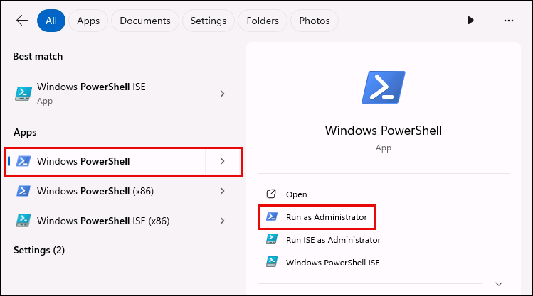

4. [] In the PowerShell terminal, set the network category to **Private** by running:

    ```powershell
    Set-NetConnectionProfile -NetworkCategory Private
    ```

5. [] Verify the change by running:

    ```powershell
    Get-NetConnectionProfile
    ```

    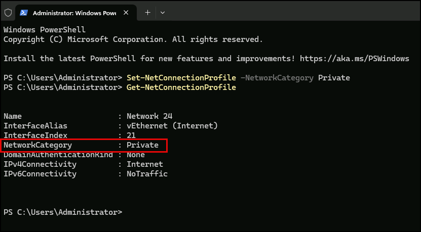

6. [] Open a browser on the Lab VM and navigate to <https://aka.ms/migrate/hyperv/script> to download the **MicrosoftAzureMigrate-Hyper-V.ps1** script.

    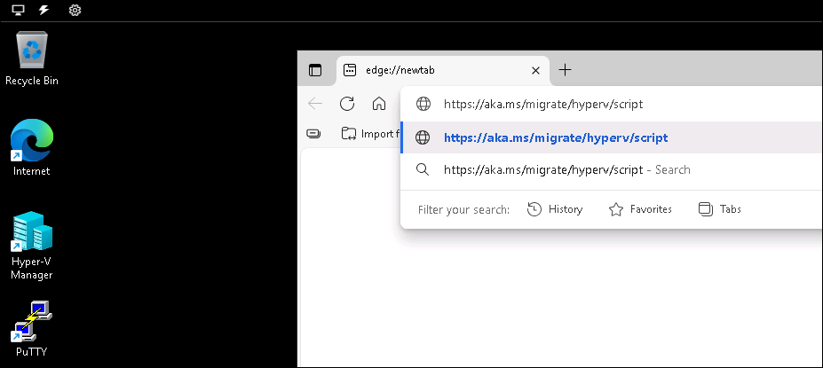

7. [] Return to PowerShell and change to the **Downloads** directory:

    ```powershell
    cd Downloads
    ```

8. [] Execute the downloaded script:

    ```powershell
    .\MicrosoftAzureMigrate-Hyper-V.ps1
    ```

9. [] Respond to the script prompts as follows:

    - [] Do you want to run software from this untrusted publisher?: `[A] Always run`
    - [] Enable Remote Management (WinRM)?: `Y`
    - [] Make these changes?: `y`
    - [] Enable PowerShell Remoting?: `Y`
    - [] Configure firewall to open required ports?: `Y`
    - [] Use SMB share(s) to store VHDs?: `Y`
    - [] Create non-administrator local user for Azure Migrate?: `Y`
    - [] When prompted for credentials:
      - [] **Username**: `MigrateLocal`  
      - [] **Password**: `Pa$$w0rd`

10. [] After the script completes, reset the network category to **Public**:

    ```powershell
    Set-NetConnectionProfile -NetworkCategory Public
    ```

11. [] Confirm the reset by running:

    ```powershell
    Get-NetConnectionProfile
    ```

    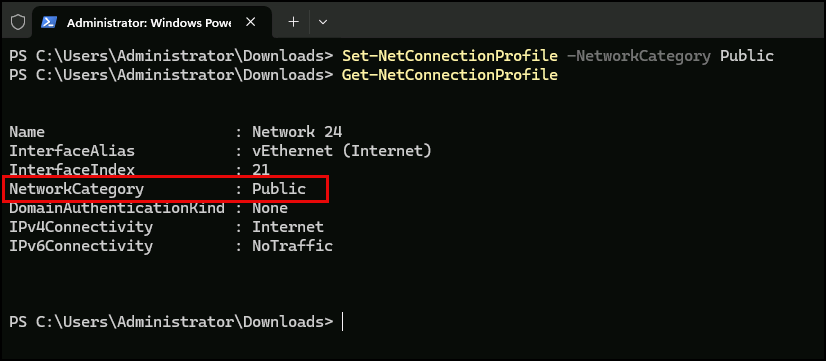

12. [] Close the PowerShell window.

===

# Task 2: Provision an Azure Migrate Service

## Introduction

Azure Migrate is a service that helps you decide on, plan, and execute your migration to Azure. Azure Migrate helps you find the best migration path, assess for Azure readiness and cost of hosting workloads on Azure, and perform the migration with minimal downtime and risk. Azure Migrate provides support for servers, databases, web apps, virtual desktops, and large-scale offline migration by using Azure Data Box.

## Description

In this task, you will use Azure Cloud Shell to run a PowerShell script that provisions the resources needed to support the Azure Migration Service, including a resource group, storage account, and a virtual network.

## Success criteria

- You have successfully executed the PowerShell script in Azure Cloud Shell and provisioned the required Azure resources

## Learning resources

- [Preparing for migrating Linux Virtual Machine to Azure](https://learn.microsoft.com/azure/migrate/prepare-for-migration?view=migrate-classic)

## Key tasks

1. [] Open a web browser on the Lab VM and navigate to the [Azure portal](https://portal.azure.com/).

2. [] Sign in using your lab credentials from the **Resources** tab in the instructions panel.

    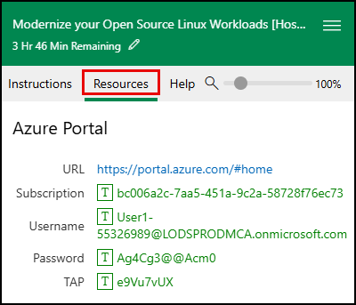

    > **IMPORTANT**: You may be prompted to use a Temporary Access Pass (TAP) for login. This value is listed on the **Resources** tab.
    >
    > 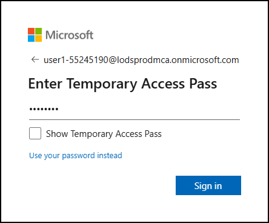
    >
    > If TAP does not work, choose **Use your password instead** and log in using the provided password.
    >
    > 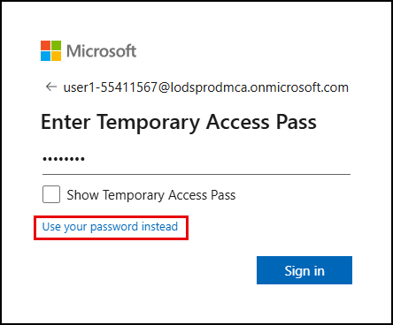

3. [] Select **Yes** if prompted to stay signed in.

4. [] In the Azure portal, start a Cloud Shell session by selecting the Cloud Shell icon in the top bar.

    

5. [] When prompted, choose `PowerShell` as your shell type.

6. [] In the Cloud Shell setup dialog:

    - [] Select `No storage account required`
    - [] Choose the available subscription from the dropdown
    - [] Ensure **Use an existing private virtual network** is **NOT** checked
    - [] Select **Apply**

    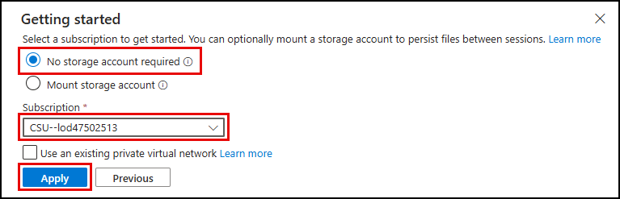

7. [] At the Cloud Shell prompt, run the following script to create the required resources in the `RG-Techsummit` resource group:

    > **TIP**:
    > You may need to press `ENTER` during the `New-AzVirtualNetwork` command to complete execution.

    ```powershell
    # Get the precreated resource group
    $resourceGroupName = "RG-Techsummit"
    $resourceGroup = Get-AzResourceGroup -Name $resourceGroupName
    # Retrieve the location of the resource group
    $location = $resourceGroup.Location

    $storagePrefix = "storazmig"
    $vnetName = "vnet-AzMigrateLab"

    # Generate unique storage account name
    $randomSuffix = -join ((48..57) + (97..122) | Get-Random -Count 8 | % {[char]$_})
    $storageAccountName = "$storagePrefix$randomSuffix"

    # Create storage account
    Write-Host "Creating storage account '$storageAccountName'..."
    New-AzStorageAccount -ResourceGroupName $resourceGroupName `
        -Name $storageAccountName `
        -Location $location `
        -SkuName Standard_GRS `
        -Kind StorageV2 `
        -AllowBlobPublicAccess $false `
        -PublicNetworkAccess "Enabled"

    # Create Virtual Network and Subnet
    Write-Host "Creating virtual network '$vnetName' with subnet 'default'..."
    $subnetConfig = New-AzVirtualNetworkSubnetConfig -Name "default" -AddressPrefix "198.168.4.0/26"
    New-AzVirtualNetwork -Name $vnetName `
        -ResourceGroupName $resourceGroupName `
        -Location $location `
        -AddressPrefix "198.168.4.0/24" `
        -Subnet $subnetConfig
    ```

8. [] When the script finishes, verify storage account and virtual network outputs look similar to:

    ```powershell
    StorageAccountName ResourceGroupName PrimaryLocation SkuName      Kind      AccessTier CreationTime          ProvisioningState EnableHttpsTrafficOnly
    ------------------ ----------------- --------------- -------      ----      ---------- ------------          ----------------- ----------------------
    storazmigxbmezwi7  RG-Techsummit     westus2         Standard_GRS StorageV2 Hot        10/17/2025 9:53:25 PM Succeeded         True
    ```

    ```powershell
    ResourceGroupName Name              Location  ProvisioningState EnableDdosProtection DefaultPublicNatGateway
    ----------------- ----              --------  ----------------- -------------------- -----------------------
    RG-Techsummit     vnet-AzMigrateLab westus2   Succeeded         False
    ```

9. [] Close the Cloud Shell pane.

10. [] In the Azure portal, navigate to the `RG-Techsummit` resource group and verify you see the newly created storage account and Virtual network resources.

    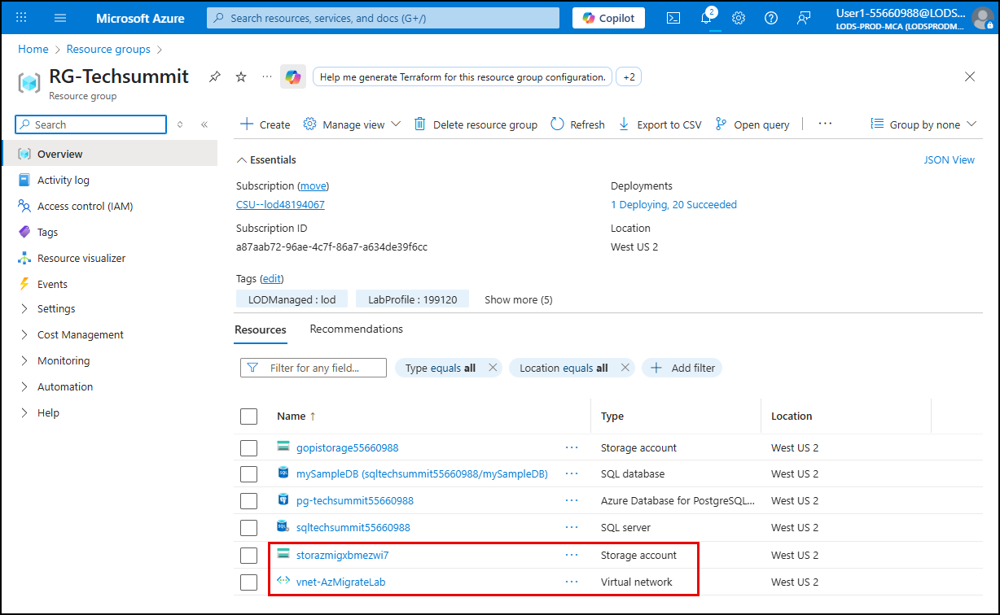

===

# Task 3: Create a new migration project

## Introduction

Projects in Azure Migrate are used to store discovery, assessment, and migration metadata collected from the environment you're asssessing or migrating. In a project, you can track discovered assets, create assessments, and orchestrate migrations to Azure.

## Description

In this task, you will create a new Azure Migrate project in the Azure portal.

## Success criteria

- You have created a new Azure Migrate project in the Azure portal  

## Learning resources

- [Quickstart: Create an Azure Migrate project using the Azure portal](https://learn.microsoft.com/azure/migrate/quickstart-create-project?view=migrate-classic)

## Key tasks

1. [] In the Azure portal, search for "Azure Migrate" in the search bar and select **Azure Migrate** under **Services**.

    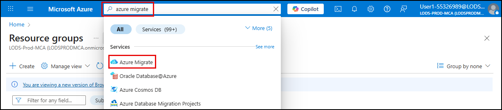

2. [] On the **Azure Migrate** blade:

    - [] Select **All projects** in the left menu  
    - [] Select **Create Project** in the toolbar

    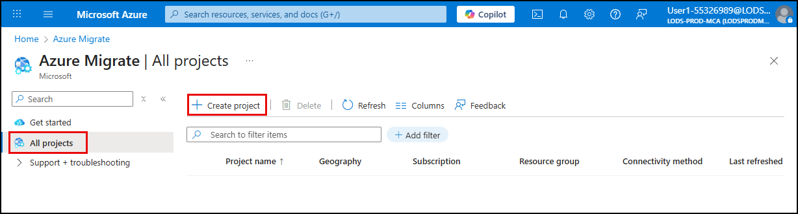

3. [] On the **Create Project** blade, enter the following:

    - [] **Subscription**: Accept the default  
    - [] **Resource group**: Select `RG-Techsummit`  
    - [] **Project name**: `Linux-VM-Migration`  
    - [] **Geography**: `United States`  
    - [] Expand **Advanced** and verify **Connectivity method** is set to `Public Endpoint`  
    - [] Select **Create**

    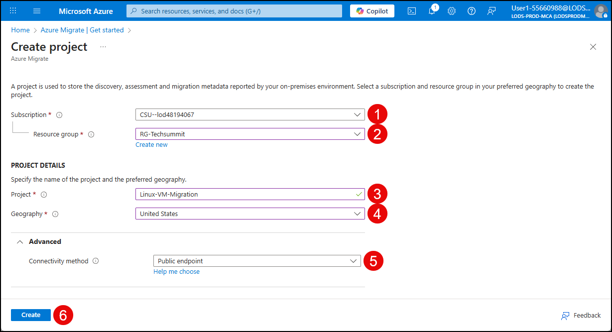

4. [] After project creation completes, select **Refresh** on the **All projects** blade to view your new project.

    > Keep this blade open for the next task.

===

# Task 4: Register the Azure Migrate appliance

## Introduction

To begin discovery and assessment of on-premises virtual machines, Azure Migrate requires an appliance to be registered and connected to your Azure Migrate project. The appliance collects metadata about your Hyper-V environment and securely transmits it to Azure for analysis. You will use the Azure Migrate Appliance Configuration Manager to register your appliance with the Azure Migrate project created earlier. This step enables discovery of virtual machines hosted on your Hyper-V environment.

## Description

In this task, you will register the pre-provisioned Azure Migrate appliance using the Appliance Configuration Manager.

## Success criteria

- Your Azure Migrate project key has been verified  
- You have successfully logged in with your lab user credentials  
- Your appliance has been successfully registered  

## Learning resources

- [Azure Migrate appliance](https://learn.microsoft.com/azure/migrate/migrate-appliance?view=migrate-classic)  
- [Appliance requirements](https://learn.microsoft.com/azure/migrate/migrate-appliance?view=migrate-classic)  
- [Preparing for migrating Linux Virtual Machine to Azure](https://learn.microsoft.com/azure/migrate/prepare-for-migration?view=migrate-classic)

## Key tasks

1. [] On the Azure Migrate **All projects** blade in the Azure portal, select the **Linux-VM-Migration** project.

    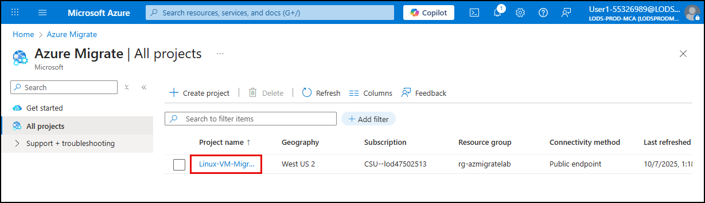

2. [] On the **Overview** page, select **Start Discovery**, then choose `Using Appliance` → `For Azure`.

    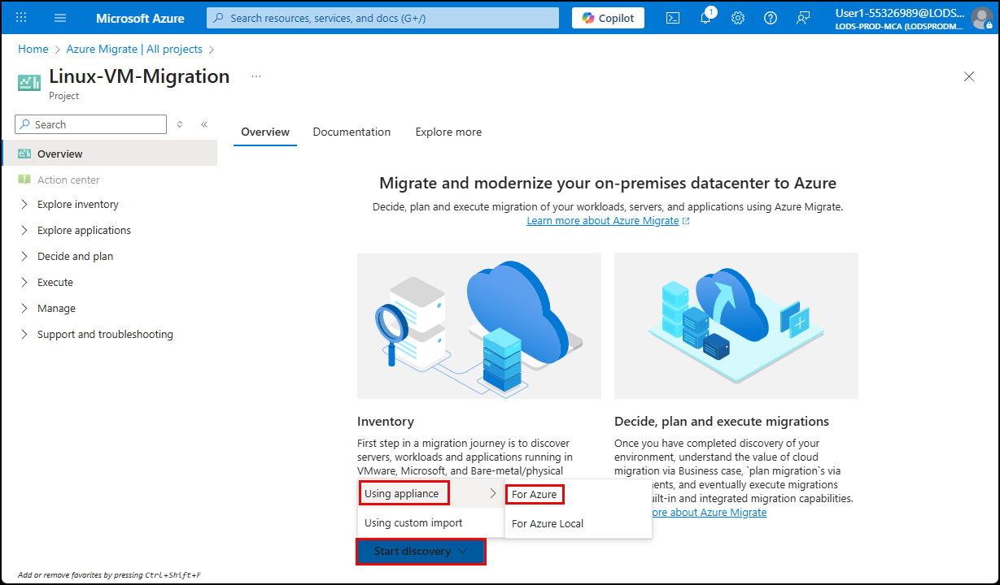

3. [] On the **Discover** blade:

    - [] **Are your servers virtualized?** → `Yes, with Hyper-V`  
    - [] **Name your appliance** → `LabAppliance`  
    - [] Select **Generate Key**

    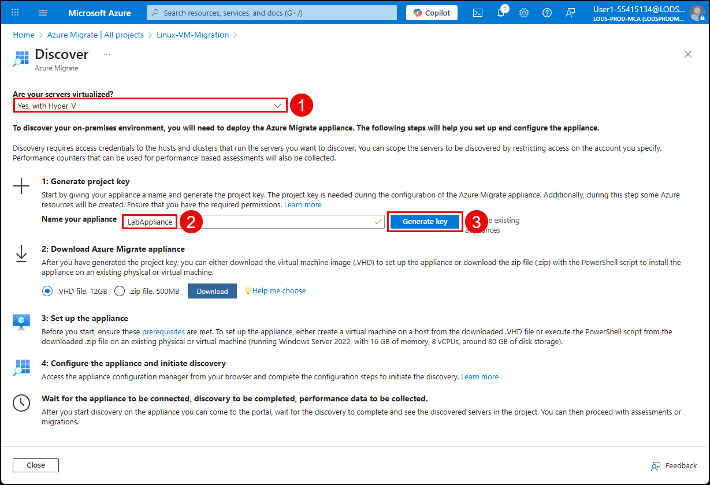

4. [] After a minute or two, a **Project key** field will appear on the Discover screen. Copy the project key.

    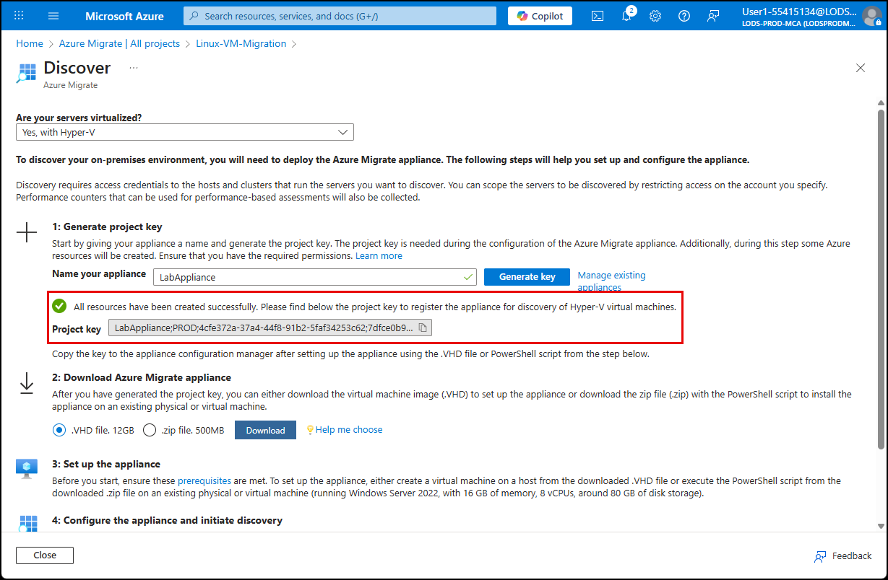

    > **IMPORTANT**: Do not download the Azure Migrate appliance VHD or ZIP file.

5. [] On the Lab VM, open **Hyper-V Manager** and connect to the `AzMigrateAppliance-Test` VM.

    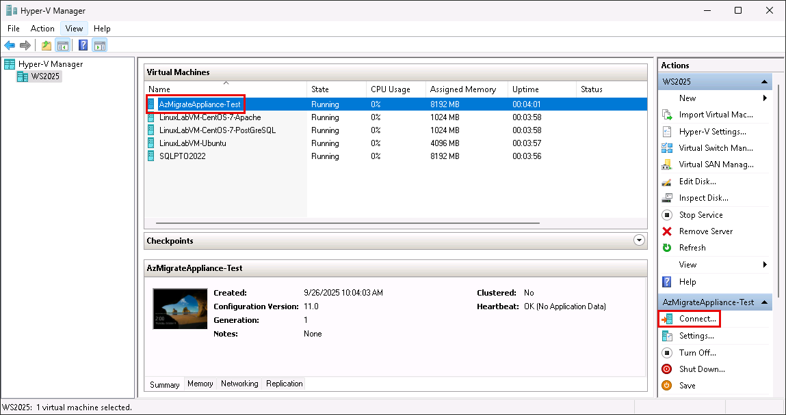

6. [] Log in to the VM using the following credentials:

    - [] **Username**: `Administrator`
    - [] **Password**: `Pa$$w0rd`

7. [] On the `AzMigrateAppliance-Test` VM desktop, open the **Azure Migrate Appliance Configuration Manager**.

    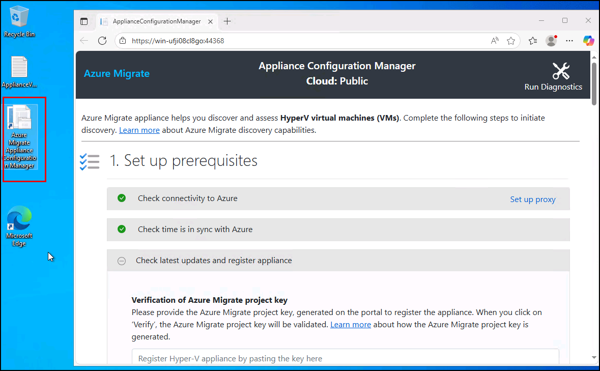

8. [] Under **Verification of Azure Migrate project key**, paste the project key into the **Project key** field and select **Verify**.

    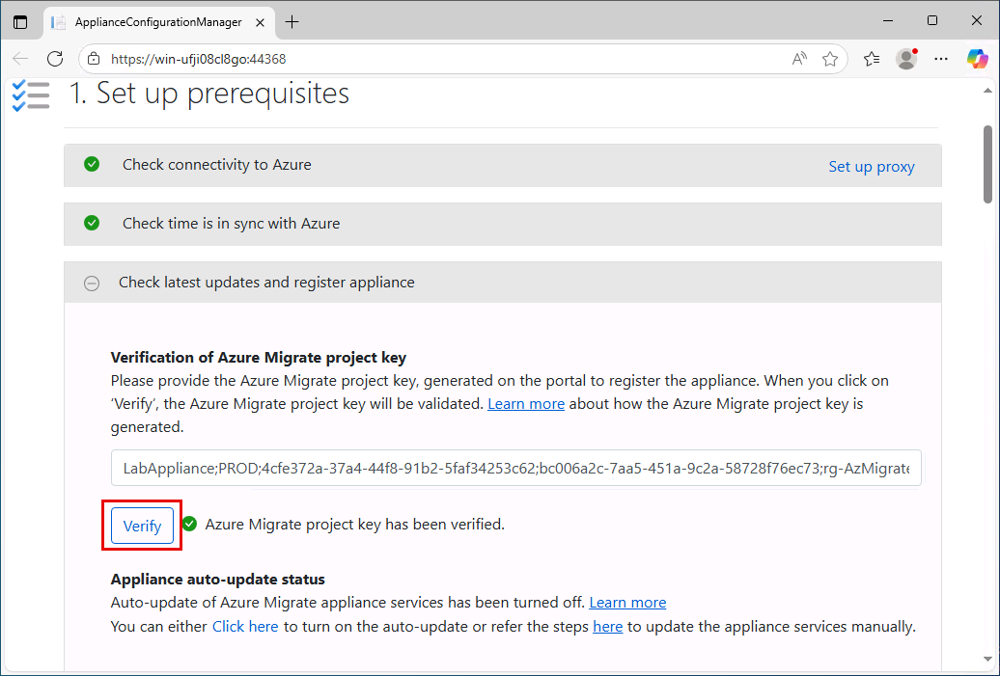

    > [!NOTE]
    > If you receive an internal server error while verifying the project key, periodically try again until it succeeds.

9. [] It may take a few minutes after selecting verify for the Appliance prerequisites to be installed. If you receive a **New update installed** notification, select **Refresh** and then you will need to select **Verify** again to proceed.

    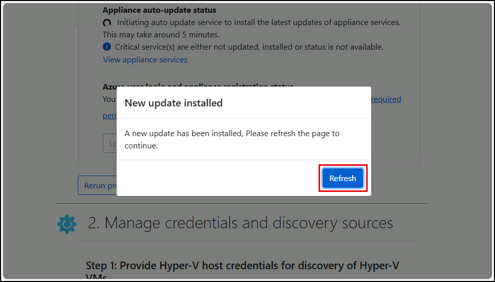

10. [] Scroll to the **Azure user login and appliance registration status** section and select **Login**.

    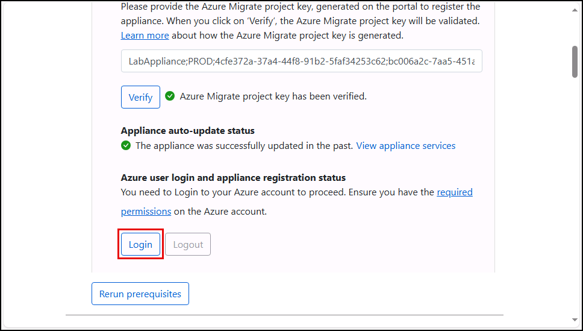

    > **Note** You can safely ignore errors about not being able to deploy the required Azure artifacts for discovery of MySQL and PostgreSQL Server instances and databases, if you receive them.
    >
    > 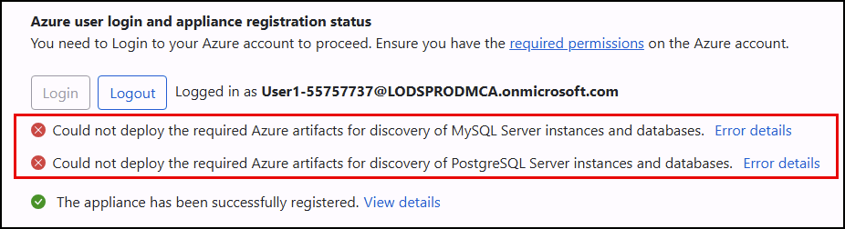

11. [] In the pop-up window, select **Copy code & Login**.

    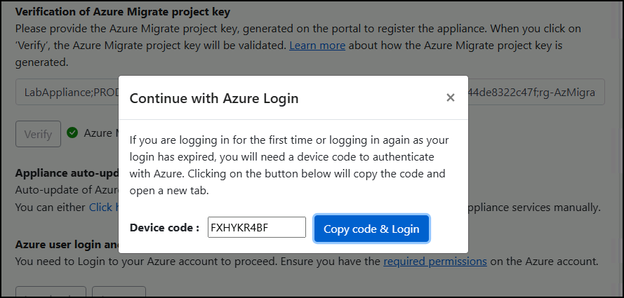

12. [] Enter the code in the next window and sign in using the Azure credentials from the **Resources** tab in the lab instructions.

13. [] Close the sign-in window and return to the **Appliance Configuration Manager** browser tab.

> **IMPORTANT**:
>
> The login and application registration process can take around 10 minutes. Move on to Exercise 2 while this completes.
