# Exercise 2: Provision Azure Database Migration Service

Contoso Inc. is continuing its infrastructure modernization journey by migrating legacy workloads to Azure in order to improve scalability, security, and operational efficiency. As part of this initiative, the company plans to move its on-premises SQL Server databases to Azure SQL Database to take advantage of the fully managed platform that offers built-in high availability, automated updates, and elastic scalability.

As part of their cloud modernization, Contoso wants to migrate the on-premises SQL Server database supporting its human resources personnel system to Azure SQL Database using the [Azure Database Migration Service](https://learn.microsoft.com/azure/dms/dms-overview).

In this exercise, you will provision a new Azure Database Migration Service (DMS) instance. You will also install and configure a self-hosted integration runtime (SHIR) to enable secure connectivity to the source SQL Server and preparing for the migration process.

## Objectives

After completing this exercise, you will be able to:

- Provision a new Azure Database Migration Service using the Azure portal
- Install and configure a self-hosted integration runtime (SHIR) to establish secure connectivity between on-premises SQL servers and Azure

## Duration

**Estimated time**: 15 minutes

===

# Task 1: Create an Azure Database Migration Service

In this task, you will provision an Azure Database Migration Service instance to facilitate the migration of the on-premises SQL Server database to Azure SQL Database.

## Introduction

Azure Database Migration Service (DMS) is a fully managed service that enables seamless migrations from on-premises or cloud-hosted databases to Azure data platforms. It supports both offline and online migration modes, allowing organizations to choose between minimal downtime or simplified cutover depending on their operational needs. In this lab, you will use DMS to migrate a SQL Server database to Azure SQL Database.

## Description

In this task, you will provision a new instance of Azure Database Migration Service using the Azure portal. This service will be used to orchestrate the migration of the on-premises SQL Server database to Azure SQL Database. Provisioning the service is a prerequisite for configuring and launching the migration project in later tasks.

## Success criteria

- A new Azure Database Migration Service instance has been successfully created in the correct resource group and region.
- The migration scenario has been configured to support SQL Server to Azure SQL Database.
- The deployment status shows **Succeeded**, and the resource is accessible from the Azure portal.

## Learning resources

- [What is Azure Database Migration Service?](https://learn.microsoft.com/azure/dms/dms-overview)
- [Create a Database Migration Service instance](https://learn.microsoft.com/data-migration/sql-server/database/database-migration-service?toc=%2Fazure%2Fdms%2Ftoc.json&tabs=portal#create-a-database-migration-service-instance)

## Key tasks

In this task, you will provision a new Azure Database Migration Service using the Azure portal.

1. [] Open a web browser on the Lab VM and navigate to the [Azure portal](https://portal.azure.com/).

2. [] Sign in using your lab credentials from the **Resources** tab in the instructions panel.

    

    > **IMPORTANT**: You will be prompted to use a Temporary Access Pass (TAP) for login. This value is also listed on the **Resources** tab.
    >
    > 

3. [] Click **Yes** if prompted to stay signed in.

4. [] On the Azure portal home page, select **Resource groups** under **Azure services**.

    

5. [] Select the **RG-Techsummit** resource group.

    

6. [] On the **RG-Techsummit** blade, note the **Location** of the resource group and its resources, then select **Create** in the toolbar.

    

7. [] On the **Marketplace** blade, search for "database migration," and select the **Azure Database Migration Service** from the search results.

    

8. [] On the **Azure Database Migration Service** blade, select **Create**.

    

9. [] On the **Select migration scenario and Database Migration Service** page, use the following settings:

    1. [] **Source server type**: `SQL Server`
    2. [] **Target server type**: `Azure SQL Database`
    3. [] **Database Migration Service**: `Database Migration Service`
    4. [] Choose **Select**

    

10. [] On the **Basics** tab of the **Create Data Migration Service** blade, enter the following:

    1. [] **Subscription**: Accept the default subscription
    2. [] **Resource group**: Ensure `RG-Techsummit` is selected
    3. [] **Location**: Choose the region noted earlier
    4. [] **Migration service name**: `dms-sql-migration-lab`
    5. [] Select **Review + create**

    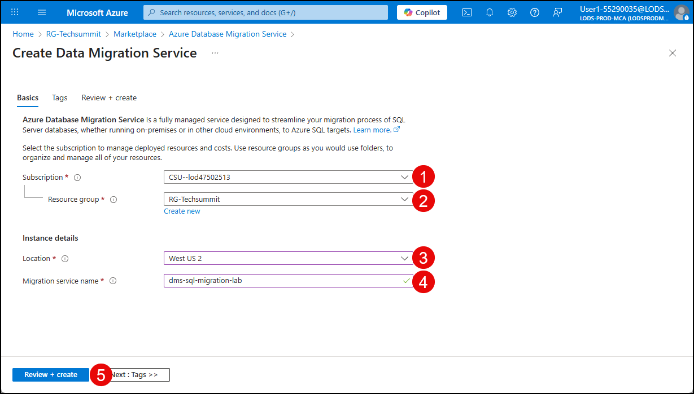

11. [] On the **Review + create** tab, select **Create** to provision the Database Migration Service.

    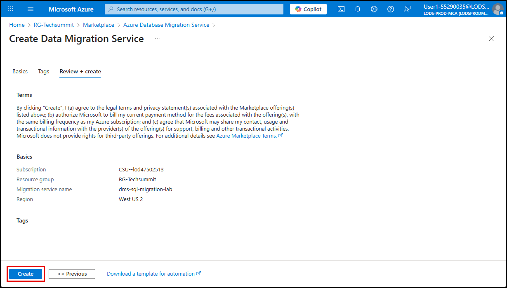

12. [] Monitor the deployment progress and select **Go to resource** when the deployment is complete.

    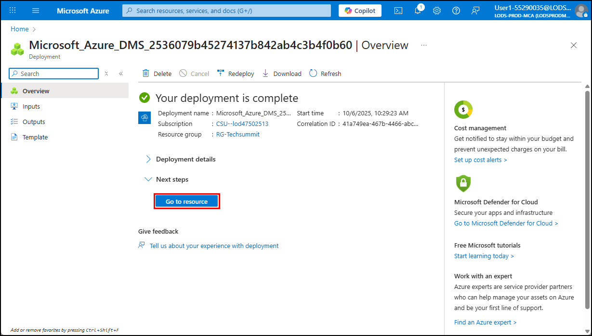

===

# Task 2: Configure a self-hosted integration runtime

## Introduction

An Integration Runtime (IR) provides the compute infrastructure used by the Azure Database Migration Service (DMS) to securely move data between source and target environments. A self-hosted integration runtime (SHIR) is required when the source database resides in a private network, such as an on-premises data center or a VM-hosted SQL Server, because it enables secure connectivity between the local environment and Azure.

> **Note**  
> When migrating from SQL Server to Azure SQL Database, a SHIR is required because Azure DMS cannot directly access on-premises SQL Server instances over the public internet. The SHIR acts as a secure bridge, running inside the source network and relaying data to Azure through encrypted channels.

## Description

In this task, you will download and configure the self-hosted integration runtime (SHIR) associated with your Azure Database Migration Service. You will install the SHIR on the Lab VM to allow DMS to connect to the on-premises SQL Server and perform the migration. Once registered, the SHIR will appear in the Azure portal with a status of **Online**, confirming that it is ready to be used in the migration workflow.

## Success criteria

- The self-hosted integration runtime has been successfully installed and registered using the authentication key from Azure DMS.
- The SHIR is running on the Lab VM, enabling secure connectivity to the on-premises SQL Server instance.
- The SHIR node appears in the Azure portal with a status of **Online**, confirming that it is ready to facilitate migration.
- The IP address of the SHIR has been added to the firewall of the Azure SQL database.

## Learning resources

- [Recommendations for using a self-hosted integration runtime for database migrations](https://learn.microsoft.com/azure/dms/migration-using-azure-data-studio?tabs=azure-sql-mi#recommendations-for-using-a-self-hosted-integration-runtime-for-database-migrations)
- [Create a new instance of Database Migration Service](https://learn.microsoft.com/data-migration/sql-server/database/database-migration-service?toc=%2Fazure%2Fdms%2Ftoc.json&tabs=portal#create-a-new-instance-of-database-migration-service)

## Key tasks

1. [] On the Azure Database Migration Service **Overview** blade you opened at the end of the previous task, select **View integration runtime** in the **View integration runtime** tile in the **Getting started** tab.

    

2. [] On the **Integration runtime** blade, select **Configure integration runtime** on the toolbar.

    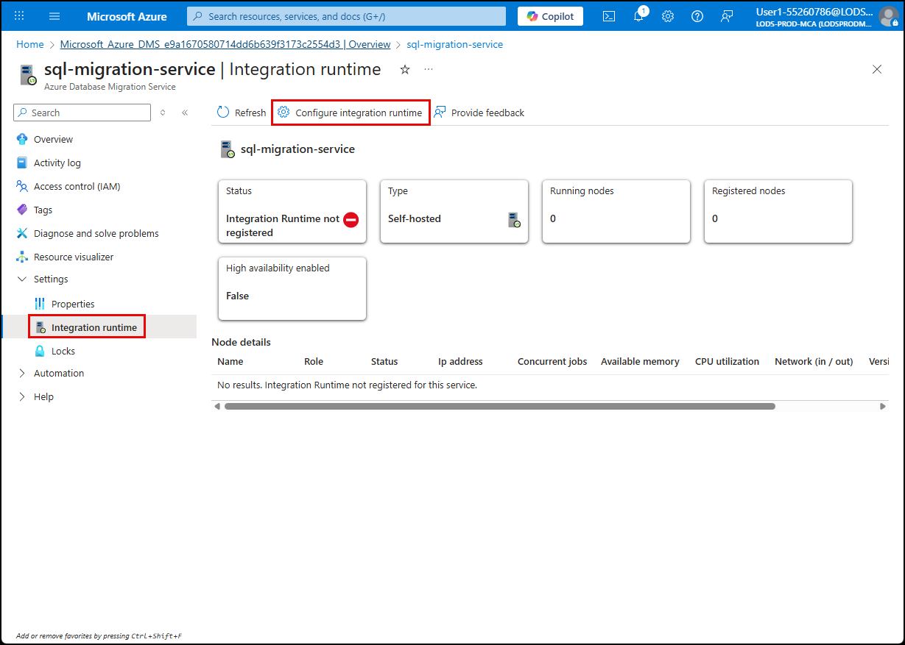

    > **NOTE**: Typically you would select the download link for the integration runtime on the **Configure integration runtime** dialog. However, to save time in this exercise, the Microsoft Integration Runtime has already been downloaded into the **Downloads** folder on the Lab VM desktop.

3. [] On the Lab VM, open **File Explorer** and navigate to the **Downloads** folder. Run the Integration Runtime MSI to install the integration runtime.

    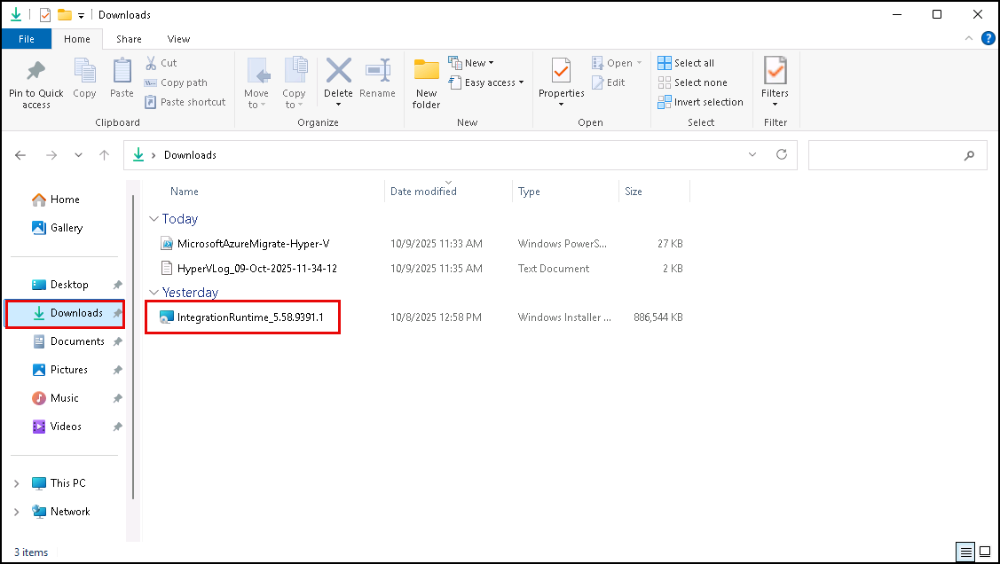

4. [] Complete the installation, accepting the license agreement and default values on each screen. On the final screen, select **Finish**, which will launch the **Microsoft Integration Runtime Configuration Manager**.

5. [] Return to the Azure portal and copy the **Authentication key** from the **Configure integration runtime** dialog (use **key 1**).

    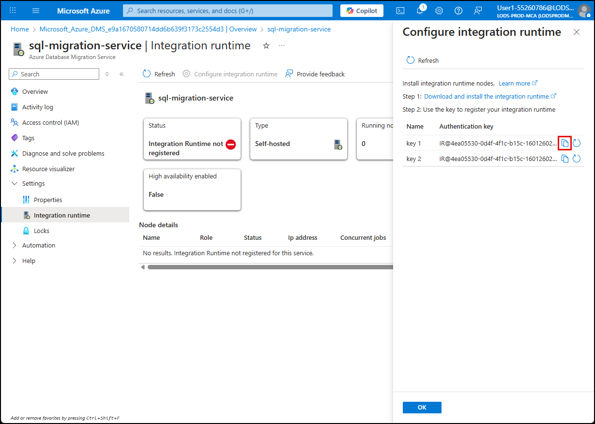

6. [] Paste the key into the **Authentication key** box in the Configuration Manager and select **Register**.

    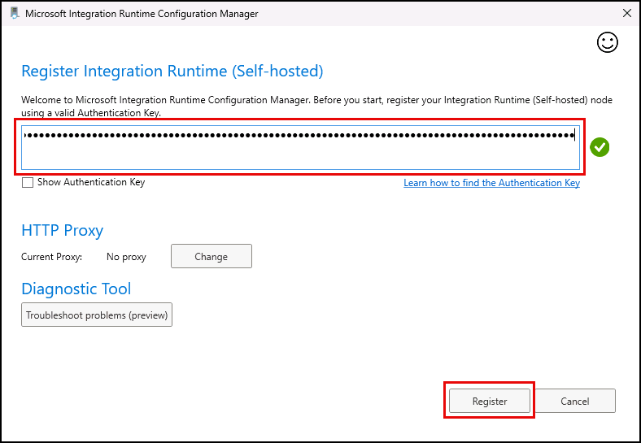

7. [] Select **Finish** on the **New Integration Runtime (Self-hosted) Node** dialog.

    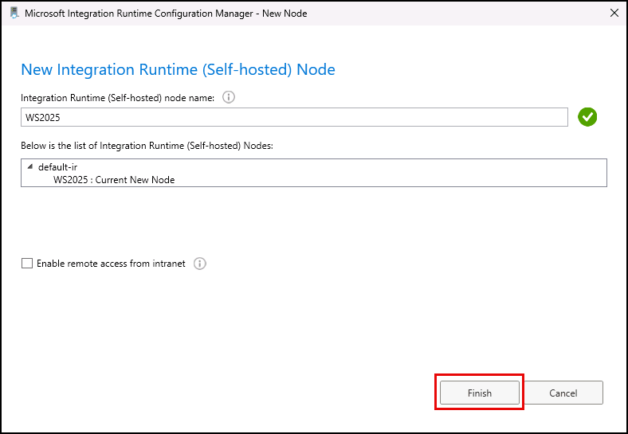

8. [] Confirm that the integration runtime node has been registered successfully.

    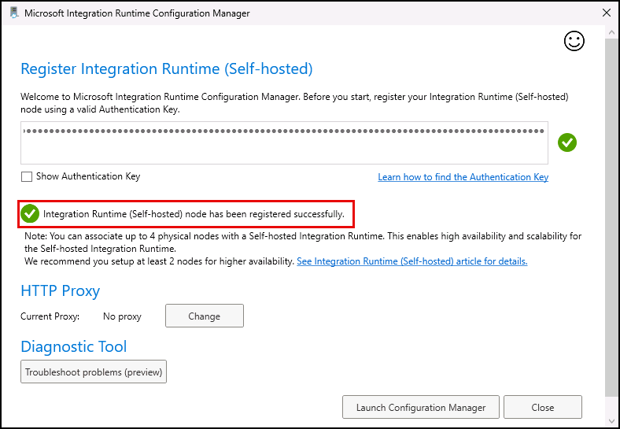

9. [] Select **Close** to exit the Microsoft Integration Runtime Configuration Manager.

10. [] Return to the **Integration runtime** blade in the Azure portal, select **Ok** to close the **Configuration integration runtime** dialog, then select **Refresh** on the **Integration runtime** page and confirm the node status appears as **Online**.

    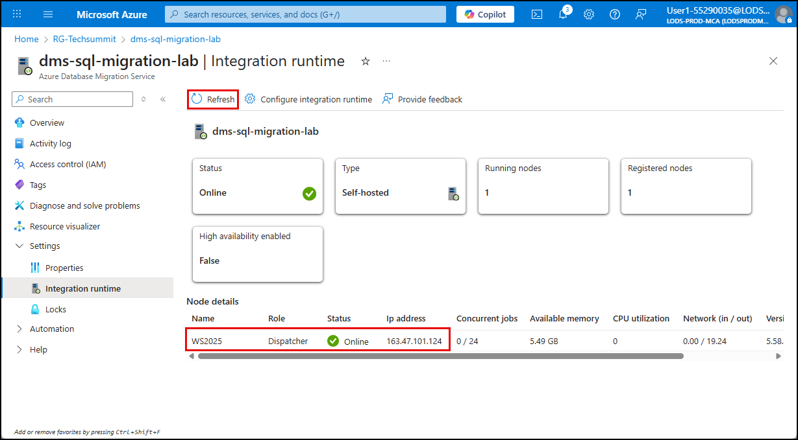

11. [] Before leaving the **Integration runtime** blade, copy the IP address of the SHIR node so it can be added to the firewall of your Azure SQL Server.

    

12. [] To get to your SQL server resource, enter "sql" in the Azure search bar and select your SQL server under **Resources** in the search results.

    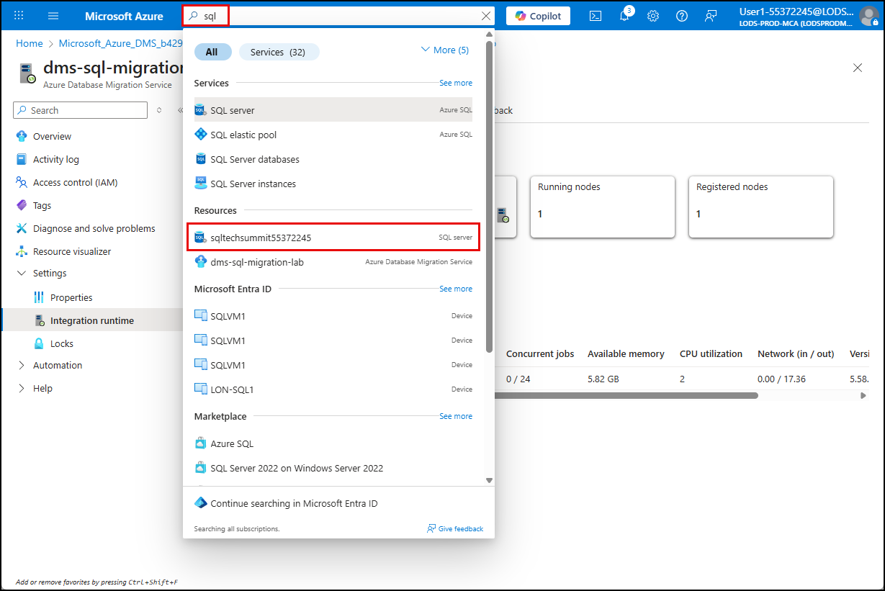

13. [] On the SQL server blade, expand **Security** in the left menu, select **Networking**, then select **Add a firewall rule**.

    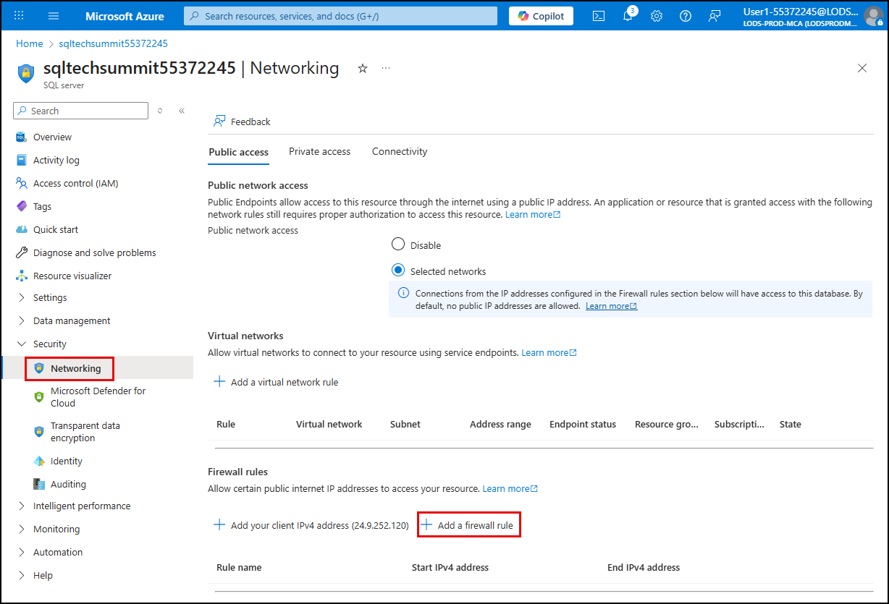

14. [] In the **Add a firewall rule** dialog, enter `SHIR` for the rule name, then paste the IP address of your SHIR node into both the start and end IP boxes, and select **OK**.

    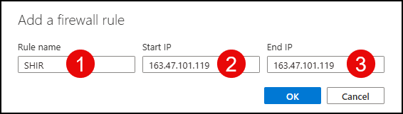

15. [] Select **Save** on the Network blade to create the firewall rule.

Congrats! With DMS and the SHIR configured, you are ready to move on to the next task of performing discovery on your Hyper-V hosted workloads in Azure Migrate.
