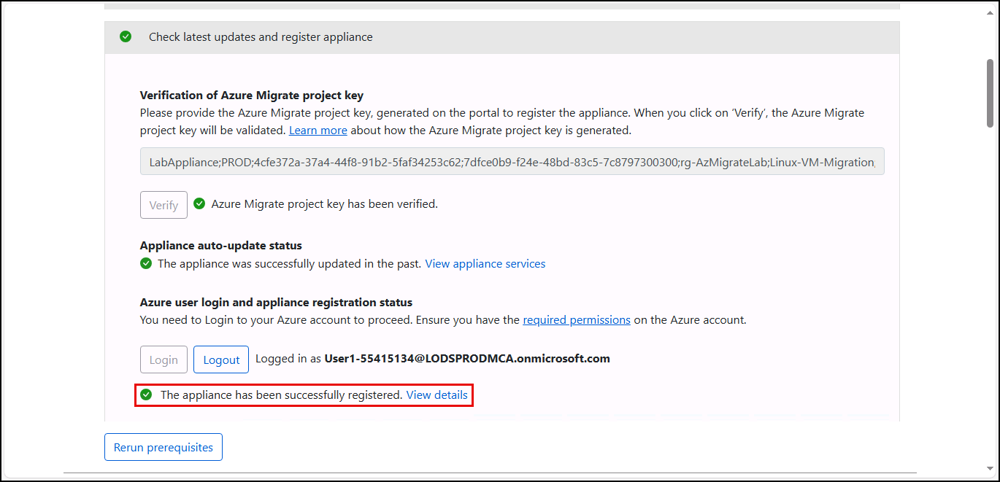

# Exercise 3: Discover virtual machines and workloads on the Hyper-V host

Discovery is the foundational step in any successful migration strategy, and Azure Migrate provides a robust framework for assessing on-premises environments. Using agentless guest discovery, organizations can inventory installed software, identify workload dependencies, and map application interconnectivity across servers. This visibility enables informed planning, risk mitigation, and prioritization of workloads for migration.

In this exercise, you will use the [Azure Migrate Service](https://learn.microsoft.com/azure/migrate/prepare-for-migration?view=migrate-classic) perform discovery against Contoso's Hyper-V-hosted virtual machines, simulating the real-world steps Contoso's IT team would follow to transition legacy infrastructure into a cloud-first model.

## Duration

**Estimated time**: 10 minutes

===

# Task 1: Discover virtual machines and workloads

## Introduction

Once the Azure Migrate appliance has been registered, you can begin the discovery process for virtual machines hosted on your Hyper-V environment. The discovery process collects metadata about VM configurations, operating systems, and resource usage, which helps assess readiness and plan migration strategies.

By enabling guest discovery, you can also identify workloads running inside the virtual machines—such as SQL Server, PostgreSQL, and other database platforms. This deeper insight allows you to plan workload-specific migrations and apply appropriate tooling and remediation steps. Guest discovery requires valid credentials and access to the VMs to collect software inventory, dependencies, and workload metadata.

## Description

In this task, you configure discovery credentials and host details in the Azure Migrate Appliance Configuration Manager, then initiate the discovery process. With guest discovery enabled, the appliance will identify both virtual machines and the workloads running inside them, including database platforms and installed software. Discovery results are sent to your Azure Migrate project for review.

## Success criteria

- You provide credentials to enable virtual machine and guest workload discovery
- You initiate discovery in the Azure Migrate project

## Learning resources

- [Discover servers running on Hyper-V with Azure Migrate: Discovery and assessment](https://learn.microsoft.com/azure/migrate/tutorial-discover-hyper-v?view=migrate-classic)
- [Discover installed software inventory, web apps, and SQL Server instances and databases](https://learn.microsoft.com/azure/migrate/how-to-discover-applications?view=migrate-classic)
- [Provide server credentials to discover software inventory, dependencies, web apps, and SQL Server instances and databases](https://learn.microsoft.com/azure/migrate/add-server-credentials?view=migrate-classic)

## Key tasks

1. [] Return to the **Appliance Configuration Manager** on the `AzMigrateAppliance-Test` VM and verify you see a message that the appliance has been successfully registered.

    

2. [] Continue to Section 2, **Manage credentials and discovery sources**. Select **Add credentials** under **Step 1: Provide Hyper-V host credentials for discovery of Hyper-V VMs**.

    

3. [] In the **Add credentials** popup, enter the following:

    - [] **Friendly name**: `LabCredentials`  
    - [] **Username**: `MigrateLocal`  
    - [] **Password**: `Pa$$w0rd`  
    - [] Select **Save**

    

4. [] Under **Step 2: Provide Hyper-V host/cluster details**, select **Add discovery source**.

    

5. [] In the **Add discovery source** dialog, select **Add single item**.

    

6. [] To complete the form, you'll need the IP address of your Lab VM (which acts as the Hyper-V host). On the Lab VM, open **Command Prompt** (`cmd.exe`) and run:

    ```bash
    ipconfig
    ```

7. [] Copy the `IPv4 Address` from the output.

8. [] Return to the **Appliance Configuration Manager** and complete the **Add discovery source** form:

    - [] **Discovery source**: Leave `Hyper-V Host/Cluster` selected  
    - [] **IP Address/FQDN**: Paste the IP address of your Lab VM  
    - [] **Map credentials**: Choose `LabCredentials`  
    - [] Select **Save**

    

9. [] You should receive a **Validation successful** message within a minute or so.

    

10. [] After validation completes, ensure **Guest discovery is enabled by default** under **Step 3: Provide server credentials to perform guest discovery of installed software, dependencies, and workloads** is enabled.

    

11. [] Scroll down and select **Add credentials**.

    

12. [] In the **Add credentials** popup, enter the following:

    - [] **Credentials type**: `Windows (Non-domain)`  
    - [] **Friendly name**: `SqlWindows`
    - [] **Username**: `Administrator`  
    - [] **Password**: `P@$$w0rd1`

    

13. [] Select **Add more** and add a second set of credentials:

    - [] **Credentials type**: `Linux (Non-domain)`  
    - [] **Friendly name**: `Ubuntu`
    - [] **Username**: `administrator`  
    - [] **Password**: `Pa$$w0rd`

14. [] Select **Add more** and add a third set of credentials:

    - [] **Credentials type**: `Linux (Non-domain)`  
    - [] **Friendly name**: `CentOS`
    - [] **Username**: `root`  
    - [] **Password**: `Pa$$w0rd`

15. [] Select **Add more** and add a fourth set of credentials:

    - [] **Credentials type**: `SQL Server Authentication`  
    - [] **Friendly name**: `SqlServer`
    - [] **Username**: `sqladmin`
    - [] **Password**: `Microsoft123`

16. [] Select **Add more** and add a fifth set of credentials:

    - [] **Credentials type**: `PostgreSQL Server (Password based)`  
    - [] **Friendly name**: `PostgreSQL`
    - [] **Username**: `pgadmin`
    - [] **Password**: `pgadmin123`

17. [] Select **Save** to close the **Add credentials** dialog.

18. [] Verify that all five sets of credentials appear under **Step 3**.

    

19. [] Scroll down and select the **Start Discovery** button.

    

> **IMPORTANT**:
>
> Initializing the **Discovery** step can take up to 15 minutes to complete. Move on to the next exercise while this completes.
