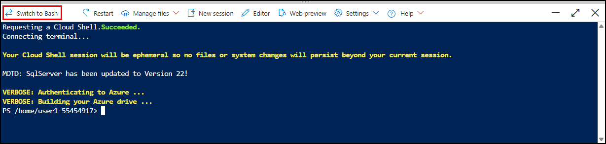

# Exercise 4: Prepare on-premises web apps for migration

Contoso Inc. wants to modernize its customer-facing DVD Rental PHP application. The goal is to replicate the existing PHP-based DVD rental application, currently hosted on a Linux VM, to an Azure App Service Plan. This migration will allow Contoso to leverage platform-as-a-service (PaaS) benefits such as autoscaling, integrated monitoring, and simplified deployment, while maintaining the application's functionality and performance.

In this exercise, you will deploy an App Service Plan in Azure and migrate a web application to the App Service Plan.

## Objectives

After you complete this exercise, you will be able to:

- Deploy an App Service Plan in Azure.
- Deploy a web application to the App Service Plan.
- Migrate the web application so that it is hosted in the App Service in Azure.

## Duration

**Estimated time**: 10 minutes

===

# Task 1: Provision Azure App Service Plan and deploy the web app

## Introduction

Azure App Service Plans define the underlying compute resources that host your web applications, APIs, and functions in Azure. They determine key aspects such as pricing tier, scalability, performance, and regional availability. By selecting an appropriate App Service Plan, you can optimize cost and performance while enabling features like autoscaling, custom domains, and deployment slots.

## Description

In this task, you will use the Azure CLI in the Cloud Shell to deploy a web application to an App Service Plan in Azure. The web application code is hosted in a public GitHub repository. You will clone the repository, then use the `az webapp up` command to deploy the web application to an App Service Plan in your existing Resource Group named `RG-Techsummit`. The web application will be deployed using the PHP 8.2 runtime on Linux.

## Success criteria

- The App Service Plan is provisioned successfully.
- The web application is deployed to the App Service Plan and is accessible.

## Learning resources

- [az webapp up CLI command](https://learn.microsoft.com/cli/azure/webapp?view=azure-cli-latest#az-webapp-up)

## Key tasks

1. [] On the Lab VM, return to the [Azure portal](https://portal.azure.com/).

2. [] In the Azure portal, open a new **Cloud Shell** from the top bar of the portal.

    

3. [] In the Cloud Shell pane, ensure that you are using a Bash environment. If not, select **Switch to Bash** and select **Confirm** in the **Switch to Bash in Cloud Shell** dialog.

    

4. [] In the Cloud Shell, run the following command to clone the repository containing the web application code:

    ```bash
    git clone https://github.com/Tahubu-AI/microsoft-tmw-linux-migration-files.git
    ```

    

5. [] Change to the directory containing the web application code:

    ```bash
    cd microsoft-tmw-linux-migration-files
    ```

6. [] Register the `Microsoft.Web` provider in the Azure subscription by running the following command:

    ```bash
    az provider register --namespace Microsoft.Web
    ```

7. [] Check the registration status of the `Microsoft.Web` provider:

    ```bash
    az provider show --namespace Microsoft.Web --query "registrationState"
    ```

    > The status may show as `NotRegistered` or `Registering` initially. Wait a few minutes and run the above command again until it shows `Registered`.
    >
    > If after a few attempts the status is still `Registering`, proceed to the next step, and if it fails due to the provider not being registered, wait a bit longer and try again.

8. [] Run the following command to set a variable named `location` to the region of the **RG-Techsummit` resource group:

    ```bash
    location=$(az group list --query "[?name=='RG-Techsummit'].location" -o tsv)
    ```

9. [] Execute the following `az webapp up` command to deploy the web application to an App Service in Azure. This will provision a new App Service Plan and a new Web App in your existing Resource Group named `RG-Techsummit`. The web application will be deployed using the PHP 8.2 runtime on Linux and be provided a generated name. You can customize the name by using the `--name` parameter.

     > **Note**: The first time you run the `az webapp up` command, it may take several minutes to complete as it provisions the necessary resources in Azure.

    ```bash
    az webapp up --resource-group "RG-Techsummit" --runtime "PHP:8.2" --os-type=linux --location $location
    ```

    After the command completes, you will see output similar to the following, indicating that the web application has been successfully deployed:

    

10. [] After the deployment is complete, navigate to the **RG-Techsummit** resource group in the Azure portal. You should see a new App Service Plan and a new Web App created.

    

11. [] Close the Cloud Shell pane.

Success! You can finished provision an Azure App Service Plan and deploying the web app. Next, you will return to the Azure Migration Appliance Configuration Manager, ensure the discovery has been successfully initiated, and then use Azure Migrate to perform assessments of Contoso's VM and database workloads.
