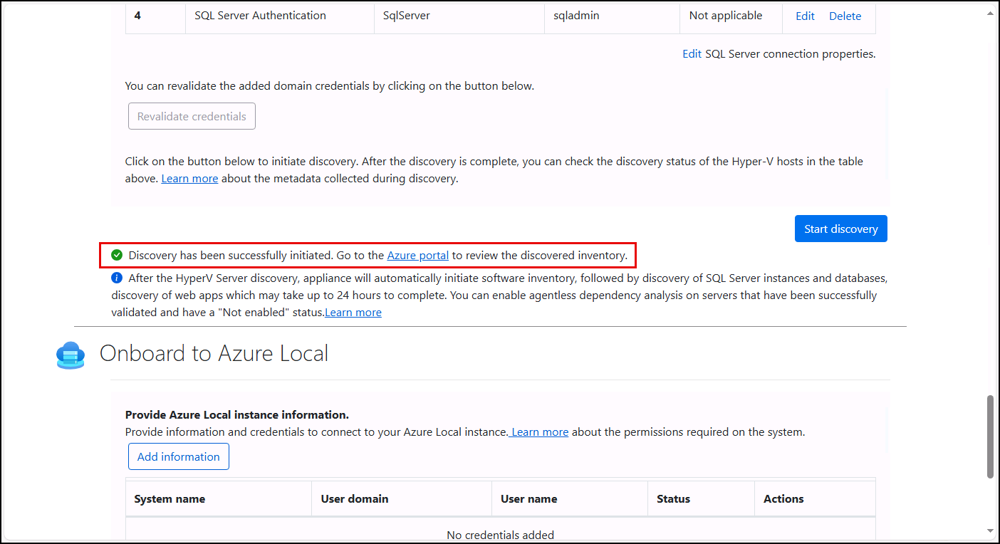

# Exercise 5: Perform Assessments of discovered resources

Assessing virtual machines and database workloads is a critical step in preparing for a successful cloud migration, and Azure Migrate offers a comprehensive suite of tools to support this process. Through agentless or agent-based discovery, Azure Migrate collects performance data, configuration details, and dependency mappings across your environment. These insights enable accurate sizing, cost estimation, and readiness analysis for both Windows and Linux VMs, as well as SQL Server and other database platforms. By leveraging Azure Migrate's assessment capabilities, Contoso hopes to gain valuable insights to help them make informed decisions, reduce migration risk, and align cloud resources with workload requirements.

In this exercise, you will use the [Azure Migrate Service](https://learn.microsoft.com/azure/migrate/prepare-for-migration?view=migrate-classic) to assess a Hyper-V–based Ubuntu VM and both SQL and PostgreSQL database. The assessment process is essential in understanding issues you may face while migrating legacy infrastructure into Azure.

## Objectives

After completing this exercise, you will be able to:

- Assess the readiness of a Linux VM for migration to Azure
- Assess the readiness of database workloads for migration to Azure

## Duration

**Estimated time**: 10 minutes

===

# Task 1: Create an assessment

## Introduction

With discovery complete, Contoso's migration team is ready to assess the readiness of key workloads for migration to Azure. This includes the Linux-based personnel system running on `LinuxLabVM-Ubuntu`, as well as SQL Server and PostgreSQL database instances discovered through guest-level inspection.

Azure Migrate assessments help estimate sizing, identify compatibility issues, and surface remediation guidance. By assessing both infrastructure and workload-level details, Contoso can make informed decisions about migration tooling, target platforms, and performance expectations.

## Description

In this task, you create assessments for the Linux VM, SQL Server, and PostgreSQL workloads discovered by the Azure Migrate appliance. These assessments will help validate sizing, compatibility, and migration readiness for each resource.

## Success criteria

- You reviewed the discovery results in the Azure portal
- You created assessments for the Linux VM, SQL Server, and PostgreSQL workloads in the Azure portal  
- You reviewed the assessment results for sizing and compatibility recommendations

## Learning resources

- [Azure Migrate Assessment overview](https://learn.microsoft.com/azure/migrate/concepts-overview?view=migrate)
- [Azure Migrate application and code assessment](https://learn.microsoft.com/azure/migrate/appcat/overview?view=migrate-classic)
- [Create an Azure VM assessment](https://learn.microsoft.com/azure/migrate/how-to-create-assessment?view=migrate)
- [Assess SQL instances for migration to Azure SQL](https://learn.microsoft.com/azure/migrate/tutorial-assess-sql?view=migrate)
- [Assess PostgreSQL workloads for migration using Azure Migrate](https://learn.microsoft.com/azure/migrate/tutorial-assess-postgresql?view=migrate)

## Key tasks

1. [] Return to the **Appliance Configuration Manager** on the `AzMigrateAppliance-Test` VM and verify that discovery has been successfully initiated. If it is still in progress, wait for it to complete.

    

2. [] On the Lab VM, return to the web browser and navigate to the Azure Migrate **Linux-VM-Migration** project in the Azure portal, expand **Explore Inventory** in the left navigation menu, then select **All Inventory** and confirm that your Hyper-V VMs appear in the list and that you see the PostgreSQL and SQL Server databases.

    

3. [] On the Azure Migrate Project blade in the Azure portal, expand the **Decide and Plan** in the left menu, select **Assessments**, and then select **Create assessment**.

    

4. [] Give enter `LabAssessment` for the **Assessment name** and then select **Add workloads**.

    

5. [] On the **Select workloads** page, check the boxes next to the following items:

    - [] `LinuxLabVM-CentOS-PostgreSQL` (this will automatically check the box next to the `localhost:5432` (PostgreSQL) database installed on that server)
    - [] `LinuxLabVM-Ubuntu`
    - [] `SQLPTO2022` (this will automatically check the box next to the `MSSQLSERVER` database installed on that server)
    - [] Select **Add**

    

6. [] Select **Next** and verify that **Sizing criteria** is set to `Performance-based`.

7. [] Select **Next** to go to the **Advanced** tab.

8. [] On the **Advanced** tab, select **Edit defaults** next to **SQL Server**.

    

9. [] On the **SQL Server settings** page, update the **Target services** by unchecking **Azure SQL MI (Managed Instance)** and checking **Azure SQL Database**, and then select **Save**.

    

10. [] Select **Review + Create assessment**, then select **Create** on the review tab.

    > It will take a minute or two for the assessment to be created. You will receive a notification when it is complete.

11. [] On the **Assessments** blade, select **Refresh** after receiving the notification that the assessment was created.

    

Congratulations! You successfully created assessments for the Linux Ubuntu VM, SQL Server, and PostgreSQL. In the next exercise, you will evaluate the assessment of the Ubuntu VM and start the replication process for that VM.
