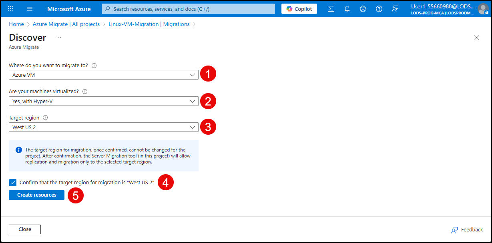
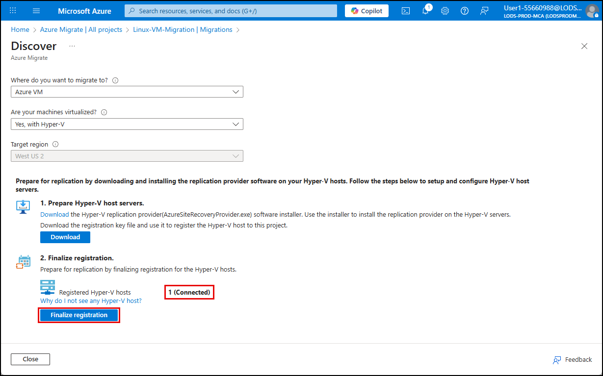
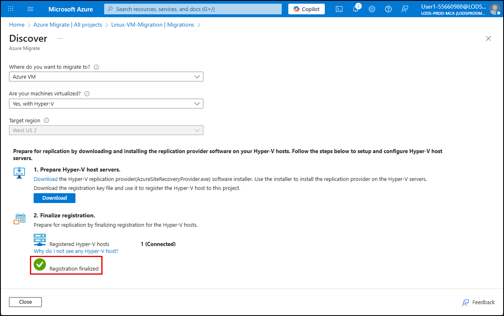

# Exercise 6: Replicate the Linux Ubuntu VM to Azure

One of these VMs hosts a Linux-based personnel management application. While the application remains critical to daily operations, its underlying infrastructure is aging and difficult to scale. To preserve compatibility while gaining cloud-based resilience and manageability, Contoso has chosen a lift-and-shift migration strategy for this workload.

With the assessment of that VM complete, Azure Migrate can be used to enable seamless replication the Ubuntu virtual machine to Azure as part of the migration workflow. After setting up the replication appliance and configuring the target environment, Ubuntu VMs are continuously replicated to Azure, allowing for testing, validation, and cutover with minimal disruption. This approach ensures operational continuity and provides flexibility in scheduling the final migration.

In this exercise, you will use the [Azure Migrate Service](https://learn.microsoft.com/azure/migrate/prepare-for-migration?view=migrate-classic) replicate a Hyper-V–based Ubuntu VM to Azure.

## Objectives

After completing this exercise, you will be able to:

- Assess the readiness of a Linux VM for migration to Azure
- Configure replication of the VM using Azure Migrate

## Duration

**Estimated time**: 30 minutes

===

# Task 1: Review Linux VM inventory and assessment report

## Introduction

Before starting replication, it is critical to review the assessment report created for the VM.

## Description

In this task, you will open the assessment report you created in Azure Migrate and review the details surrounding the Ubuntu VM.

## Success criteria

- You have reviewed the assessment report for the Linux Ubuntu VM
- You have reviewed any potential issues or considerations for the migration
- You confirmed that the VM meets the requirements for replication to Azure

## Learning resources

- [Preparing for migrating Linux Virtual Machine to Azure](https://learn.microsoft.com/azure/migrate/prepare-for-migration?view=migrate-classic)

## Key tasks

1. [] On the Lab VM, open the Azure portal, navigate to the **All Inventory** page of the `Linux-VM-Migration` Azure Migrate Project, and select the `LinuxLabVM-Ubuntu` server.

    

2. [] On the **LinuxLabVM-Ubuntu** server page, review the content on the **Overview** tab, noting things like the server operating system, OS version, and other details.

    

3. [] Select the **Software Inventory** tab, and review the list of installed software.

    

4. [] Return to the **Linux-VM-Migration** Project page, select **Assessments** under **Decide and plan** in the left menu, and then select the assessment named `LabAssessment`.

    

5. [] On the **LabAssessment** page, select **Lift-and-shift to Azure VM** tab, then select **Servers to Azure VM (Lift and shift)**.

    

6. [] On the Servers to Azure VM (Lift and shift) page, scroll down to the list of servers and select `LinuxLabVM-Ubuntu`.

    

7. [] Review the assessment report by selecting each tab and inspecting the details.

    

===

# Task 2: Prepare for replication

## Introduction

Before replicating or migrating VMs using Azure migrate, you must prepare for replication by downloading and installing the replication provider software on your Hyper-V hosts. This task simulates the final stages of a lift-and-shift migration using Azure Migrate, configuring replication using the Azure Site Recovery provider and registration key.

## Description

In this task, you will prepare for the replication of a Linux VM by downloading and installing the necessary replication provider software on your Hyper-V hosts.

## Success criteria

- You downloaded and installed the Azure Site Recovery provider on the Hyper-V host
- You downloaded the registration key file and used it to register the Hyper-V host to your Migration project
- You configured replication for the `LinuxLabVM-Ubuntu` VM

## Learning resources

- [Preparing for migrating Linux Virtual Machine to Azure](https://learn.microsoft.com/azure/migrate/prepare-for-migration?view=migrate-classic)

## Key tasks

1. [] Return to the **Linux-VM-Migration** Project page, expand **Execute** in the left menu, select **Migrations**, and on the Migration blade, select **Discover more**.

    

2. [] On the **Discover** blade:

   - [] **Where to you want to migrate to?**: Choose `Azure VM`
   - [] **Are your machines virtualized?**: Choose `Yes, with Hyper-V`
   - [] **Target region**: Select the location that matches the `RG-Techsummit` resource group's region
     - **CRITICAL**: The region must be the same as the `RG-Techsummit` resource group and the VNet within it, or you will not see the resources you are migrating.
   - [] Check the box for **Confirm that the target region for migration is "[YOUR_RESOURCE_GROUP_REGION]"**, where `[YOUR_RESOURCE_GROUP_REGION]` is the region of the `RG-Techsummit` resource group.
   - [] Select **Create resources**

    

3. [] When the deployment completes, under **1. Prepare Hyper-V host servers**:

   - [] Select the **Download** link to download the Hyper-V replication provider software installer.
   - [] Select the **Download** button to download the registration key.

    

    > **IMPORTANT**: You must be on the Lab VM when you download the software and the key above so that your Hyper-V host is configured correctly.

4. [] Run the `AzureSiteRecoveryProvider.exe` that you just downloaded.

   1. [] Select **On (recommended)** and **Next**.

   2. [] Select **Install**, accepting the default installation location.

   3. [] Select **Register** and on the **Vault Settings...** screen, browse to the **key file** you downloaded earlier and select **Next**.

        

        > The key file should be in the `Downloads` folder on the Lab VM.

   4. [] Select **Connect directly to Azure Site Recovery without a proxy server** and select **Next**.

   5. [] Configuration Azure Site Recovery for registration will take one or two minutes to install. When it completes, select **Finish**.

        > **Note**: If you receive an error that "Registration to site recovery failed," rerun the Azure Site Recover installer (`AzureSiteRecoveryProvider.exe`) and it should resolve the error.

5. [] Go back to the **Discover** blade in the Azure portal and refresh the browser page.

6. [] Select **Azure VM** under **Where do you want to migrate to?** and **Yes, with Hyper-V** under **Are your machines virtualized?** to reload the previous discover page.

    > You should see that you have one connected registration.

7. [] Select **Finalize registration**.

    

    > This step may take up to 3 minutes.

8. [] After the registration completes, verify you see the registration finalized message.

    

9.  [] Select **Close** on the **Discover** page to return to the Migrations blade.

===

# Task 3: Start replication for the Linux Ubuntu VM

## Introduction

With preparation done, Contoso's migration team is ready to start the replication process for the Linux-based personnel system to Azure.

## Description

In this task, you start replication of a Linux VM.

## Success criteria

- You initiated replication process successfully

## Learning resources

- [Preparing for migrating Linux Virtual Machine to Azure](https://learn.microsoft.com/azure/migrate/prepare-for-migration?view=migrate-classic)

## Key tasks

1. [] Return to the Azure Migrate **Migrations** blade in the Azure portal by going to Azure Migrate, selecting All projects in the left menu, selecting the **Linux-VM-Migration** project, selecting **Migrations** under Execute in the left menu, and then selecting the **Replicate** button.

    

2. [] On the **Specify intent** page:

    - [] **What do you want to migrate?**: Choose `Servers or virtual machines (VM)`
    - [] **Where do you want to migrate to?**: Select `Azure VM`
    - [] **Are your machines virtualized?**: Select `Yes, with Hyper-V`
    - [] Select **Continue**

    

3. [] On the **Replicate** Virtual machines tab:

    - [] **Target VM security type**: Choose `Standard or Trusted Launch Virtual machines`
    - [] **Import migration settings from an assessment**: Select `Yes, apply migration settings from an Azure Migrate assessment`
    - [] **Select assessment**: Select the `LabAssessment` you created earlier
    - [] Check the box next to `LinuxLabVM-Ubuntu`
    - [] Select **Next**

    

    > **NOTE**: If you see an orange exclamation mark under **Azure VM Readiness** from the `LinuxLabVM-Ubuntu` VM, create a new assessment with a different name before proceeding.

4. [] On the **Target settings** tab:

    - [] **Resource group**: Select `RG-Techsummit`
    - [] **Cache storage account**: Select the storage account whose name begins with "storazmig"
    - [] **Virtual network**: Choose `vnet-AzMigrateLab`
    - [] **Availability options**: Choose `No infrastructure redundancy required`
    - [] Select **Next**

    

    > **NOTE**: If you see an error that the Azure Migrate service cannot access the replication storage account. This error is because the storage account does not have the proper access privilege to the Recovery Service vault. To resolve this issue, open the Recovery Service Vault resource in another browser page and under `Settings | Identity` turn ON the status on the `System assigned` and select **Save**.
    >
    > 
    >
    > Next, you will need to navigate to the storage account in the Azure portal, select **Access control (IAM)**, and assign the `Contributor` and `Storage Blob Data Contributor` RBAC roles to the `Recovery Services Vault` identity.
    >
    > The above steps should remove the error on the `Replicate` blade's Target settings tab and enable you to move to the next step. (You will need to redo the replicate steps after the IAM has been fixed).

5. [] On the **Compute** tab:

    - [] Select `Linux` in the **OS Type** drop down
    - [] Accept the default values for all other fields
    - [] Select **Next**

    

6. [] Accept the default values on the remaining tabs, then select **Replicate** on the **Review + start replication** tab.

    

> **IMPORTANT**:
>
> Replication will take around 25 minutes. Move to the next exercise while the replication is in progress.
>
> You can monitor the progress by opening the **Replications Summary** and selecting **Jobs** under **Migration** in the left menu.
>
> 
