# Exercise 7: Migrate on-premises PostgreSQL database to Azure Database for PostgreSQL - Flexible Server

Contoso Inc. is modernizing its infrastructure to improve scalability, security, and operational efficiency. As part of this initiative, the company plans to migrate its legacy DVD rental application to Azure. This application relies on a PostgreSQL database named `dvdrental`, which currently resides on an on-premises Linux VM. To ensure a smooth transition, Contoso will use the built-in migration service in Azure Database for PostgreSQL - Flexible Server to move the database to a managed Azure environment.

In this exercise, you will use the [migration service in Azure Database for PostgreSQL](https://learn.microsoft.com/azure/postgresql/migrate/migration-service/overview-migration-service-postgresql) to validate the source database and perform a full migration to Azure. This approach allows Contoso to benefit from Azure's built-in high availability, automated backups, and performance tuning features while minimizing downtime and manual effort.

> **Note**: Additional context about online migration and real-world networking
>
> For simplicity, this lab focuses on an offline migration scenario. However, the migration service for Azure Database for PostgreSQL also supports online migrations, which allow continuous data replication from the source to Azure with minimal downtime. This is especially useful for production environments where cutover windows must be tightly controlled. Read the [online migration setup documentation](https://learn.microsoft.com/azure/postgresql/migrate/migration-service/tutorial-migration-service-iaas-online?tabs=portal) to learn more.
>
> In real-world deployments, network architecture is often more complex than the lab setup. On-premises environments typically connect to Azure through VPN gateways, ExpressRoute, or private endpoints within Azure Virtual Networks (VNets). These configurations ensure secure, low-latency connectivity between source and target environments. You may also need to configure VNet peering, NSG rules, and firewall exceptions to allow replication traffic. For guidance on networking best practices, refer to the [how to set up the network](https://learn.microsoft.com/azure/postgresql/migrate/migration-service/how-to-network-setup-migration-service) documentation for the migration service.

## Objectives

After completing this exercise, you will be able to:

- Evaluate the compatibility of an on-premises PostgreSQL database for migration to Azure using built-in validation tools.
- Perform a full offline migration of a PostgreSQL database to Azure Database for PostgreSQL - Flexible Server using the integrated migration service.
- Verify the integrity of the migrated schema and data in Azure Database for PostgreSQL.

## Duration

**Estimated time**: 25 minutes

===

# Task 1: Review Azure Migrate PostgreSQL assessment

## Introduction

Before migrating a PostgreSQL database to Azure, it is essential to assess its compatibility with the target environment. In Exercise 1, you conducted an assessment of the PostgreSQL server hosting the `dvdrental` database using Azure Migrate. This assessment can help to identify unsupported features, extensions, or configurations that may require remediation before proceeding with the migration.

## Description

In this task, you will review the assessment report generated by Azure Migrate to understand any potential blockers or considerations for migrating the `dvdrental` database to Azure Database for PostgreSQL - Flexible Server.

## Success criteria

- The assessment report for the `dvdrental` database has been reviewed.
- Any identified issues or blockers have been documented for further action before migration.
- The assessment confirms that the database is compatible with Azure Database for PostgreSQL flexible server, or necessary remediation steps have been identified.
- The source PostgreSQL server has been verified to run version 9.5 or higher, ensuring compatibility with the migration service in Azure Database for PostgreSQL.

## Learning resources

- [Assess PostgreSQL workloads for migration using Azure Migrate](https://learn.microsoft.com/azure/migrate/tutorial-assess-postgresql?view=migrate)

## Key tasks

1. [] On the Lab VM and go to the [Azure portal](https://portal.azure.com/) and navigate to the Azure Migrate **All projects** blade and select the **Linux-VM-Migration** project.

    

2. [] On the **Linux-VM-Migration** project blade, select **Assessments** under **Decide and plan** in the left menu, and then select the assessment named `LabAssessment`.

    

3. [] Select the **PaaS preferred (Recommended)** tab, then select the **PostgreSQL Instances to Azure Database for PostgreSQL** item.

    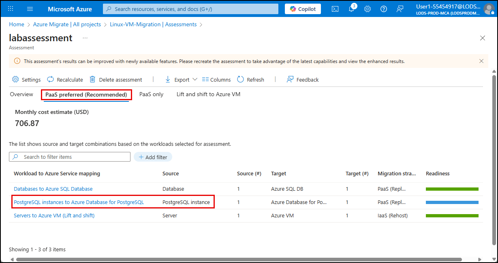

4. [] On the **PostgreSQL Instances to Azure Database for PostgreSQL** blade, select the **localhost:5432** PostgreSQL instance in the list of discovered servers.

    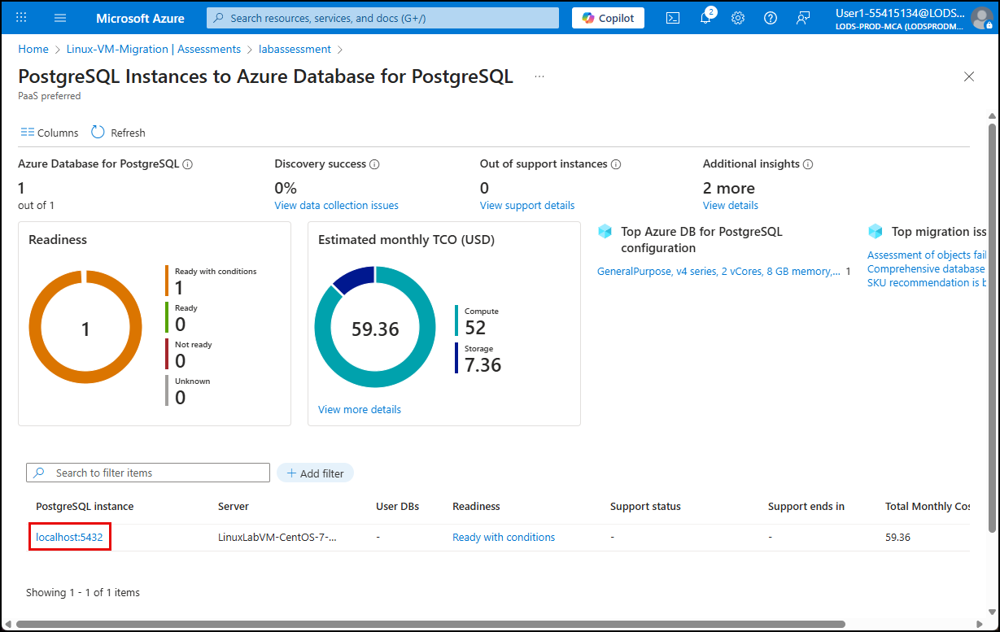

    > **NOTE**: The **DB Instance** page in the assessment report includes tabs that provide a summary of the assessment, readiness details, sources details, target recommendations with estimated monthly total cost of ownership (TCO) for migrating the PostgreSQL instance to Azure. It also provides insights into the recommended configuration settings for the target Azure Database for PostgreSQL flexible server and top migration issues.

5. [] Select the **Readiness** tab and review any potential blockers or issues that need to be addressed before migration by selecting number specified for **Migration issues**.

    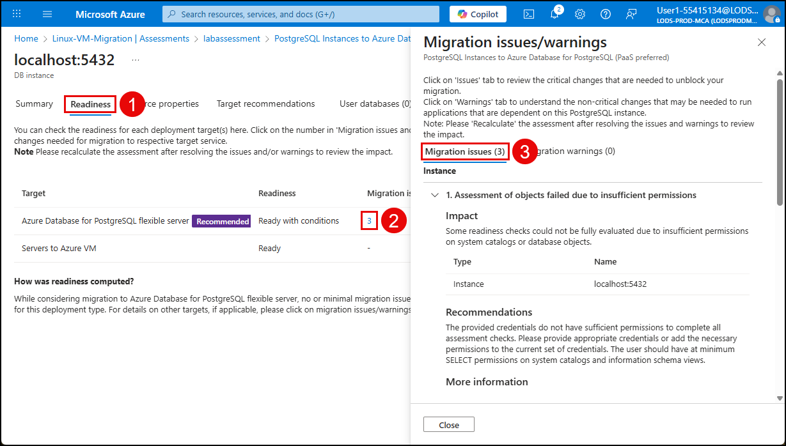

    > **NOTE**:
    > The readiness details will highlight any unsupported features, extensions, or configurations that may require remediation before proceeding with the migration. Review the migration issues and warnings to understand any potential blockers. The final section of the **Migration issues/warnings** dialog provides details about if any databases on the source server have migration blockers.

6. [] Select the **Source properties** tab, and inspect the **Version** of the source database to ensure it is compatible with the migration service in Azure Database for PostgreSQL.

    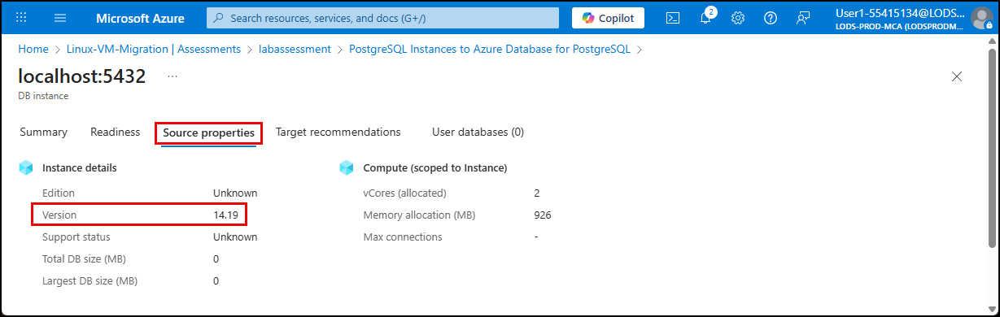

    > **NOTE**:
    > The source PostgreSQL server version must be greater than **9.5** to ensure compatibility with the migration service in Azure Database for PostgreSQL.
    >
    > If you need to migrate a PostgreSQL database running on a server version less than 9.5, you must upgrade it before migration.

===

# Task 2: Ensure connectivity between source and target PostgreSQL servers

## Introduction

Before a migration can begin, the source PostgreSQL server must be reachable by the target Azure Database for PostgreSQL flexible server. Connectivity to the source database in typically controlled by the PostgreSQL Client Authentication Configuration file (`pg_hba.conf`), which defines which hosts are allowed to connect, which users and databases they can access, and what authentication methods are permitted. Ensuring that the target server is authorized in this file is a critical prerequisite for a successful migration.

## Description

In this task, you will connect to the on-premises PostgreSQL server hosted on the `LinuxLabVM-CentOS-7-PostGreSQL` virtual machine and verify connectivity between the source and target PostgreSQL servers. You will inspect the `pg_hba.conf` file on the source server to verify that it allows connections from external hosts, including the Azure target server.

## Success criteria

- Network connectivity between the source and target servers has been confirmed, allowing secure and reliable data transfer.

## Learning resources

- [Prerequisites for migrating from an on-premises PostgreSQL server to Azure Database for PostgreSQL](https://learn.microsoft.com/azure/postgresql/migrate/migration-service/tutorial-migration-service-iaas-offline?tabs=portal#prerequisites)

## Key tasks

1. [] Locate the IP address of the `LinuxLabVM-CentOS-7-PostGreSQL` VM by opening the `VM_IPs.txt` file on the Lab VM's desktop.

    

2. [] From the `VM_IPs.txt` file, copy the **private IP** address of the `LinuxLabVM-CentOS-7-PostGreSQL` VM.

    

3. [] Open **PuTTY** from the Lab VM's desktop or Start menu. Paste the private IP address into the **Host Name (or IP address)** field in the PuTTY Configuration dialog, then select **Open**.

    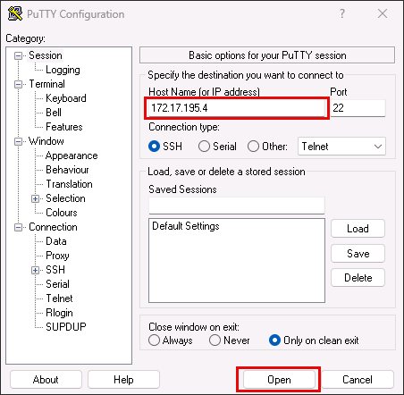

4. [] In the PuTTY console, log in using the following credentials:

   - [] **Login**: root
   - [] **Password**: Pa$$w0rd

5. [] Verify that the `psql` client is installed by running the following command:

    ```bash
    psql --version
    ```

6. [] Connect to the `dvdrental` database using the `psql` client:

    > **IMPORTANT**  
    > Replace `<PRIVATE_IP_OF_YOUR_POSTGRESQL_SERVER>` with the private IP address you copied earlier.

    ```bash
    psql -h <PRIVATE_IP_OF_YOUR_POSTGRESQL_SERVER> -U pgadmin -d dvdrental
    ```

7. [] When prompted, enter the password for the **pgadmin** user: `pgadmin123`.

8. [] At the database prompt in the PuTTY terminal, run the following command to locate the active `pg_hba.conf` file:

    ```sql
    SHOW hba_file;
    ```

9. [] Copy the file path from the output, which should be `/var/lib/pgsql/14/data/pg_hba.conf`.

10. [] Disconnect from the `dvdrental` database to return to the shell prompt:

    ```sql
    \q
    ```

11. [] At the PuTTY command prompt, run the following command to view the contents of the `pg_hba.conf` file. Replace `<YOUR_HBA_FILE_LOCATION>` with the path you copied above:

    ```bash
    cat <YOUR_HBA_FILE_LOCATION>
    ```

    The output should include `host` records that allow connections from external IP ranges. For example:

    ```bash
    # TYPE  DATABASE        USER            ADDRESS                 METHOD
    host    all             all             0.0.0.0/0               md5
    ```

    This entry allows any host to connect using MD5 password authentication. For production environments, this rule should be scoped to specific IP ranges for security, but for this lab, it ensures that the migration service in Azure Database for PostgreSQL can reach the source server.

===

# Task 3: Prepare the target Azure Database for PostgreSQL flexible server

## Introduction

To ensure compatibility between the source and target environments, the Azure Database for PostgreSQL flexible server must be configured to match the source server's extensions and server parameters. Extensions and parameters are not automatically migrated, so they must be reviewed and manually enabled before starting the migration.

Extensions in PostgreSQL are modular packages that add functionality such as new data types, functions, or indexing methods. Server parameters are configuration settings that control database behavior, performance, and resource usage.

## Description

In this task, you will identify the extensions used by the source database and enable them on the target Azure server.

## Success criteria

- All required extensions have been identified and successfully enabled on the target Azure Database for PostgreSQL flexible server.

## Learning resources

- [Prerequisites for migrating from an on-premises PostgreSQL server to Azure Database for PostgreSQL](https://learn.microsoft.com/azure/postgresql/migrate/migration-service/tutorial-migration-service-iaas-offline?tabs=portal#prerequisites)

## Key tasks

1. [] Reconnect to the `dvdrental` database in the PuTTY terminal by running the following command. Replace `<PRIVATE_IP_OF_YOUR_POSTGRESQL_SERVER>` with the private IP address of the source VM:

    ```bash
    psql -h <PRIVATE_IP_OF_YOUR_POSTGRESQL_SERVER> -U pgadmin -d dvdrental
    ```

2. [] When prompted, enter the password for the **pgadmin** user: `pgadmin123`

3. [] At the `dvdrental` prompt, run the following `psql` meta-command to list installed extensions:

    ```bash
    \dx
    ```

    The output should show the `plpgsql` extension, which is required for procedural logic in PostgreSQL:

    ```bash
                     List of installed extensions
      Name   | Version |   Schema   |         Description
    ---------+---------+------------+------------------------------
     plpgsql | 1.0     | pg_catalog | PL/pgSQL procedural language
    ```

    > Alternatively, you can get the list of installed extensions using the following SQL command:
    >
    > ```sql
    > SELECT extname, extversion FROM pg_extension;
    > ```

4. [] Disconnect from the `dvdrental` database to return to the shell prompt:

    ```sql
    \q
    ```

5. [] Leave the PuTTY terminal by running for use later in this exercise.

6. [] Next, you will enable the required extension on the target Azure Database for PostgreSQL flexible server.

7. [] On the Lab VM, return to the [Azure portal](https://portal.azure.com/).

8. [] On the Azure portal home page, select **Resource groups** under **Azure services**.

    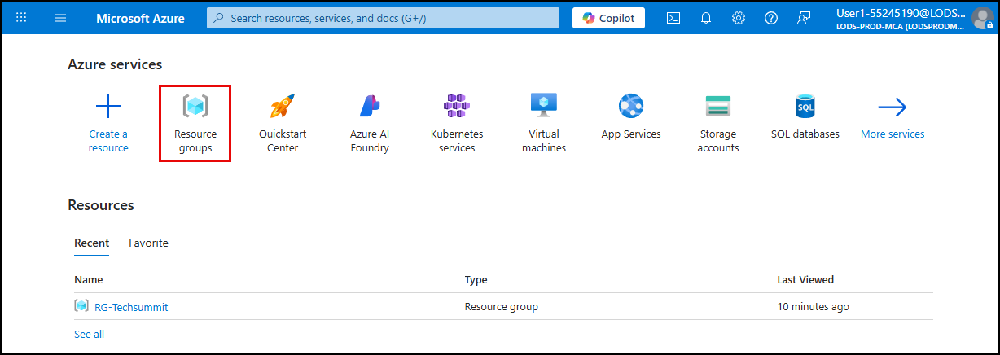

9. [] Select the **RG-Techsummit** resource group.

    

10. [] Select the **Azure Database for PostgreSQL flexible server** resource.

    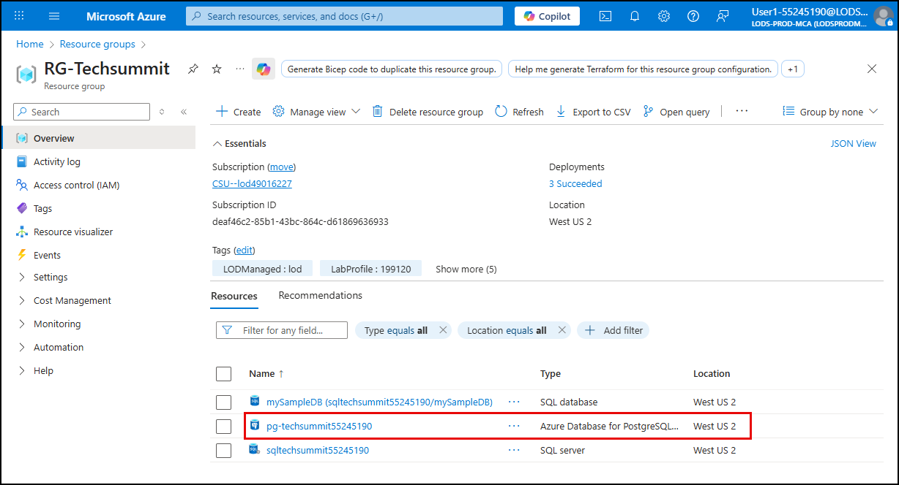

11. [] To enable the `plpgsql` extension:

    1. [] Select **Server parameters** under **Settings** in the left menu.
    2. [] Enter `azure.extensions` in the search box.
    3. [] Locate and check the box next to **PLPGSQL** in the extensions list.
    4. [] Select **Save** on the toolbar.

    

    > Selecting **Save** will apply the change and restart the server, which may take a few minutes.

12. [] When the server has restarted, select **Go to resource** on the deployment page to return to the PostgreSQL server overview.

> **Note on server parameters**:
>
> Server parameters are not automatically migrated and must be manually configured. To view the source server's parameters, run:
>
> ```sql
> SELECT name, setting, source, sourcefile, sourceline FROM pg_settings WHERE source = 'configuration file';
> ```
>
> For this lab, no additional parameters need to be configured.
>
> It is also important to ensure that high availability and read replicas are disabled on the target server before migration. These features can be enabled after the migration is complete and the database is stable.
>
> These features have been disabled in the lab environment.

===

# Task 4: Migrate the database

## Introduction

Once the source database has been assessed and any necessary preparations have been made, you can proceed with the migration. You can initiate the migration using the Azure Database for PostgreSQL migration service. This process transfers the schema and data from the source to the target server, preserving object definitions, relationships, and data integrity. The migration is performed in offline mode, meaning the source database is not actively serving traffic during the transfer.

## Description

In this task, you will configure and launch the migration and monitor its progress.

## Success criteria

- A migration job has been configured and launched using the Azure portal.
- The `dvdrental` database has been selected and migrated without errors.
- The migration status in the Azure portal shows Succeeded, indicating a complete and successful transfer.

## Learning resources

- [What is the migration serivce in Azure Database for PostgreSQL?](https://learn.microsoft.com/azure/postgresql/migrate/migration-service/overview-migration-service-postgresql)
- [Perform a migration using the migration service in Azure Database for PostgreSQL](https://learn.microsoft.com/azure/postgresql/migrate/migration-service/tutorial-migration-service-iaas-offline?tabs=portal#perform-the-migration)

## Key tasks

1. [] On the Azure Database for PostgreSQL flexible server blade in the Azure portal, select **Migration** from the left menu and select **Create**.

    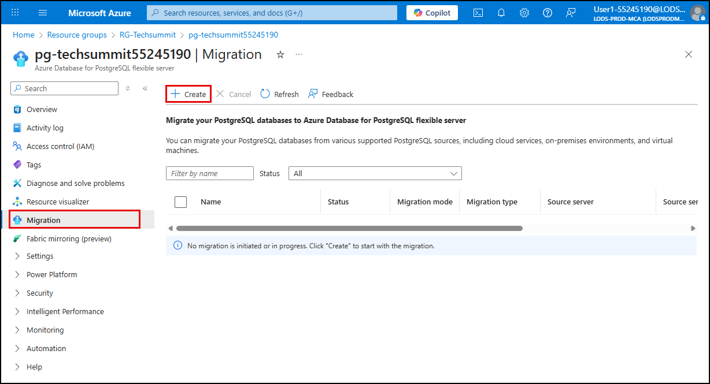

2. [] On the **Setup** tab, enter the following values:

    - [] **Migration name**: `dvdrental-db-migration`
    - [] **Source server type**: **On-premises server**
    - [] **Migration option**: **Validate and migrate**
    - [] **Migration mode**: **Offline**
    - [] Select **Next: Runtime server >**

    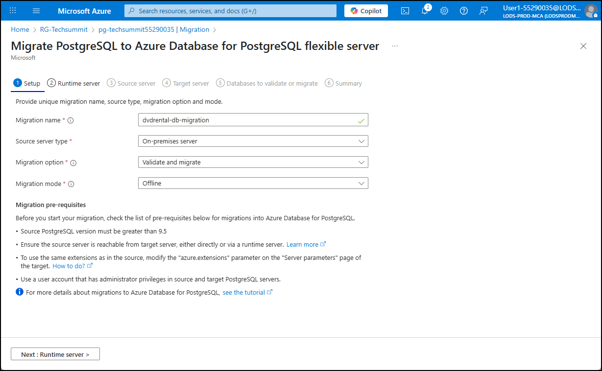

    > **NOTE**: The best practice is to first run a validation-only migration to identify and resolve any issues before performing the actual migration. However, to save time in this lab, you are performing both validation and migration in a single step.

3. [] On the **Runtime server** tab, leave **Use runtime server** set to **No**, then select **Next: Source server >**

    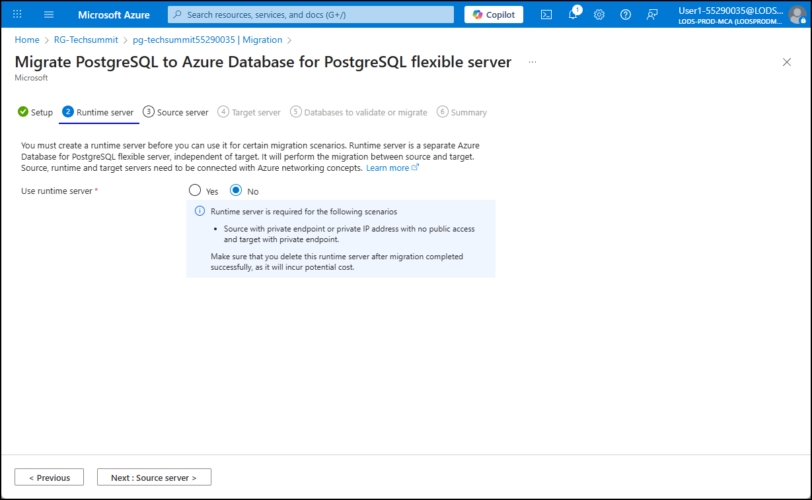

4. [] On the **Source server** tab, enter the following values:

    - [] **Server name**: Public IP address of the `LinuxLabVM-CentOS-7-PostGreSQL` VM

        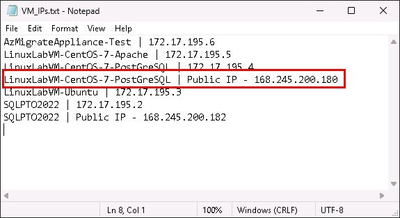

    - [] **Port**: `5432`
    - [] **Administrator login**: `pgadmin`
    - [] **Password**: `pgadmin123`
    - [] **SSL mode**: **Prefer**
    - [] Select **Connect to source** and confirm the connection
    - [] Select **Next: Target server >**

    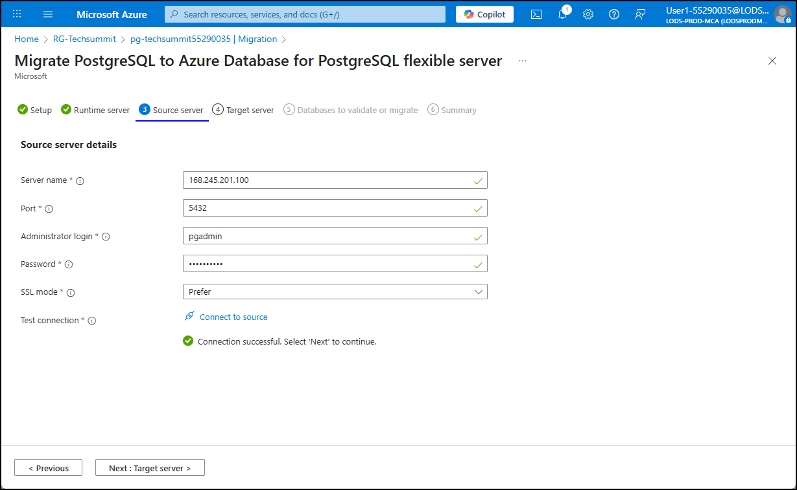

5. [] On the **Target server** tab, enter your lab user password (same as the Azure login password) and select **Next: Databases >**.

    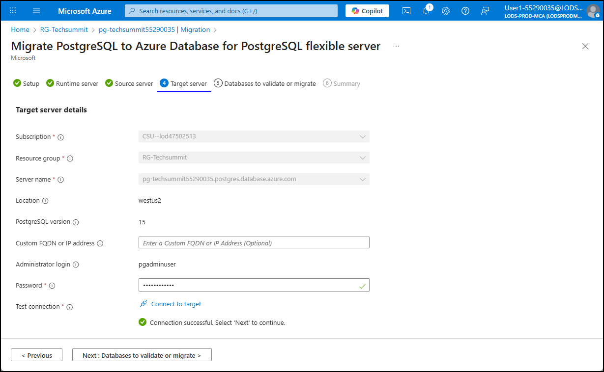

6. [] On the **Databases to validate and migrate** tab, select `dvdrental` and choose **Next: Summary >**

    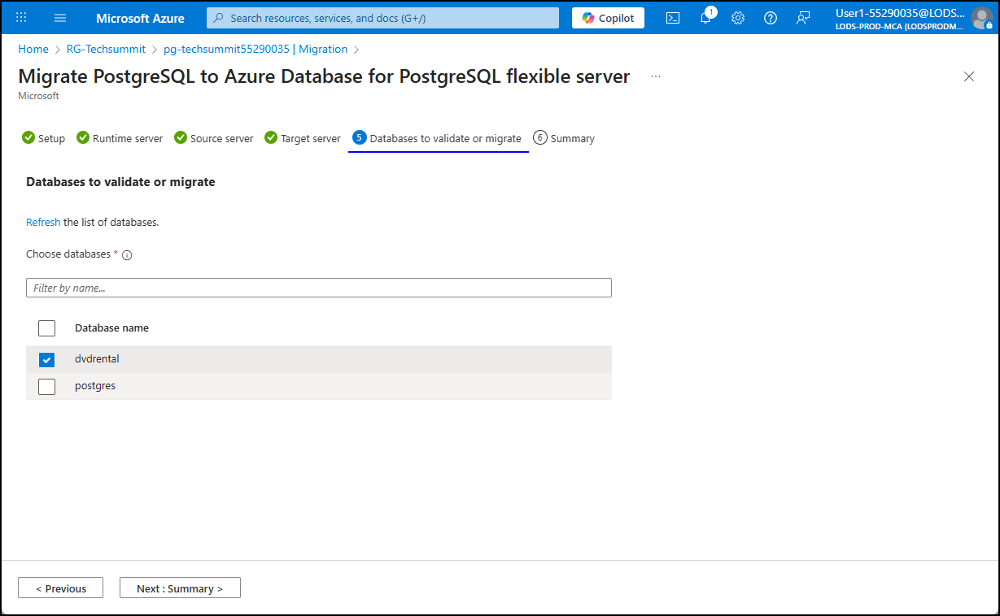

7. [] On the **Summary** tab, review the configuration and select **Start validation and migration**

    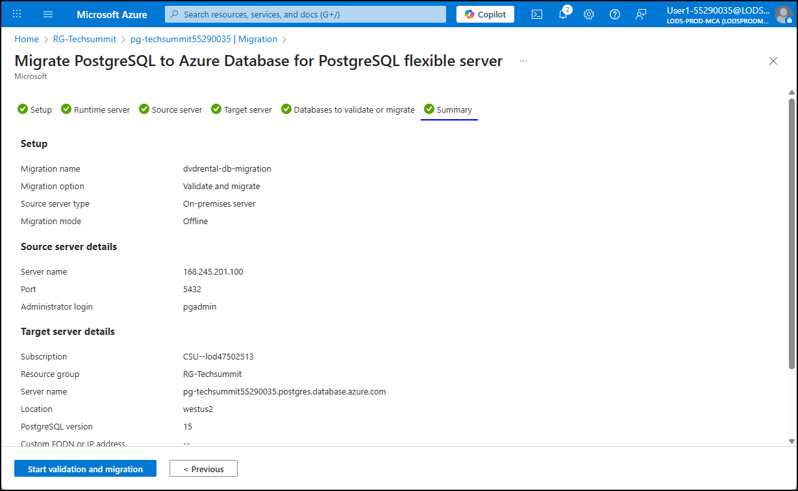

8. [] Monitor the progress of the migration on the **Migration** page.

    

9. [] Select `dvdrental-db-migation` in the list to view the validation and migration details while monitoring.

    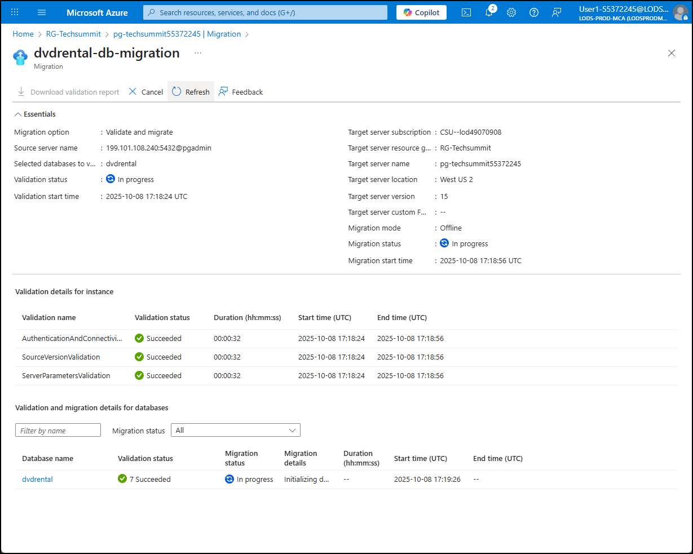

10. [] Once complete, confirm that the status shows **Succeeded** and that no errors were reported.

    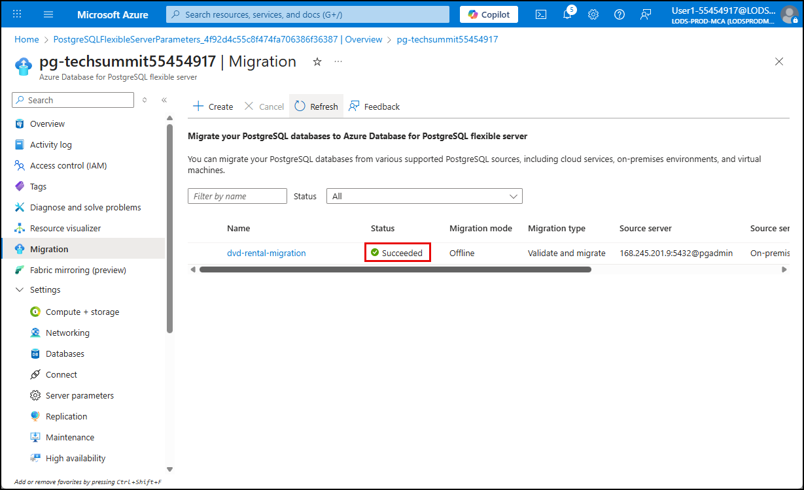

    > **Note**: If validation fails due to unsupported objects or configuration mismatches, you must resolve those issues before proceeding to migration. Refer to the validation report for details.

===

# Task 5: Verify the migration

## Introduction

After the migration finishes, it is important to verify that the target Azure Database for PostgreSQL flexible server contains the expected schema and data. This step confirms that the migration was successful and that the application can resume using the new database without issues.

## Description

In this task, you will connect to the target Azure database and run few a simple queries to confirm that the `dvdrental` database was migrated successfully.

## Success criteria

- A connection to the target Azure Database for PostgreSQL flexible server has been established using the Query editor.
- A query against the `dvdrental` database has returned expected results, confirming that data was successfully migrated.
- The `film` table exists and contains valid records, demonstrating that schema and data integrity were preserved during migration.

## Learning resources

- [Check PostgreSQL database migration when completed](https://learn.microsoft.com/azure/postgresql/migrate/migration-service/tutorial-migration-service-iaas-offline?tabs=portal#check-the-migration-when-completed)

## Key tasks

1. [] On the Azure Database for PostgreSQL flexible server blade in the Azure portal, select **Overview** from the left menu.

2. [] On the **Overview** blade, copy the endpoint value in the **Essentials** pane.

    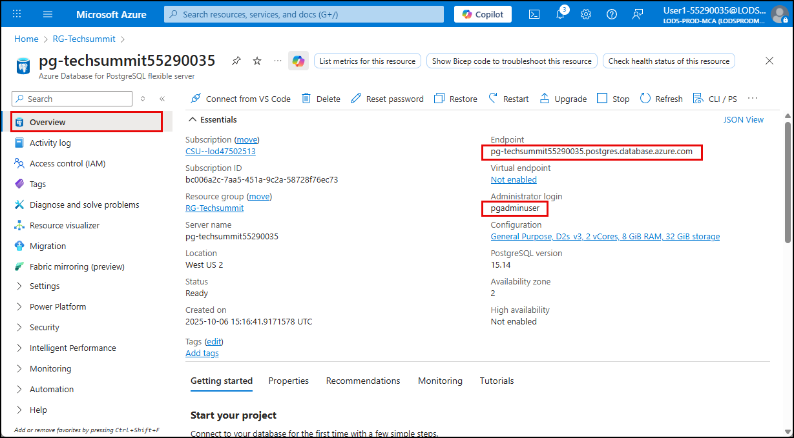

    > **NOTE**: Within the **Essentials** pane, also note the **Administrator login** value. This is the username that will be used to log in to the server. This differs from the `pgadmin` user you used to connect to the on-premises database.

3. [] Return to the open PuTTY terminal window on your Lab VM, or open a new one by connecting to the private IP address of the `LinuxLabVM-CentOS-7-PostGreSQL` VM and logging in with the `root` user and password.

4. [] At the PuTTY shell prompt, run the following command to connect to your Azure Database for PostgreSQL flexible server, replacing the `<YOUR_AZURE_POSTGRESQL_ENDPOINT>` token with the endpoint for your Azure Database for PostgreSQL flexible server.

    ```bash
    psql -h pg-techsummit55290035.postgres.database.azure.com -U pgadminuser -d dvdrental
    psql -h <YOUR_AZURE_POSTGRESQL_ENDPOINT> -U pgadminuser -d dvdrental
    ```

5. [] When prompted for the password for user `pgadminuser`, enter the **Password** from the **Resources** tab in the lab instructions.

6. [] From the `dvdrental` prompt, execute the following query to confirm that the data and schema were successfully migrated:

    ```sql
    SELECT * FROM sales_by_film_category;
    ```

    The query should return 16 rows from the `sales_by_film_category` view, confirming that the database was successfully migrated.

    > If the query fails or returns no results, revisit the migration status and validation report to identify any issues.

7. [] Disconnect from the `dvdrental` database to return to the shell prompt:

    ```sql
    \q
    ```

8. [] Exit the PuTTY terminal by running the following command:

    ```bash
    exit
    ```

Congratulations! You have successfully migrated Contoso's `dvdrental` database to Azure Database for PostgreSQL flexible server. You can move on to the next exercise, where you will start the migration process for the `LinuxLabVM-Ubuntu` virtual machine.
