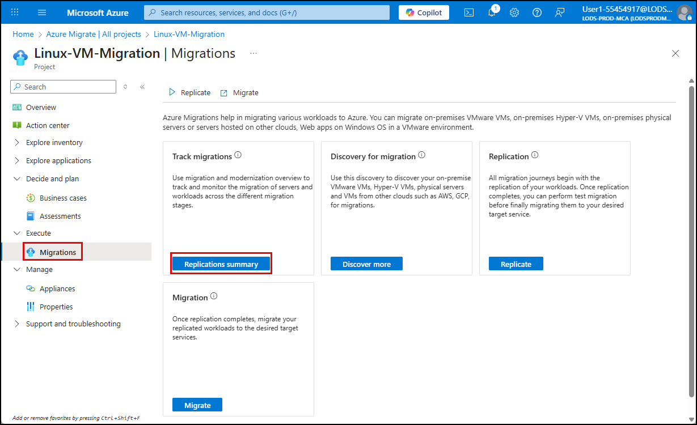

# Exercise 8: Start the migration of the Linux Ubuntu VM

DURATION: 5 minutes

## Introduction

With the Linux Ubuntu VM replicated, you are ready to migrate the Linux-based personnel system to Azure. This task simulates the final stages of a lift-and-shift migration using Azure Migrate. You will perform a planned migration to Azure Virtual Machines.

## Description

In this task, you initiate a planned migration of the Linux VM to Azure using the Azure Migrate portal.

## Success criteria

- You initiated the migration process successfully

## Learning resources

- [Preparing for migrating Linux Virtual Machine to Azure](https://learn.microsoft.com/azure/migrate/prepare-for-migration?view=migrate-classic)

## Key tasks

1. [] In the Azure portal, return to the **Linux-VM-Migration** Project page, expand **Execute** in the left menu, select **Migrations**, and on the Migration blade, select **Replications summary**.

    

2. [] On the Replications Summary page, expand **Migration** in the left menu, select **Replications**, and observe the replication you started previously.

    > The replication is complete when you see the replication status for the `LinuxLabVM-Ubuntu` set to **Protected**.

3. [] Start the migration by selecting the ellipsis to the right of the `LinuxLabVM-Ubuntu` item and then selecting **Migrate** from the context menu.

    

4. [] Select **Yes** to shutting down the VM and performing a planned migration with no data loss.

5. [] Select **Migrate** to begin the migration process.

> **IMPORTANT**:
>
> The migration process can take over two hours to finish. Move to the next exercise start migrating Contoso's SQL Server database to Azure SQL Database.
