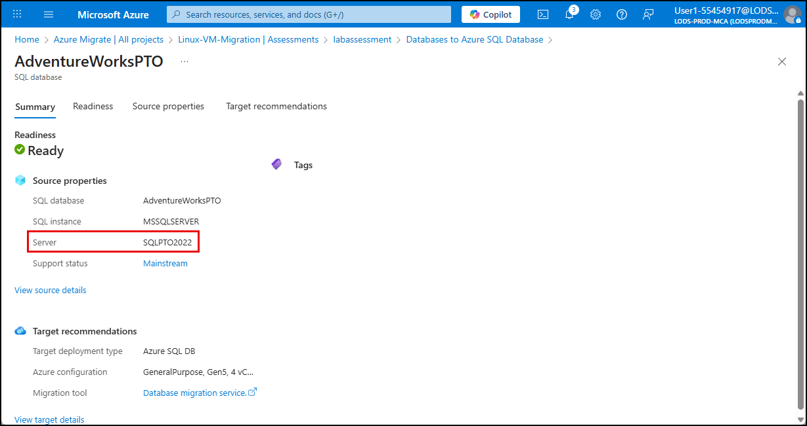
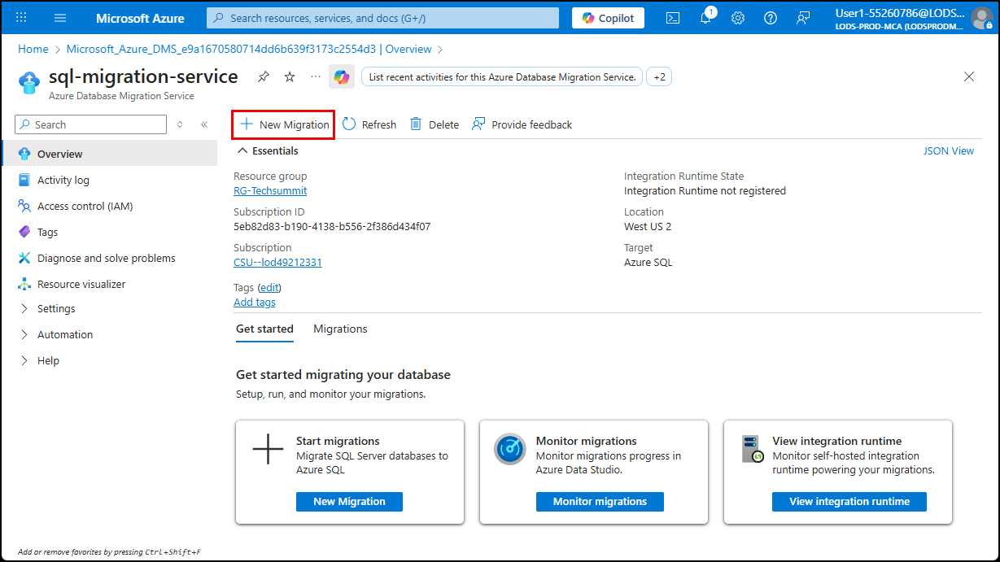
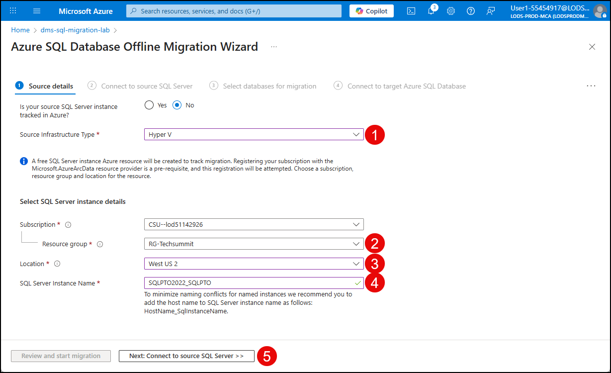
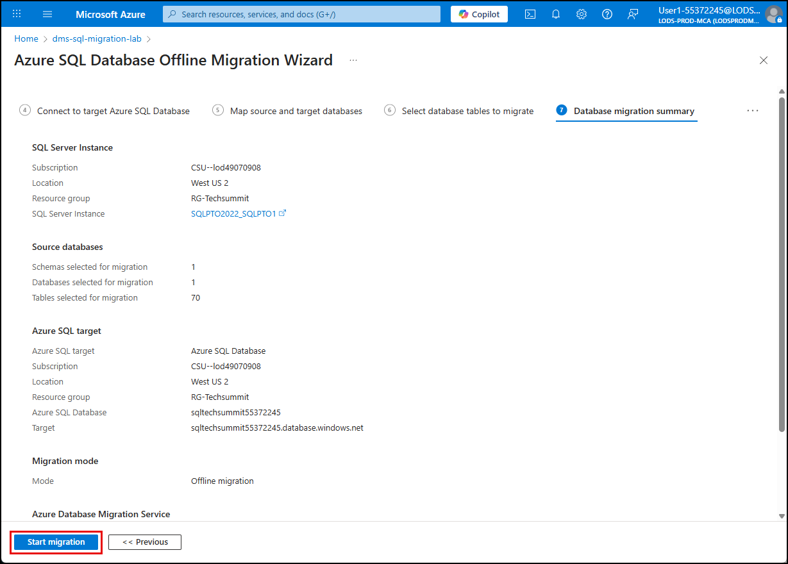

# Exercise 9: Start SQL Server to Azure SQL Database migration

Contoso Inc. is continuing its infrastructure modernization journey by migrating legacy workloads to Azure in order to improve scalability, security, and operational efficiency. As part of this initiative, the company plans to move its on-premises SQL Server databases to Azure SQL Database to take advantage of the fully managed platform that offers built-in high availability, automated updates, and elastic scalability.

In this exercise, you will migrate an on-premises, VM-hosted SQL Server database to Azure SQL Database using the [Azure Database Migration Service](https://learn.microsoft.com/azure/dms/dms-overview). This process includes validating the source environment, configuring and running the migration project, verifying that the target database reflects the expected schema and data, and protecting the target database from threats and vulnerabilities.

> **Additional context about online migration and real-world networking**
>
> While this lab demonstrates an offline migration of SQL Server to Azure SQL Database, it's important to note that online migrations are not currently supported for this specific target platform. Offline migration involves a one-time data and schema transfer, followed by a cutover that typically incurs downtime. This approach is suitable for development, testing, and smaller production workloads where brief downtime is acceptable.
>
> For enterprise scenarios requiring minimal downtime, online migration is supported when targeting Azure SQL Managed Instance or SQL Server on Azure VMs, but not Azure SQL Database. Organizations with high availability requirements should plan for coordinated cutover windows, pre-migration validation, and post-migration testing to minimize disruption.
>
> In real-world environments, networking is often more complex than the lab setup. On-premises SQL Server instances typically connect to Azure through VPN gateways, ExpressRoute circuits, or private endpoints within Azure Virtual Networks (VNets). These configurations ensure secure, high-throughput connectivity between source and target environments. You may also need to configure VNet peering, NSG rules, and firewall exceptions to allow migration traffic. For guidance on networking best practices, refer to [Azure SQL Database connectivity architecture](https://learn.microsoft.com/azure/azure-sql/database/connectivity-architecture?view=azuresql).

## Objectives

After completing this exercise, you will be able to:

- Assess the compatibility of an on-premises SQL Server database for migration to Azure SQL Database.
- Configure and execute a migration using Azure Database Migration Service.
- Verify the integrity of the migrated schema and data in Azure SQL Database.

## Duration

**Estimated time**: 10 minutes

===

# Task 1: Review Azure Migrate SQL Server assessment

## Introduction

Before migrating a SQL Server database to Azure SQL Database, it is important to assess the source environment to identify any potential compatibility issues, performance considerations, and remediation steps. Azure Migrate provides a comprehensive assessment tool that can analyze your on-premises SQL Server instances and generate a detailed report.

## Description

In this task, you will review the Azure Migrate assessment report for the SQL Server instance running on the `SQLPTO2022` VM. This report will help you understand any potential issues that may impact the migration process and ensure that the database is ready for migration to Azure SQL Database.

## Success criteria

- You have accessed the Azure Migrate project and reviewed the SQL Server assessment report.
- You have identified any potential issues or recommendations provided in the assessment report.
- You understand the readiness of the SQL Server instance for migration to Azure SQL Database.

## Learning resources

- [Assess SQL instances for migration to Azure SQL Database](https://learn.microsoft.com/azure/migrate/tutorial-assess-sql?view=migrate)

## Key tasks

1. [] On the Lab VM and go to the [Azure portal](https://portal.azure.com/) and navigate to the Azure Migrate **All projects** blade and select the **Linux-VM-Migration** project.

    

2. [] On the **Linux-VM-Migration** project blade, select **Assessments** under **Decide and plan** in the left menu, and then select the assessment named `LabAssessment`.

    

3. [] The overview blade should show **3 servers** and **2 DB instances** as part of the assessed workloads. If not, select **Recalculate** in the toolbar.

    

4. [] On the **Assessment** blade, select the **PaaS preferred (Recommended)** tab, then select the **Databases to Azure SQL Database** item.

    

    > **NOTE**: If you don't see **Databases to Azure SQL Database** in the list, you may need to select **Recalculate** on the toolbar and wait a few minutes for the assessment to update.

5. [] On the **Databases to Azure SQL Database** blade, select the **AdventureWorksPTO** database to view the detailed assessment report. We will not be migrating the `WideWorldImporters` or `WideWorldImportersDW` databases in this lab.

    

    > **NOTE**: The **AdventureWorksPTO** page in the assessment report includes tabs that provide a summary of the assessment, readiness details, source properties, and target recommendations with estimated monthly total cost of ownership (TCO). Review each tab to understand the assessment findings and any recommendations for migration.

6. [] On the **Summary** tab, review the details provided, noting the **Server** value, as this provides you with the version of SQL Server that is running on the source VM.

    

    > **NOTE**: The **Server** value indicates the version of SQL Server running on the source VM. Ensure that it is a supported version for migration to Azure SQL Database.

7. [] Select the **Readiness** tab and review any issues or warnings that may impact the migration by selecting the number specified for **Migration warnings**.

    

    > **NOTE**: The readiness details will highlight any unsupported features, extensions, or configurations that may require remediation before proceeding with the migration. Review the migration issues and warnings to understand any potential blockers. The final section of the **Migration issues/warnings** dialog provides details about if any databases on the source server have migration blockers.

===

# Task 2: Create a migration project

## Introduction

To perform a database migration in Azure Database Migration Service (DMS), you begin by creating a migration project that defines the scope and parameters of your migration. Each project serves as a container for source and target database details, migration type (online or offline), and assessment or migration tasks. By organizing migrations into projects, Azure DMS enables repeatable, auditable workflows that support SQL Server, PostgreSQL, MySQL, and other supported platforms. This structure simplifies planning, execution, and monitoring, ensuring migrations are aligned with business requirements and technical constraints.

## Description

In this task, you will create a new migration project in the Azure Database Migration Service.

## Success criteria

- You have created a project in DMS
- You have started the database migration

## Learning resources

- [Migrate SQL Server to Azure SQL Database (offline)](https://learn.microsoft.com/data-migration/sql-server/database/database-migration-service?toc=%2Fazure%2Fdms%2Ftoc.json&tabs=portal)
- [Azure Database Migration Service supported scenarios](https://learn.microsoft.com/azure/dms/resource-scenario-status)
- [Monitor database migration progress in the Azure portal](https://learn.microsoft.com/azure/dms/migration-using-azure-data-studio?tabs=azure-sql-mi#monitor-database-migration-progress-in-the-azure-portal)

## Key tasks

1. [] Navigate to the **Azure Database Migration Service** blade in the Azure portal, select the **Overview** item from the left menu, then select **New Migration**.

    

2. [] On the **Select new migration scenario** blade, choose `Azure SQL Database` for the **Target server type** and select **Select**.

    

3. [] On the **Source details** of the Azure SQL Database Offline Migration Wizard:

    - **Source Infrastruture Type**: Choose `Hyper V`
    - **Resource group**: Select `RG-Techsummit`
    - **Location**: Select the location of your `RG-Techsummit` resource group
    - **SQL Server Instance Name**: Enter `SQLPTO2022_SQLPTO`
    - Select **Next: Connect to source SQL Server**

    

4. [] On the **Connect to source SQL Server** tab:

    - **Source server name**: Paste the private IP address of the `SQLPTO2022` VM, which you can copy from the `VM_IPs.txt` file on the desktop and the Lab VM.
    - **Authentication type**: Choose `SQL Authentication`
    - **User name**: `sqladmin`
    - **Password**: `Microsoft123`
    - Ensure both **Encrypt connection** and **Trust server certificate** are checked
    - Select **Next: Select databases for migration**

    

    > If you recieve a **Migration settings validation error**, verify the user name and password, the source server IP address, and that you have added the IP address of the self-hosted integration runtime (SHIR) host to the Azure SQL Server firewall.

5. [] On the **Select databases for migration** tab, check the box for the **AdventureWorksPTO** database and select **Next: Connect to target Azure SQL Database**.

    

6. [] On the **Connect to target Azure SQL Database** tab:

    - **Authentication type**: Choose `SQL Authentication`
    - **User name**: `sqladminuser`
    - **Password**: Use the `Sql Admin Password` password provided on the **Resources** tab of the lab instructions.
    - Select **Next: Map source and target databases**

    

    

7. [] On the **Map source and target databases** tab, choose `mySampleDB` as the **Target database** and select **Next: Select database tables to migrate**.

    

8. [] On the **Select database tables to migrate** tab, expand the list of AdventureWorksPTO tables to review the tables selected for migration, then select **Next: Database and migration summary**.

    

9. [] On the **Database migration summary** tab, review the migration details and select **Start migration**.

    

> **IMPORTANT**:
>
> The migration will take about 12-15 minutes to run. Move on to the next task while the migration is in progress.
