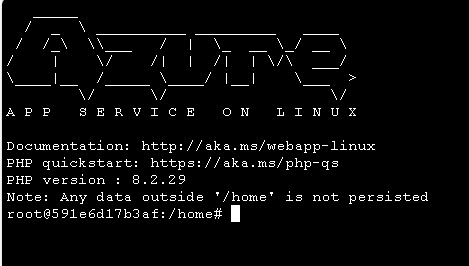

# Exercise 10: Configure web application to connect to PostgreSQL database

In exercise 4, you created an App Service plan and deployed a web application to it. With the PostgreSQL database migrated to Azure, Contoso Inc. is ready to transition the underlying PHP application to use the Azure Database for PostgreSQL flexible server.

In this exercise, you will configure the Azure web application to connect to the PostgreSQL database that you migrated to Azure Database for PostgreSQL - Flexible Server in Exercise 7.

## Objectives

After you complete this exercise, you will be able to:

- Configure the web application to connect to the migrated PostgreSQL database.
- Validate that the web application is functioning correctly.

## Duration

**Estimated time**: 10 minutes

===

# Task 1: Configure web application to connect to PostgreSQL database

## Introduction

Previously, you deployed a web application to an App Service Plan in Azure. However, the deployed application is still configured to connect to a PostgreSQL database hosted on an on-premises Linux VM. You need to update the web application's configuration to connect the `dvdrental` database on your Azure Database for PostgreSQL flexible server.

## Description

In this task, you will update the web application's configuration file to connect to the PostgreSQL database hosted in Azure Database for PostgreSQL flexible server. You will retrieve the necessary connection details from the Azure portal and modify the configuration file accordingly.

## Success criteria

- The web application is configured to connect to the PostgreSQL database in Azure Database for PostgreSQL - Flexible Server.

## Learning resources

- [Quickstart: Use PHP to connect and query data in Azure Database for PostgreSQL](https://learn.microsoft.com/azure/postgresql/flexible-server/connect-php)

## Key tasks

1. [] In the Azure portal, navigate to the **RG-Techsummit** resource group and select the PostgreSQL server.

    

2. [] In the PostgreSQL server overview, copy the **Endpoint**. You will need this to configure the web application.

    

3. [] Expand the **Settings** section in the left-hand menu and select **Networking**.

    

4. [] In the **Networking** settings, ensure that the **Public access** option is selected and that the **Allow public access from any Azure service within Azure to this server** option is enabled. This allows the App Service to connect to the PostgreSQL server. Select **Save** if you made any changes.

    

5. [] Navigate back to the **RG-Techsummit** resource group and select the **App Service** resource you deployed previously.

    

6. [] In the Web App overview, expand the **Development Tools** section in the left menu, select **Advanced Tools** from the left-hand menu, then select **Go** to open the Kudu console in a new tab.

    

7. [] In the Kudu console, select the **Debug console** menu, then select **SSH** to open a remote SSH session to the App Service.

    

    This will open a terminal window where you can run commands in the context of the App Service.

    

8. [] In the SSH session, navigate to the `/home/site/wwwroot` directory where the web application files are located (you automatically start in the `/home` directory):

    ```bash
    cd site/wwwroot
    ```

9. [] Run the following command to open the `index.php` file in the `nano` text editor:

    ```bash
    nano index.php
    ```

10. [] In the `index.php` file, locate the section that defines the database connection parameters. It should look similar to the following:

    

11. [] Update the database connection parameters as follows (please note that you must also update the username):

    ```php
    $dbHost = "<YOUR_AZURE_POSTGRESQL_SERVER_NAME>.postgres.database.azure.com";
    $dbPort = "5432";
    $dbName = "dvdrental";
    $dbUser = "pgadminuser";
    $dbPassword = "<Your Password from the Resources tab in the lab instructions>";
    ```

    When you are done, press `CTRL + X`, then `Y`, then `ENTER` to save and exit the `nano` editor. Your completed section should look similar to the following:

    

12. [] In the SSH session, restart the Web App to apply the changes by running the following command:

    ```bash
    touch restart.txt
    ```

13. [] Close the Kudu console tab and return to the Azure portal.

===

# Task 2: Verify the web application is working

## Introduction

With the connection string updated in the web application's configuration, you should verify the deployed application is properly connecting to the `dvdrental` database on your Azure Database for PostgreSQL flexible server.

## Description

In this task, you will launch the deployed web application and verify it is retrieving data correctly.

## Success criteria

- The web application is functioning correctly and can retrieve data from the database.

## Learning resources

- [Quickstart: Use PHP to connect and query data in Azure Database for PostgreSQL](https://learn.microsoft.com/azure/postgresql/flexible-server/connect-php)

## Key tasks

1. [] In the Web App overview, select the link in the **Default domain** within the **Essentials** section.

    

2. [] The web application should load and display a list of actors from the PostgreSQL database. If you see the list of actors, the web application is successfully connected to the PostgreSQL database in Azure Database for PostgreSQL - Flexible Server.

    

Congrats! You have successfully migrated the PostgreSQL database to Azure and updated the Azure Web App to pull data from it. In the next exercise, you return to the SQL database migration to monitor progress and verify the database migrated successfully.
