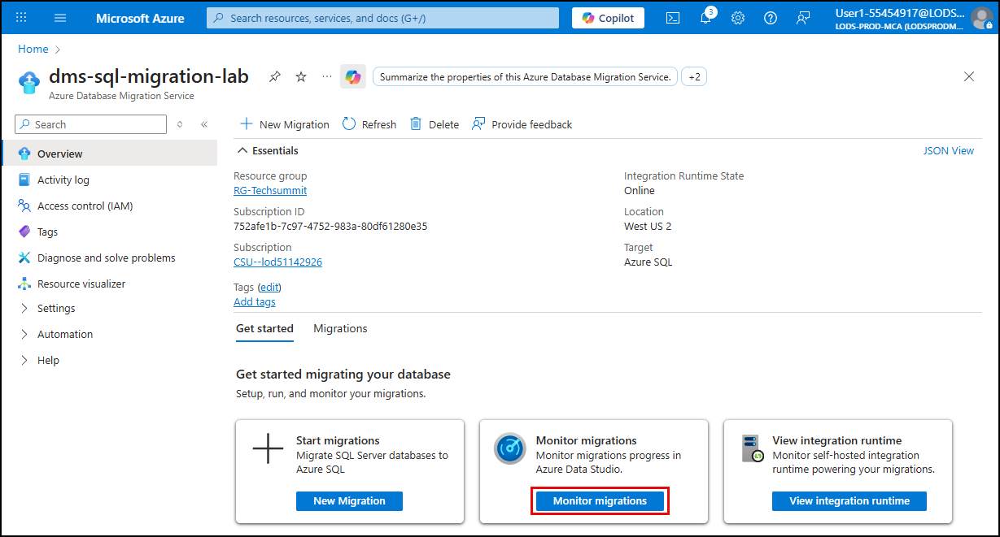
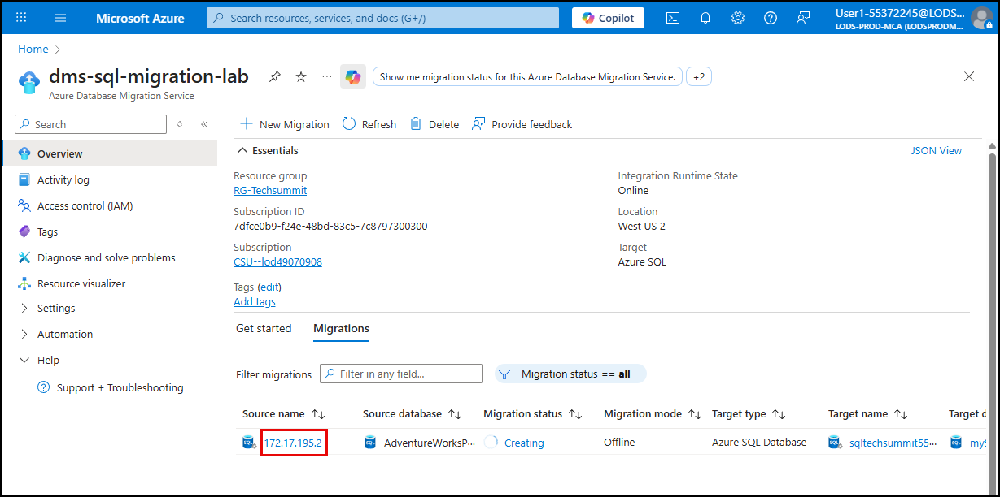
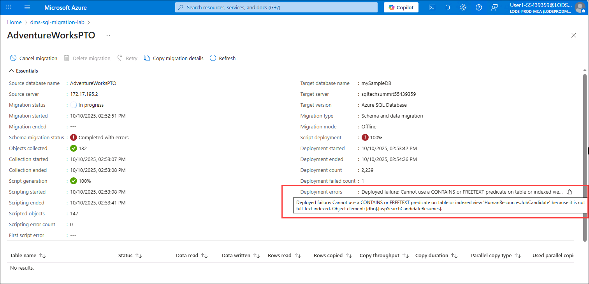
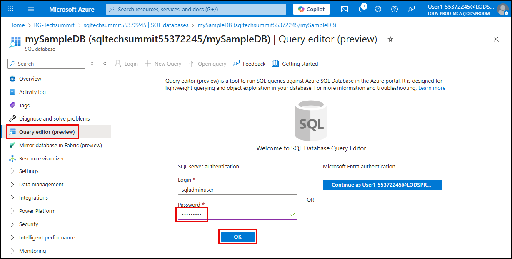
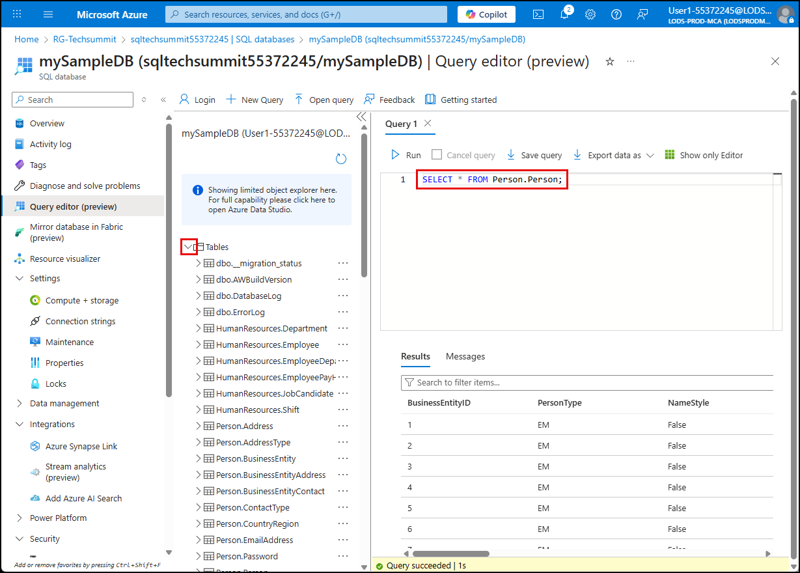

# Exercise 11: Monitor and verify the SQL database migration

In this exercise, you will complete the migrate the on-premises, VM-hosted SQL Server database to Azure SQL Database using the [Azure Database Migration Service](https://learn.microsoft.com/azure/dms/dms-overview). This process includes verifying that the target database reflects the expected schema and data, and protecting the target database from threats and vulnerabilities.

## Objectives

After completing this exercise, you will be able to:

- Verify the integrity of the migrated schema and data in Azure SQL Database.

## Duration

**Estimated time**: 10 minutes

===

# Task 1: Monitor migration

## Introduction

Previously, you started migrating a SQL Server database to Azure SQL Database. You now need to ensure the migration finished successfully.

## Description

In this task, you will ensure the SQL database migration finished and review any migration issues.

## Success criteria

- You have verified the migration completed successfully
- You have review any migration errors

## Learning resources

- [Monitor the database migration](https://learn.microsoft.com/data-migration/sql-server/database/database-migration-service?toc=%2Fazure%2Fdms%2Ftoc.json&tabs=portal#monitor-the-database-migration-1)

## Key tasks

1. [] On the Lab VM, return to the Azure portal and navigate to the **Azure Database Migration Service** blade.

2. [] On the **Overview** blade, select **Monitor migrations**.

    

3. [] View the detailed migration report by selecting the IP address in the **Source name** field.

    

4. [] If the **Migration status** is not **Succeeded**, select **Refresh** in the toolbar occasionally until the migration has completed and shows a status of success.

    **NOTE**: On the `AdventureWorksPTO` migration details page, you may see warnings related to unsupported features or schema conversion issues. These warnings do not necessarily indicate a failed migration but highlight areas that may require attention post-migration. Hover over **Deployment errors** to view the details about a stored procedure that could not be migrated:

    

    You will see the following when you hover over **Deployment errors**: `Deployed failure: Cannot use a CONTAINS or FREETEXT predicate on table or indexed view 'HumanResources.JobCandidate' because it is not full-text indexed. Object element: [dbo].[uspSearchCandidateResumes].`

    - You can safely ignore this warning for the purposes of this lab, as it does not impact the overall migration success.
    - How you would handle this in the real world: After the migration, you would need to manually recreate the full-text index on the `HumanResources.JobCandidate` table in the Azure SQL Database to restore the functionality of the `uspSearchCandidateResumes` stored procedure. This involves using the `CREATE FULLTEXT INDEX` statement in T-SQL to define the full-text index on the appropriate columns of the table. Finally, you would need to copy the contents of the stored procedure from the source SQL Server and re-create it in the Azure SQL Database.

===

# Task 2: Verify data and schema migration

## Introduction

With the database migration complete, it is critical to verify the database schema and data were copied over correctly.

## Description

In this task, you will connect to the database using the Azure portal's Query Editor, and verify the schema and data are correct in the database.

## Success criteria

- You have review the database schema and tables
- You have executed a query against the `Person.Person` table to verify it has data

## Key tasks

1. [] To verify the migration, navigate to the `mySampleDatabase` Azure SQL Database resource in the Azure portal.

2. [] On the SQL database blade, select the **Query editor (preview)** item in the left navigation menu, enter the password for the `sqladminuser` account in the **SQL server authentication** form, and select **OK**.

    

3. [] Expand the tables folder for `mySampleDB` and observe the `HumanResources` and `Person` tables and schema added by the migration.

4. [] In the query editor, run the following query and observe the results to ensure the table is populated with data:

    ```sql
    SELECT * FROM Person.Person
    ```

    

Congratulations! You have successfully migrated the SQL Server database to Azure SQL Database. In the next exercise, you will enable Microsoft Defender for Cloud on your SQL and PostgreSQL databases to enable continuous monitoring of security threats.
