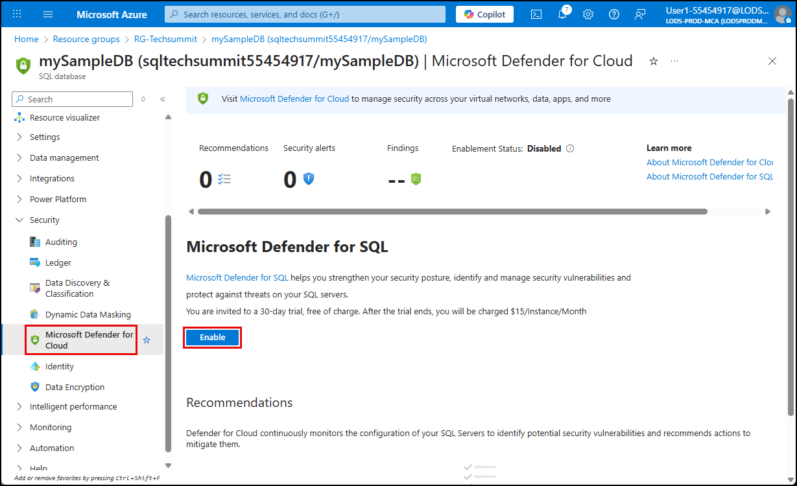
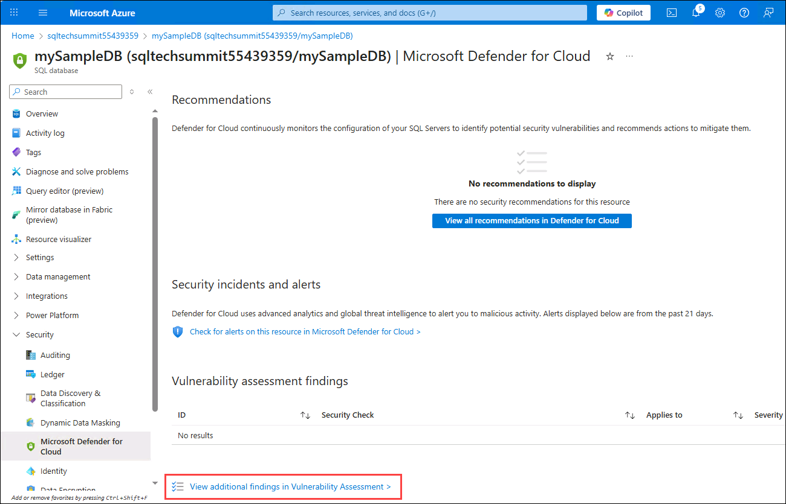
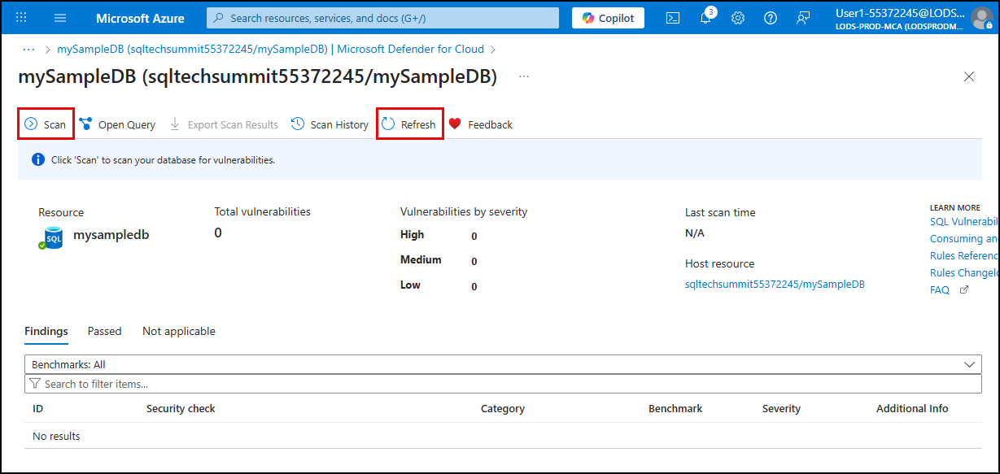
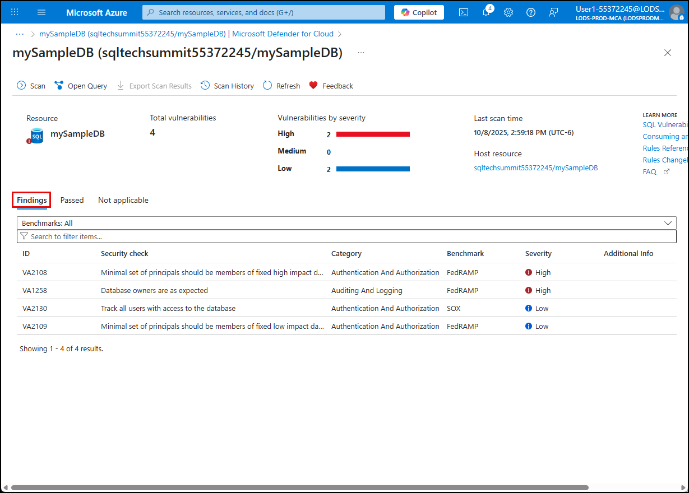
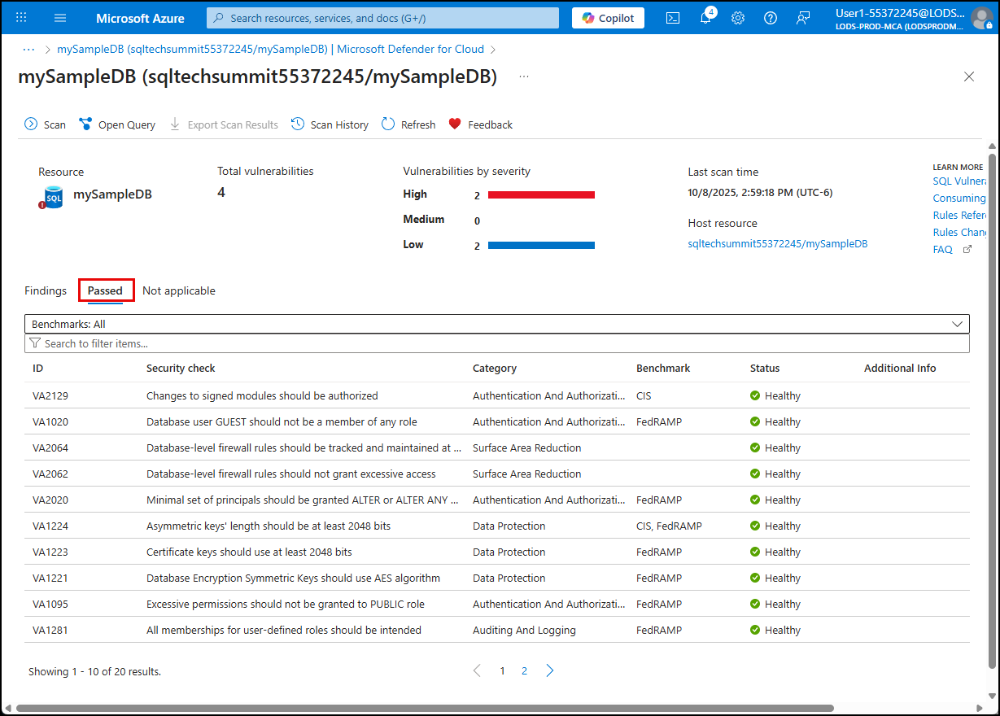
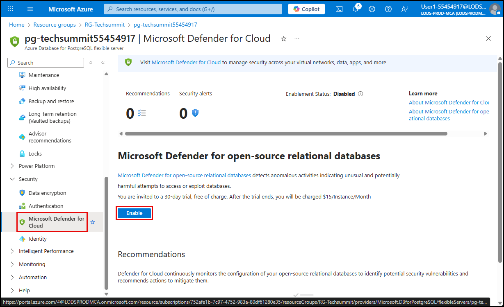
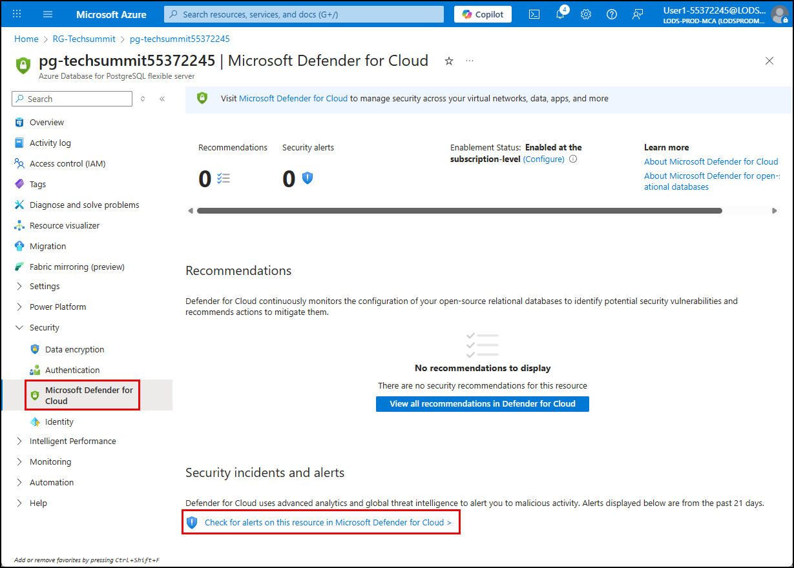
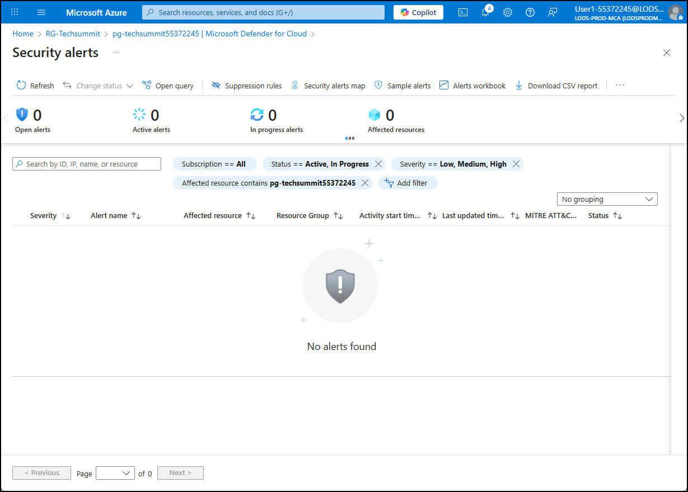

# Exercise 12: Database post-migration enhancements

Once your SQL and PostgreSQL databases have been migrated to Azure, you can take advantage of Azure-native features to enhance performance, security, and availability. These capabilities are not available in on-premises environments and are designed to help you operate more securely and efficiently in the cloud.

Microsoft Defender for Cloud provides advanced threat protection for Azure Database for PostgreSQL. When enabled, it continuously monitors for unusual activity, potential vulnerabilities, and known attack patterns. Defender for Open-Source Relational Databases helps secure your PostgreSQL environment by integrating with Microsoft Defender for Cloud to surface alerts, recommendations, and remediation guidance.

In Microsoft Defender for Cloud, the Defender for Databases plan helps protect your database estate from threats and vulnerabilities. The Defender for Databases plan provides threat protection and security management across cloud environments.

In this exercise, you will explore some of the post-migration features available for Azure SQL Database and Azure Database for PostgreSQL - Flexible Server, including enabling vulnerability assessments in Microsoft Defender for Cloud and reviewing the security posture of your databases.

## Objectives

After completing this exercise, you will be able to:

- Enable Microsoft Defender for Cloud on Azure-hosted databases
- Run and review vulnerability assessments for SQL and Open Source databases

## Duration

**Estimated time**: 10 minutes

===

# Task 1: Enable Defender for Azure SQL Databases

## Introduction

In Microsoft Defender for Cloud, the Defender for Azure SQL Databases plan within Defender for Databases helps you discover and mitigate potential database vulnerabilities. It alerts you to anomalous activities that might indicate a threat to your databases.

When you enable Defender for Azure SQL Databases, all supported resources within the subscription are protected.

## Description

In this task, you will enable Microsoft Defender for SQL on your newly migrated SQL database.

## Success criteria

- You have enabled Microsoft Defender for SQL
- You have run a scan on the `mySampleDB` database
- You have reviewed the vulnerability report

## Learning resources

- [SQL server post-migration steps](https://learn.microsoft.com/data-migration/sql-server/database/guide?toc=%2Fazure%2Fazure-sql%2Ftoc.json&bc=%2Fazure%2Fbread%2Ftoc.json&view=azuresql#post-migration)
- [Overview of Microsoft Defender for Databases](https://learn.microsoft.com/azure/defender-for-cloud/defender-for-databases-overview)
- [Overview of Microsoft Defender for Azure SQL Databases](https://learn.microsoft.com/azure/defender-for-cloud/defender-for-sql-introduction)
- [SQL Advanced Threat Protection](https://learn.microsoft.com/azure/azure-sql/database/threat-detection-overview)

## Key tasks

1. Navigate to the `mySampleDB` Azure SQL Database resource in the Azure portal and select **Microsoft Defender for Cloud** under Security in the left navigation menu.

2. [] Select **Enable** under **Microsoft Defender for SQL**.

    

3. Scroll down on the page and select the **View additional findings in Vulnerability Assessment** link.

    

4. On the **Vulnerability Assessment** page, select **Scan** on the toolbar, then select **Refresh** when you get a notification that the scan has completed.

    

5. Review the assessment by selecting the **Findings** and **Passed** tabs and reviewing the items listed.

    

    

===

# Task 2: Enable Microsoft Defender for Open-Source Relational Databases

## Introduction

**Microsoft Defender for Open-Source Relational Databases** provides advanced threat protection for Azure Database for PostgreSQL. Defender continuously monitors for suspicious activity, potential vulnerabilities, and anomalous access patterns. It also integrates with Microsoft Defender for Cloud to provide centralized security recommendations and alerts.

Other post-migration enhancements include enabling high availability, configuring automated backups, and applying performance tuning recommendations, all of which help ensure your database is resilient, secure, and optimized for production workloads.

## Description

In this task, you enable Microsoft Defender for Open-Source Relational Databases on the Azure Database for PostgreSQL flexible server, and review its configuration to see how it can help to improve the security posture of your Azure Database for PostgreSQL flexible server.

## Success criteria

- You have reviewed the Microsoft Defender for Open-Source Relational Databases configuration in the Azure portal.

## Learning resources

- [What is Microsoft Defender for Cloud?](https://learn.microsoft.com/azure/defender-for-cloud/defender-for-cloud-introduction)
- [Overview of Microsoft Defender for Open-Source Relational Databases](https://learn.microsoft.com/azure/defender-for-cloud/defender-for-databases-introduction)

## Key tasks

1. [] Navigate to the Azure Database for PostgreSQL resource in the Azure portal and select **Microsoft Defender for Cloud** under **Security** in the left navigation menu.

2. [] Select **Enable** under **Microsoft Defender for open-source relational databases**.

    

3. [] On the **Microsoft Defender for Cloud** blade, select **Check for alerts on this resource in Microsoft Defender for Cloud**.

    

4. [] Review the **Security alerts** page for your PostgreSQL resource.

    > The security alerts page displays any detected threats or suspicious activity, such as brute-force login attempts, SQL injection patterns, or anomalous access behavior. You can view alert severity, affected resources, and recommended actions. This page helps you quickly assess and respond to potential risks in your PostgreSQL environment.

    

Success! You have improved the security posture of your Azure SQL and Azure Database for PostgreSQL - Flexible Server databases using Microsoft Defender for Cloud. In the final exercise, you will return to the VM migration and monitor its progress.
