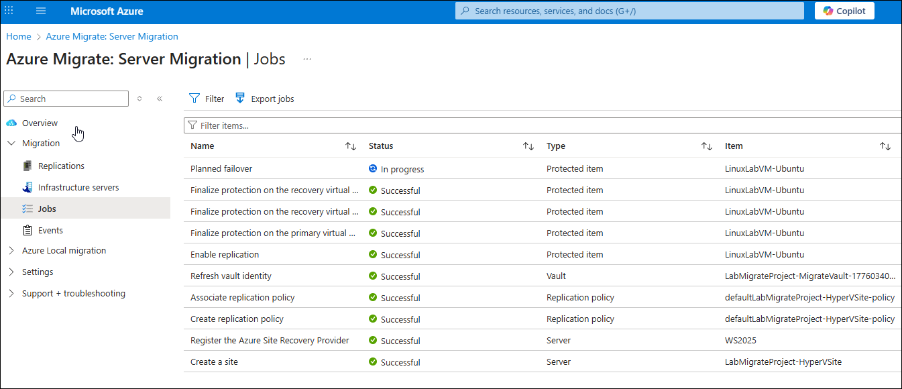

# Exercise 13: Monitor Linux VM migration

In this exercise, you will monitor the status of the Linux Ubuntu VM migration.

> **IMPORTANT**: The migration can take over two hours to complete, so you may not have time in the lab to see the migration finish.

## Objectives

After completing this exercise, you will be able to:

- Monitor the status of an active VM migration
- Verify the successful completion of a VM migration

## Duration

**Estimated time**: 10 minutes

===

# Task 1: Monitor and complete the migration

## Introduction

With the Linux Ubuntu VM migration ongoing, you can monitor the status of the migration in the Azure portal.

## Description

In this task, you monitor the status on the active Linux VM migration using the Azure Migrate portal.

## Success criteria

- You have checked the status of the VM migration
- If possible, you have completed the migration

## Learning resources

- [Migrate Hyper-V VMs to Azure](https://learn.microsoft.com/azure/migrate/tutorial-migrate-hyper-v?view=migrate-classic&tabs=UI)
- [Preparing for migrating Linux Virtual Machine to Azure](https://learn.microsoft.com/azure/migrate/prepare-for-migration?view=migrate-classic)
- [Overview of migration methods](https://learn.microsoft.com/azure/migrate/server-migrate-overview?view=migrate-classic)
- [Complete the migration](https://learn.microsoft.com/azure/migrate/tutorial-migrate-hyper-v?view=migrate-classic&tabs=UI#complete-the-migration)

## Key tasks

1. You can monitor the progress by opening the **Jobs** section on the Migration blade and selecting **Planned failover**.

    

    

2. When the migration completes (if time allows), stop the replication by right-clicking the VM and selecting **Stop replication**.

Great work! You have successfully completed the TechSummit Migration Workshop!